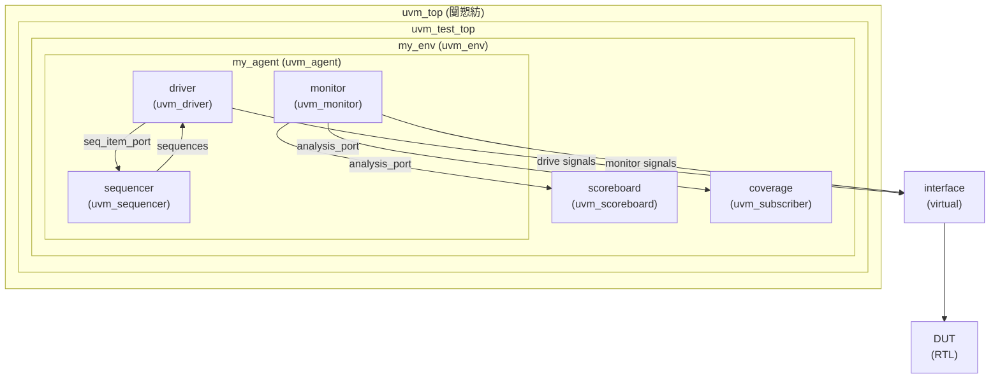
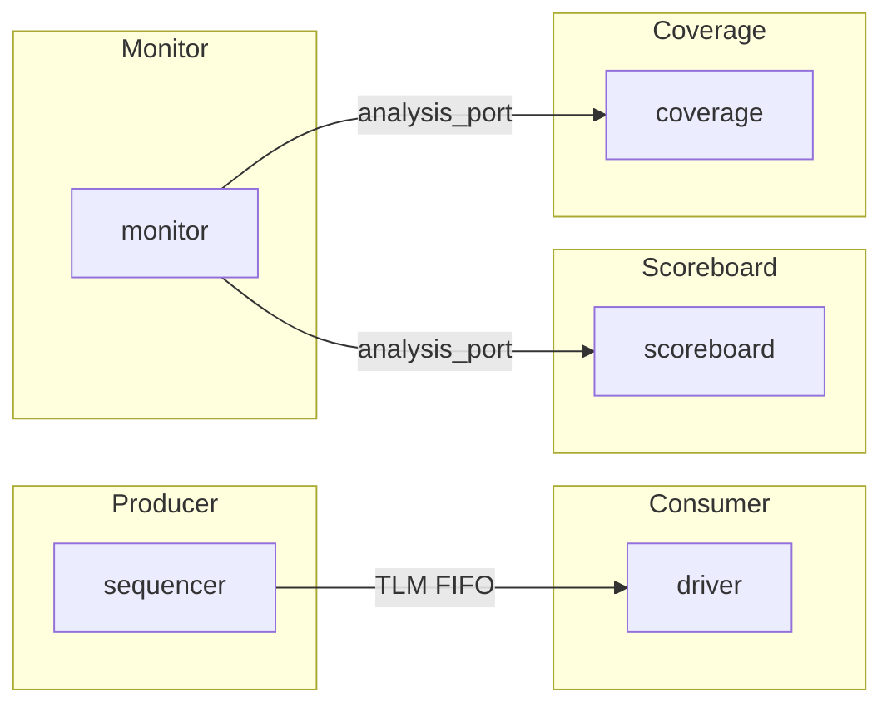
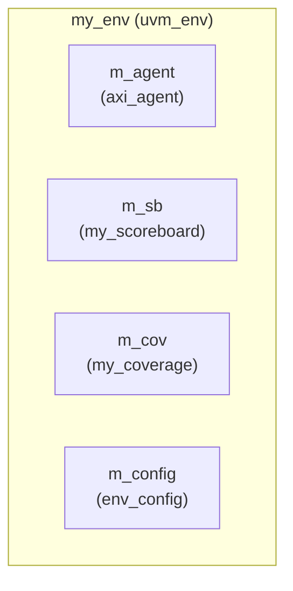
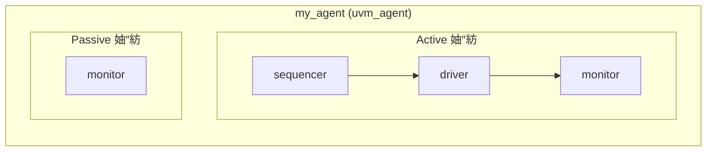
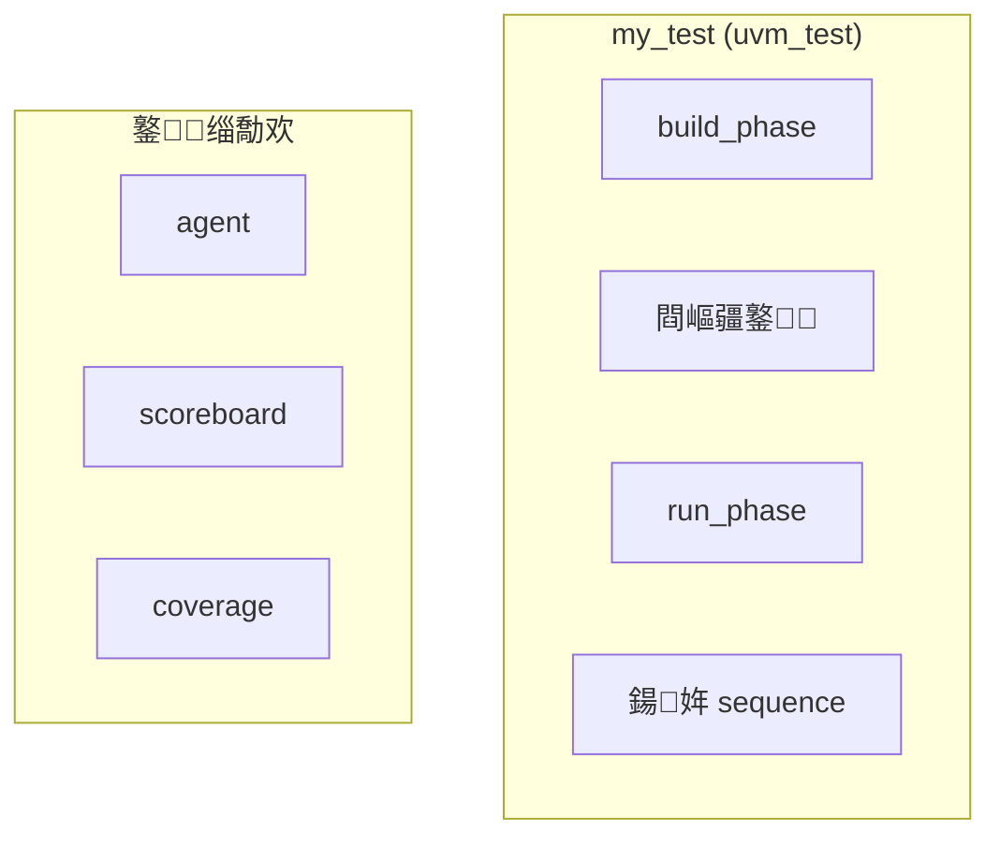

# 04-缁勪欢

> UVM 楠岃瘉骞冲彴鐨勭粍浠跺眰娆′笌缁撴瀯

tags: AXI, DDR, Assertion, UVM, Coverage, Protocol

## UVM 缁勪欢灞傛缁撴瀯



## 缁勪欢绫诲瀷鎬昏

| 缁勪欢绫诲瀷 | 鍩虹被 | 鐢ㄩ€?|
|----------|------|------|
| Test | `uvm_test` | 娴嬭瘯鐢ㄤ緥椤跺眰 |
| Environment | `uvm_env` | 楠岃瘉鐜瀹瑰櫒 |
| Agent | `uvm_agent` | 鍗忚椹卞姩鍣ㄥ皝瑁?|
| Driver | `uvm_driver` | 椹卞姩淇″彿鍒?DUT |
| Sequencer | `uvm_sequencer` | 鎺у埗 sequence 鍙戦€?|
| Monitor | `uvm_monitor` | 鐩戞祴 DUT 淇″彿 |
| Scoreboard | `uvm_scoreboard` | 鏁版嵁姣斿 |
| Coverage | `uvm_subscriber` | 鍔熻兘瑕嗙洊鐜囨敹闆?|

## TLM 杩炴帴绀烘剰鍥?


---

## 璇︾粏缁勪欢瀹炵幇

### 1. uvm_env (Environment)

鐜鏄獙璇佸钩鍙扮殑椤跺眰瀹瑰櫒锛屽皝瑁呮墍鏈夌粍浠躲€?


```systemverilog
class my_env extends uvm_env;
    `uvm_component_utils(my_env)

    my_agent     m_agent;
    my_scoreboard m_sb;
    my_coverage   m_cov;
    env_config    m_config;

    function new(string name, uvm_component parent);
        super.new(name, parent);
    endfunction

    function void build_phase(uvm_phase phase);
        super.build_phase(phase);

        // 浠?config_db 鑾峰彇閰嶇疆
        if (!uvm_config_db#(env_config)::get(this, "", "config", m_config))
            `uvm_fatal("NOCFG", "env_config not set")

        // 鍒涘缓缁勪欢
        m_agent = my_agent::type_id::create("m_agent", this);
        m_sb    = my_scoreboard::type_id::create("m_sb", this);
        m_cov   = my_coverage::type_id::create("m_cov", this);
    endfunction

    function void connect_phase(uvm_phase phase);
        super.connect_phase(phase);

        // 杩炴帴 analysis port
        m_agent.m_monitor.ap.connect(m_sb.analysis_export);
        m_agent.m_monitor.ap.connect(m_cov.analysis_export);
    endfunction

    function void end_of_elaboration_phase(uvm_phase phase);
        super.end_of_elaboration_phase(phase);
        print();
        print_topology();
    endfunction
endclass
```

### 2. uvm_agent

Agent 灏佽浜?driver/monitor/sequencer锛屽彲閰嶇疆涓?active 鎴?passive 妯″紡銆?


```systemverilog
class my_agent extends uvm_agent;
    `uvm_component_utils(my_agent)

    // Agent 琛屼负閰嶇疆
    uvm_active_passive_enum is_active;

    // 鍐呴儴缁勪欢
    my_driver     m_driver;
    my_monitor    m_monitor;
    my_sequencer  m_sequencer;

    // Port
    uvm_analysis_port#(my_transaction) ap;

    function new(string name, uvm_component parent);
        super.new(name, parent);
    endfunction

    function void build_phase(uvm_phase phase);
        super.build_phase(phase);

        // 鑾峰彇閰嶇疆
        is_active = uvm_active_passive_enum'(
            uvm_config_db#(uvm_active_passive_enum)::get(this, "", "is_active", UVM_ACTIVE)
        );

        // 鍒涘缓 monitor锛堝缁堝垱寤猴級
        m_monitor = my_monitor::type_id::create("m_monitor", this);
        ap = new("ap", this);

        // 鏍规嵁 is_active 鍐冲畾鏄惁鍒涘缓 driver/sequencer
        if (is_active == UVM_ACTIVE) begin
            m_driver    = my_driver::type_id::create("m_driver", this);
            m_sequencer = my_sequencer::type_id::create("m_sequencer", this);
        end
    endfunction

    function void connect_phase(uvm_phase phase);
        super.connect_phase(phase);

        // 杩炴帴 driver 鍜?sequencer
        if (is_active == UVM_ACTIVE) begin
            m_driver.seq_item_port.connect(m_sequencer.seq_item_export);
        end

        // 杩炴帴 monitor port
        m_monitor.ap.connect(this.ap);
    endfunction
endclass
```

### 3. uvm_driver

Driver 浠?sequencer 鑾峰彇 transaction 骞堕┍鍔ㄥ埌 DUT 鎺ュ彛銆?
```systemverilog
class my_driver extends uvm_driver#(my_transaction);
    `uvm_component_utils(my_driver)

    // 铏氭帴鍙?    virtual dut_if vif;

    // 淇″彿鍙ユ焺
    logic clk;
    logic rst_n;

    function new(string name, uvm_component parent);
        super.new(name, parent);
    endfunction

    function void build_phase(uvm_phase phase);
        super.build_phase(phase);

        // 鑾峰彇铏氭帴鍙?        if (!uvm_config_db#(virtual dut_if)::get(this, "", "vif", vif))
            `uvm_fatal("NOVIF", "virtual interface must be set")
    endfunction

    task run_phase(uvm_phase phase);
        super.run_phase(phase);

        // 绛夊緟澶嶄綅瀹屾垚
        wait(vif.rst_n === 1'b0);
        @(posedge vif.rst_n);

        forever begin
            // 浠?sequencer 鑾峰彇涓嬩竴涓?item
            seq_item_port.get_next_item(req);

            // 椹卞姩 transaction
            drive_transaction(req);

            // 閫氱煡 sequencer item 瀹屾垚
            seq_item_port.item_done();
        end
    endtask

    virtual protected task drive_transaction(my_transaction tr);
        `uvm_info("DRIVER", $sformatf("Driving: %s", tr.convert2string()), UVM_HIGH)

        @(posedge vif.clk);
        vif.valid  <= 1'b1;
        vif.addr   <= tr.addr;
        vif.wdata  <= tr.data;
        vif.we     <= (tr.kind == WRITE);

        wait(vif.ready);

        @(posedge vif.clk);
        vif.valid  <= 1'b0;
    endtask
endclass
```

### 4. uvm_monitor

Monitor 鐩戝惉 DUT 鎺ュ彛锛屾敹闆嗕簨鍔″苟鍙戦€佺粰 scoreboard 鍜?coverage銆?
```systemverilog
class my_monitor extends uvm_monitor;
    `uvm_component_utils(my_monitor)

    // Analysis port
    uvm_analysis_port#(my_transaction) ap;

    // 铏氭帴鍙?    virtual dut_if vif;

    // 閰嶇疆
    bit coverage_enable = 1;
    bit protocol_check_enable = 1;

    function new(string name, uvm_component parent);
        super.new(name, parent);
    endfunction

    function void build_phase(uvm_phase phase);
        super.build_phase(phase);
        ap = new("ap", this);
    endfunction

    task run_phase(uvm_phase phase);
        super.run_phase(phase);

        forever begin
            @(posedge vif.clk);

            // 妫€娴嬫湁鏁堜簨鍔?            if (vif.valid && vif.ready) begin
                my_transaction tr = new();

                // 閲囬泦鏁版嵁
                tr.addr = vif.addr;
                tr.data = vif.we ? vif.wdata : vif.rdata;
                tr.kind = vif.we ? WRITE : READ;

                `uvm_info("MONITOR", $sformatf("Sampled: %s", tr.convert2string()), UVM_HIGH)

                // 鍙戦€佷簨鍔?                ap.write(tr);
            end
        end
    endtask
endclass
```

### 5. uvm_sequencer

Sequencer 鎺у埗 sequence 鐨勫彂閫侀『搴忋€?
```systemverilog
class my_sequencer extends uvm_sequencer#(my_transaction);
    `uvm_component_utils(my_sequencer)

    // Sequence 閰嶇疆
    int max_concurrent_seq = 10;

    function new(string name, uvm_component parent);
        super.new(name, parent);
    endfunction

    function void build_phase(uvm_phase phase);
        super.build_phase(phase);
    endfunction
endclass
```

### 6. uvm_scoreboard

Scoreboard 姣旇緝鍙傝€冩ā鍨嬪拰 DUT 杈撳嚭銆?
```mermaid
graph LR
    subgraph Input["杈撳叆"]
        EXP[expected]
        ACT[actual]
    end

    subgraph Compare["姣旇緝鍣?]
        CMP[comparator]
    end

    subgraph Result["缁撴灉"]
        OK[Match]
        FAIL[Mismatch]
    end

    EXP --> CMP
    ACT --> CMP
    CMP --> OK
    CMP --> FAIL
```

```systemverilog
class my_scoreboard extends uvm_scoreboard;
    `uvm_component_utils(my_scoreboard)

    // Analysis exports
    uvm_analysis_export#(my_transaction) expected_export;
    uvm_analysis_export#(my_transaction) actual_export;

    // Comparator
    typedef uvm_in_order_class_comparator#(my_transaction) comp_t;
    comp_t comparator;

    // Queues for manual comparison
    my_transaction expected_q[$];
    my_transaction actual_q[$];

    int match_count;
    int mismatch_count;

    function new(string name, uvm_component parent);
        super.new(name, parent);
        match_count = 0;
        mismatch_count = 0;
    endfunction

    function void build_phase(uvm_phase phase);
        super.build_phase(phase);

        expected_export = new("expected_export", this);
        actual_export   = new("actual_export", this);
        comparator     = comp_t::type_id::create("comparator", this);
    endfunction

    function void connect_phase(uvm_phase phase);
        expected_export.connect(comparator.before_export);
        actual_export.connect(comparator.after_export);
    endfunction

    function void report_phase(uvm_phase phase);
        super.report_phase(phase);

        `uvm_info("SCOREBOARD",
            $sformatf("Results: Matches=%0d, Mismatches=%0d",
                      comparator.m_matches, comparator.m_mismatches), UVM_MEDIUM)
    endfunction
endclass
```

### 7. uvm_test

Test 鏄祴璇曠敤渚嬬殑椤跺眰绫汇€?


```systemverilog
class my_test extends uvm_test;
    `uvm_component_utils(my_test)

    my_env m_env;
    my_sequence m_seq;

    function new(string name, uvm_component parent);
        super.new(name, parent);
    endfunction

    function void build_phase(uvm_phase phase);
        super.build_phase(phase);

        // 鍒涘缓鐜
        m_env = my_env::type_id::create("m_env", this);

        // 閰嶇疆 agent
        uvm_config_db#(uvm_active_passive_enum)::set(
            this, "m_env.m_agent", "is_active", UVM_ACTIVE
        );

        // 閰嶇疆铏氭帴鍙?        uvm_config_db#(virtual dut_if)::set(
            this, "m_env.m_agent", "vif", dut_if
        );
    endfunction

    function void end_of_elaboration_phase(uvm_phase phase);
        super.end_of_elaboration_phase(phase);
        `uvm_info("TEST", "Environment built", UVM_MEDIUM)
        print_topology();
    endfunction

    task run_phase(uvm_phase phase);
        phase.raise_objection(this);

        // 鍒涘缓骞跺惎鍔?sequence
        m_seq = my_sequence::type_id::create("m_seq");
        m_seq.start(m_env.m_agent.m_sequencer);

        // 绛夊緟涓€娈垫椂闂?        #1000ns;

        phase.drop_objection(this);
    endfunction

    function void report_phase(uvm_phase phase);
        super.report_phase(phase);
        `uvm_info("TEST", "Test completed", UVM_MEDIUM)
    endfunction
endclass
```

---

## 缁勪欢閰嶇疆鏈哄埗

### set_config_* / get_config_*

```systemverilog
// Test 涓缃?class my_test extends uvm_test;
    function void build_phase(uvm_phase phase);
        super.build_phase(phase);

        // 鏁存暟閰嶇疆
        set_config_int("env.agent", "is_active", UVM_ACTIVE);

        // 瀛楃涓查厤缃?        set_config_string("env.agent.driver", "mode", "EARLY_BWRITE");

        // 瀵硅薄閰嶇疆
        set_config_object("env.config", "cfg", cfg_obj);
    endfunction
endclass

// Driver 涓幏鍙?class my_driver extends uvm_driver;
    string mode;

    function void build_phase(uvm_phase phase);
        super.build_phase(phase);

        if (!get_config_string("mode", mode))
            mode = "NORMAL";
    endfunction
endclass
```

### uvm_config_db

```systemverilog
// 璁剧疆
// Testbench 椤跺眰
initial begin
    // 铏氭帴鍙?    uvm_config_db#(virtual dut_if)::set(uvm_root::get(), "*", "vif", dut_if);

    // 閰嶇疆瀵硅薄
    my_config cfg = new();
    uvm_config_db#(my_config)::set(uvm_root::get(), "env", "config", cfg);
end

// 鑾峰彇
// Component 涓?function void build_phase(uvm_phase phase);
    if (!uvm_config_db#(virtual dut_if)::get(this, "", "vif", vif))
        `uvm_fatal("NOVIF", "vif must be set")
endfunction
```

---

## 缁勪欢鏌ユ壘

```systemverilog
// 鏌ユ壘缁勪欢
my_component comp;
comp = my_component::get_parent();        // 鑾峰彇鐖剁粍浠?comp = my_component::get_child("name");     // 鑾峰彇瀛愮粍浠?
// 鎵撳嵃灞傛
print();                // 鎵撳嵃缁勪欢鏍?print_topology();        // 鎵撳嵃瀹屾暣鎷撴墤
printConnections();      // 鎵撳嵃杩炴帴鍏崇郴
```

---

## 鐩稿叧閾炬帴

- [[01-Phase鏈哄埗]] - UVM Phase 鏈哄埗
- [[02-config_db]] - config_db 浣跨敤
- [[03-Sequence鏈哄埗]] - Sequence 鍜?Sequencer
- [[muyu宸ヤ綔绔?02-UVM/00-鍏ラ棬]] - UVM 鍏ラ棬
- [[00-鎬荤储寮昡] - 杩斿洖鎬荤储寮?
---

*鍒涘缓鏃堕棿: 2026-04-17*
*鏇存柊鏃堕棿: 2026-04-17*

