# 🎯 数字验证工程师技能树

> [!abstract] 📖 技能发展路径
> 本页面展示数字验证工程师的核心技能体系，帮助规划学习路径和追踪成长进度。

---

## 🔬 核心技能体系

### 📊 技能概览

```mermaid
graph TB
    subgraph "基础技能"
        SV[SystemVerilog 语法]
        CB[Clocking Block]
        DFT[数字逻辑]
    end

    subgraph "验证方法学"
        UVM[UVM 验证方法学]
        SRC[UVM 源码研究]
        TPL[UVM 验证模板]
        METH[验证方法论]
    end

    subgraph "协议规范"
        subgraph "总线协议"
            AXI[AXI 总线]
            APB[APB 总线]
        end
        subgraph "串行协议"
            I2C[I2C]
            SPI[SPI]
            UART[UART]
        end
        subgraph "高速接口"
            MIPI[MIPI C-PHY/D-PHY]
            HSMT[HSMT 万兆传输]
        end
    end

    subgraph "工具链"
        SIM[仿真工具]
        COV[覆盖率分析]
        VCS[VCS 仿真]
        VERDI[Verdi 波形调试]
        QS[QuestaSim 仿真]
        subgraph "脚本自动化"
            MK[Makefile]
            PY[Python]
            PL[Perl]
            LOG[Log 解析]
        end
    end

    subgraph "项目实战"
        SPI_PRJ[SPI 验证项目]
        AXI_PRJ[AXI 验证项目]
    end

    subgraph "问题追踪"
        ISSUES[问题追踪]
    end

    SV --> CB
    SV --> UVM
    CB --> UVM
    UVM --> SRC
    UVM --> TPL
    UVM --> METH
    TPL --> AXI
    TPL --> APB
    TPL --> SPI
    METH --> MIPI
    METH --> HSMT
    UVM --> SIM
    UVM --> COV
    SIM --> VCS
    SIM --> VERDI
    SIM --> QS
    SIM --> MK
    SIM --> PY
    SIM --> PL
    SIM --> LOG
    TPL --> SPI_PRJ
    TPL --> AXI_PRJ
    SPI --> SPI_PRJ
    AXI --> AXI_PRJ
    METH --> ISSUES

    style SV fill:#fce7f3,stroke:#ec4899,color:#9d174d
    style CB fill:#fce7f3,stroke:#ec4899,color:#9d174d
    style DFT fill:#fce7f3,stroke:#ec4899,color:#9d174d
    style UVM fill:#dbeafe,stroke:#3b82f6,color:#1e40af
    style SRC fill:#dbeafe,stroke:#3b82f6,color:#1e40af
    style TPL fill:#dbeafe,stroke:#3b82f6,color:#1e40af
    style METH fill:#dbeafe,stroke:#3b82f6,color:#1e40af
    style AXI fill:#e9d5ff,stroke:#7c3aed,color:#6d28d9
    style APB fill:#e9d5ff,stroke:#7c3aed,color:#6d28d9
    style I2C fill:#e9d5ff,stroke:#7c3aed,color:#6d28d9
    style SPI fill:#e9d5ff,stroke:#7c3aed,color:#6d28d9
    style UART fill:#e9d5ff,stroke:#7c3aed,color:#6d28d9
    style MIPI fill:#fde68a,stroke:#d97706,color:#92400e
    style HSMT fill:#fde68a,stroke:#d97706,color:#92400e
    style SIM fill:#dcfce7,stroke:#22c55e,color:#166534
    style COV fill:#dcfce7,stroke:#22c55e,color:#166534
    style VCS fill:#dcfce7,stroke:#22c55e,color:#166534
    style VERDI fill:#dcfce7,stroke:#22c55e,color:#166534
    style QS fill:#dcfce7,stroke:#22c55e,color:#166534
    style MK fill:#dcfce7,stroke:#22c55e,color:#166534
    style PY fill:#dcfce7,stroke:#22c55e,color:#166534
    style PL fill:#dcfce7,stroke:#22c55e,color:#166534
    style LOG fill:#dcfce7,stroke:#22c55e,color:#166534
    style SPI_PRJ fill:#fda4af,stroke:#e11d48,color:#9f1239
    style AXI_PRJ fill:#fda4af,stroke:#e11d48,color:#9f1239
    style ISSUES fill:#fed7aa,stroke:#ea580c,color:#9a3412
```



---

## 📚 技能详情

### 🟢 Level 1: 基础技能

> [!note]- 📝 SystemVerilog 基础
>
> | 技能点 | 文档 | 掌握程度 |
> |--------|------|----------|
> | 数据类型 | `=link("01-SV语法/01-数据类型")` | ✅ 熟练 |
> | 类与OOP | `=link("01-SV语法/02-类")` | ✅ 熟练 |
> | 接口与端口 | `=link("01-SV语法/00-入门")` | ✅ 熟练 |
> | 寄存器与锁存器 | `=link("01-SV语法/03-寄存器与锁存器")` | ✅ 熟练 |
> | Clocking Block | `=link("01-SV语法/04-时钟块Clocking-Block")` | ✅ 熟练 |
> | 随机化约束 | `=link("02-UVM/05-Transaction随机与cfg联动")` | ✅ 熟练 |
> | 断言(SVA) | `=link("01-SV语法/05-断言SVA")` | ✅ 熟练 |

> [!note]- 🔢 数字逻辑基础
> 
> | 技能点 | 文档 | 掌握程度 |
> |--------|------|----------|
> | 时序分析 | `=link("10-Notes/时隙-TimeSlot")` | ✅ 熟练 |
> | 寄存器设计 | `=link("10-Notes/数字寄存器")` | ✅ 熟练 |
> | 状态机 | 待补充 | ⏳ 学习中 |
> | 时钟域交叉 | 待补充 | ⏳ 学习中 |

---

### 🔵 Level 2: 核心技能

> [!note]- 🔬 UVM 验证方法学
>
> | 技能点 | 文档 | 掌握程度 |
> |--------|------|----------|
> | UVM 入门 | `=link("02-UVM/00-入门")` | ✅ 熟练 |
> | Phase 机制 | `=link("02-UVM/01-Phase机制")` | ✅ 熟练 |
> | config_db | `=link("02-UVM/02-config_db")` | ✅ 熟练 |
> | Sequence 机制 | `=link("02-UVM/03-Sequence机制")` | ✅ 熟练 |
> | 组件层次 | `=link("02-UVM/04-组件")` | ✅ 熟练 |
> | Factory 机制 | `=link("11-UVM源码学习/UVM-uvm中的factory机制")` | ✅ 熟练 |
> | TLM Analysis Port | `=link("05-Verification/UVM-Template/UVM-Analysis-Port数据流")` | ✅ 熟练 |
> | Transaction 随机与 cfg | `=link("02-UVM/05-Transaction随机与cfg联动")` | ✅ 熟练 |
> | 覆盖率模型 | `=link("05-Verification/01-覆盖率")` | ✅ 熟练 |
> | UVM 源码研究 | `=link("11-UVM源码学习/UVM源代码研究")` | ✅ 熟练 |

> [!note]- 📋 验证方法论
>
> | 技能点 | 文档 | 掌握程度 |
> |--------|------|----------|
> | 验证计划 | `=link("05-Verification/00-验证计划")` | ✅ 熟练 |
> | 覆盖率驱动 | `=link("05-Verification/01-覆盖率")` | ✅ 熟练 |
> | 功能安全 | `=link("05-Verification/02-FMEA-FuSa")` | ✅ 熟练 |
> | UVM 验证模板 | `=link("05-Verification/UVM-Template/00-总览")` | ✅ 熟练 |
> | Driver 握手时序 | `=link("05-Verification/UVM-Template/Driver握手时序陷阱")` | ✅ 熟练 |
> | Analysis Port 数据流 | `=link("05-Verification/UVM-Template/UVM-Analysis-Port数据流")` | ✅ 熟练 |
> | analysis_imp 多端口 | `=link("05-Verification/UVM-Template/uvm_analysis_imp多端口陷阱")` | ✅ 熟练 |
> | 形式验证 | 待补充 | ⚠️ 待加强 |
> | 断言验证 | `=link("01-SV语法/05-断言SVA")` | ✅ 熟练 |

---

### 🟣 Level 3: 协议规范

> [!note]- 🔌 总线协议
>
> | 协议 | 文档 | 掌握程度 | 应用场景 |
> |------|------|----------|----------|
> | AXI | `=link("03-Protocol/AXI/00-AXI")` | ✅ 熟练 | 高性能总线 |
> | APB | `=link("03-Protocol/APB/00-APB")` | ✅ 熟练 | 低速外设 |
> | I2C | `=link("03-Protocol/I2C/00-I2C")` | ✅ 熟练 | 低速外设 |
> | SPI | `=link("03-Protocol/SPI/00-SPI")` | ✅ 熟练 | 高速外设 |
> | UART | `=link("03-Protocol/UART/00-UART")` | ✅ 熟练 | 串口通信 |

> [!note]- 🚀 高速接口协议
>
> | 协议 | 文档 | 掌握程度 | 应用场景 |
> |------|------|----------|----------|
> | MIPI C-PHY/D-PHY | `=link("03-Protocol/MIPI/CPHY-DPHY")` | ✅ 熟练 | 摄像头/显示 |
> | HSMT SPI 控制通道 | `=link("03-Protocol/HSMT/SPI-Control-Channel")` | ✅ 熟练 | 车载多媒体传输 |
> | HSMT QC/T 1217-2024 | `=link("03-Protocol/HSMT/QC-T-1217-2024/QC-T-1217-2024")` | ✅ 熟练 | 万兆全双工标准 |

---

### 🟢 Level 4: 工具链

> [!note]- 🔧 仿真工具
>
> | 工具 | 文档 | 掌握程度 | 用途 |
> |------|------|----------|------|
> | xrun | `=link("04-Tools/xrun/00-xrun")` | ✅ 熟练 | Cadence 仿真 |
> | imc | `=link("04-Tools/imc/00-imc")` | ✅ 熟练 | 覆盖率分析 |
> | VCS | `=link("04-Tools/05-VCS/00-VCS")` | ⚠️ 待加强 | Synopsys 仿真 |
> | Verdi | `=link("04-Tools/06-Verdi/00-Verdi")` | ⚠️ 待加强 | 波形调试 |
> | QuestaSim | `=link("04-Tools/07-QuestaSim/00-QuestaSim")` | ⚠️ 待加强 | Mentor 仿真 |

> [!note]- 📜 脚本自动化
>
> | 技能点 | 文档 | 掌握程度 | 用途 |
> |--------|------|----------|------|
> | Makefile | `=link("07-Scripts/00-Makefile")` | ✅ 熟练 | 构建自动化 |
> | Python | `=link("07-Scripts/00-Python脚本")` | ✅ 熟练 | 数据处理 |
> | Perl 回归脚本 | `=link("07-Scripts/02-Perl回归脚本")` | ✅ 熟练 | 回归自动化 |
> | Log解析 | `=link("07-Scripts/01-Log解析")` | ✅ 熟练 | 日志分析 |
> | Shell脚本 | `=link("04-Tools/Linux/00-常用命令")` | ✅ 熟练 | 系统管理 |

---

### 🔴 Level 5: 项目实战

> [!note]- 🚀 验证项目
>
> | 项目 | 文档 | 掌握程度 | 说明 |
> |------|------|----------|------|
> | SPI 验证实战 | `=link("08-Projects/01-SPI验证")` | ⏳ 进行中 | SPI 协议验证项目 |
> | AXI 验证实战 | `=link("08-Projects/02-AXI验证")` | ⏳ 进行中 | AXI 总线验证项目 |

> [!note]- 🐛 问题追踪
>
> | 类别 | 文档 | 说明 |
> |------|------|------|
> | 问题追踪 | `=link("09-Issues")` | 常见问题与解决方案 |

---

## 📈 技能雷达图

> [!example] 🎯 技能掌握度
> 
> ```mermaid
> radar
>     title 数字验证工程师技能雷达
>     axis SV语法, UVM核心, 协议规范, 验证方法, 工具链, 项目实战, 脚本自动化
>     "当前水平" : 90, 95, 90, 85, 90, 60, 80
>     "目标水平" : 95, 98, 95, 90, 95, 85, 85
> ```

---

## 🎯 学习目标

### 📅 短期目标 (1-3个月)

> [!todo] 🎯 近期重点
>
> - [x] 掌握 TLM Analysis Port 通信机制
> - [x] 学习 UVM 验证模板体系 (13 个模板文件)
> - [x] 掌握 MIPI C-PHY/D-PHY 协议
> - [x] 掌握 HSMT 万兆传输协议及 SPI 控制通道
> - [x] 学习 Perl 回归管理脚本
> - [x] 深入学习 SVA 断言验证
> - [x] 掌握随机化约束机制
> - [ ] 完成 SPI 验证项目
> - [ ] 学习 VCS/Verdi 仿真调试
> - [ ] 学习形式验证方法

### 📅 中期目标 (3-6个月)

> [!todo] 🎯 中期规划
>
> - [ ] 掌握 VCS 仿真工具
> - [ ] 掌握 Verdi 波形调试
> - [ ] 学习 QuestaSim 使用
> - [ ] 深入理解低功耗验证
> - [ ] 积累 10 个问题解决方案
> - [ ] 深入 UVM 源码 (phase/factory/objection)

### 📅 长期目标 (6-12个月)

> [!todo] 🎯 长期发展
>
> - [ ] 成为 UVM 专家
> - [ ] 掌握形式验证方法
> - [ ] 能够独立搭建验证环境
> - [ ] 指导初级工程师
> - [ ] 掌握多协议 SoC 验证方法论

---

## 📊 技能成长记录

> [!info] 📈 成长轨迹
> 
> ```dataview
> TABLE
>   file.folder AS "分类",
>   file.mtime AS "更新时间",
>   file.tags AS "标签"
> FROM ""
> WHERE contains(file.tags, "#核心") OR contains(file.tags, "#重要")
> SORT file.mtime DESC
> LIMIT 10
> ```

---

## 🔗 相关资源

> [!abstract] 📚 学习资源
> 
> | 资源 | 链接 | 说明 |
> |------|------|------|
> | UVM 官方文档 | [Accellera](https://www.accellera.org/) | UVM 标准 |
> | SystemVerilog | [IEEE 1800](https://standards.ieee.org/ieee/1800/7386/) | SV 标准 |
> | Verification Academy | [VerificationAcademy](https://www.verificationacademy.com/) | 学习平台 |
> | ChipVerify | [ChipVerify](https://www.chipverify.com/) | 验证教程 |

---

*最后更新: `=dateformat(date(now), "yyyy-MM-dd HH:mm")`*