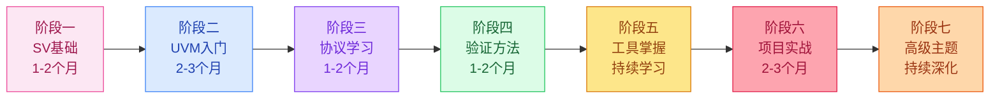

---
aliases: [学习路径, Learning Path, 学习指南, 成长路径]
tags: [LearningPath, 数字验证, 职业发展, 核心]
created: 2026-06-02
updated: 2026-06-02
---

# 数字验证工程师学习路径指南

> [!abstract] 指南概述
> 本文档为有志成为专业数字验证工程师的学习者提供系统化的学习路径。从 SystemVerilog 基础到完整的 SoC 验证项目实战，涵盖 7 个递进阶段，每个阶段明确学习内容、实践项目和里程碑目标。
> 配合 [[00-索引/01-技能树|技能树]] 和 [[00-工作台/13-学习进度追踪|学习进度追踪]] 使用效果更佳。

---

## 学习路径总览

### 目标

成为能够独立规划、搭建和执行验证环境的专业数字验证工程师，具备以下核心能力：

- 熟练使用 SystemVerilog 编写验证代码和断言
- 掌握 UVM 验证方法学，能独立搭建可复用的验证环境
- 理解常用总线/接口协议，能编写协议级验证场景
- 制定验证计划，驱动覆盖率收敛，完成验证签名
- 熟练使用仿真、调试和覆盖率分析工具

### 预计时间

6-12 个月（全职学习），具体取决于基础水平和每日投入时间。

### 前置知识

| 领域 | 要求 | 说明 |
|------|------|------|
| 数字电路基础 | 熟悉组合逻辑、时序逻辑、状态机 | 理解触发器、锁存器、时钟域概念 |
| Verilog HDL | 能读懂和编写基本 RTL 代码 | 理解 always 块、模块例化、wire/reg |
| Linux 基础 | 基本命令行操作 | 编辑、编译、文件管理 |

### 学习路径全景图



---

## 阶段一：SystemVerilog 基础（1-2 个月）

> [!note] 阶段目标
> 掌握 SystemVerilog 的核心语法特性，为后续 UVM 学习打下坚实基础。

### 学习内容

按以下顺序学习知识库中的 SV 笔记：

| 序号 | 主题 | 笔记 | 重点内容 |
|------|------|------|----------|
| 1 | SV 入门 | [[01-SV语法/00-入门]] | 语言概述、与 Verilog 的区别、基本语法结构 |
| 2 | 数据类型 | [[01-SV语法/01-数据类型]] | logic、enum、struct、union、队列、动态数组 |
| 3 | 类与 OOP | [[01-SV语法/02-类]] | 类定义、继承、多态、虚方法、参数化类 |
| 4 | 寄存器与锁存器 | [[09-Notes/02-寄存器与锁存器]] | always_ff、always_latch、阻塞/非阻塞赋值 |
| 5 | 时钟块 | [[01-SV语法/03-时钟块Clocking-Block]] | Clocking Block 语法、输入/输出偏斜、信号采样 |
| 6 | SVA 断言 | [[01-SV语法/04-SVA断言]] | 即时断言、并发断言、序列、属性、蕴含操作符 |
| 7 | 随机化约束 | [[01-SV语法/05-随机化约束]] | rand/randc、constraint 块、内联约束、求解冲突 |

### 补充学习

| 主题 | 笔记 | 说明 |
|------|------|------|
| 数字寄存器原理 | [[09-Notes/00-数字寄存器]] | 理解触发器的建立/保持时间 |
| 时隙概念 | [[09-Notes/01-时隙-TimeSlot]] | 理解 Verilog 仿真调度机制 |

### 实践项目

1. **数据类型练习**：使用 enum、struct、union 设计一个简单的数据包类
2. **类与继承练习**：实现一个基类 Transaction 及其子类，练习虚方法和多态
3. **随机化练习**：编写带约束的随机事务生成器，理解约束求解行为
4. **SVA 练习**：为一个简单的握手协议编写并发断言

### 里程碑

> [!success] 完成标志
> - [ ] 能独立编写 SV class，理解继承和多态
> - [ ] 能使用 rand/constraint 生成受约束的随机激励
> - [ ] 能编写基本的 SVA 并发断言
> - [ ] 理解 Clocking Block 的信号采样和驱动时序

---

## 阶段二：UVM 入门（2-3 个月）

> [!note] 阶段目标
> 掌握 UVM 验证方法学的核心机制，能够搭建简单的 UVM 验证环境。

### 学习内容

按以下顺序学习 UVM 核心笔记：

| 序号 | 主题 | 笔记 | 重点内容 |
|------|------|------|----------|
| 1 | UVM 入门 | [[02-UVM/00-入门]] | UVM 架构概述、组件层次、基本概念 |
| 2 | Phase 机制 | [[02-UVM/01-Phase机制]] | build/connect/run/report phase、phase 执行顺序 |
| 3 | config_db | [[02-UVM/02-config_db]] | 配置传递机制、虚接口传递、参数配置 |
| 4 | Sequence 机制 | [[02-UVM/03-Sequence机制]] | sequence/sequencer/driver 交互、sequence 层次 |
| 5 | UVM 组件 | [[02-UVM/04-组件]] | driver、monitor、agent、env、scoreboard 的职责 |
| 6 | Transaction 随机与 cfg 联动 | [[02-UVM/05-Transaction随机与cfg联动]] | 事务随机化、config_db 与约束联动 |
| 7 | TLM 通信机制 | [[02-UVM/06-TLM通信]] | port/export/imp、analysis port、TLM FIFO |

### 深入学习

| 主题 | 笔记 | 说明 |
|------|------|------|
| UVM 源码总览 | [[02-UVM/08-源代码研究]] | 理解 UVM 库的内部结构 |
| Factory 机制 | [[02-UVM/09-factory机制]] | 类型注册、创建、覆盖 |
| Component 与 Root | [[02-UVM/10-uvm_component与uvm_root]] | 组件层次结构与根节点 |
| TestBench 启动 | [[02-UVM/11-run_test与TestBench启动]] | run_test 执行流程 |

### 实践项目

1. **UVM 模板学习**：逐个阅读 [[05-Verification/UVM-Template/00-总览|UVM 模板总览]] 中的 13 个模板文件
2. **环境搭建练习**：参考模板搭建一个简单的 UVM 验证环境
3. **陷阱学习**：阅读 [[05-Verification/UVM-Template/Driver握手时序陷阱|Driver 握手时序陷阱]] 和 [[05-Verification/UVM-Template/uvm_analysis_imp多端口陷阱|analysis_imp 多端口陷阱]]

### UVM 模板详细学习清单

| 模板 | 笔记 | 说明 |
|------|------|------|
| 总览 | [[05-Verification/UVM-Template/00-总览]] | 整体架构与组件关系 |
| Interface | [[05-Verification/UVM-Template/01-interface]] | 虚接口定义与使用 |
| Transaction | [[05-Verification/UVM-Template/02-transaction]] | 事务类定义与随机化 |
| Sequence | [[05-Verification/UVM-Template/03-sequence]] | 序列定义与执行 |
| Driver | [[05-Verification/UVM-Template/04-driver]] | 驱动器实现 |
| Monitor | [[05-Verification/UVM-Template/05-monitor]] | 监测器实现 |
| Reference Model | [[05-Verification/UVM-Template/06-reference_model]] | 参考模型实现 |
| Scoreboard | [[05-Verification/UVM-Template/07-scoreboard]] | 比较器实现 |
| Agent | [[05-Verification/UVM-Template/08-agent]] | 代理封装 |
| Env | [[05-Verification/UVM-Template/09-env]] | 环境顶层 |
| Test | [[05-Verification/UVM-Template/10-test]] | 测试用例定义 |
| Top | [[05-Verification/UVM-Template/11-top]] | 顶层模块 |
| Analysis Port 数据流 | [[05-Verification/UVM-Template/UVM-Analysis-Port数据流]] | TLM 通信数据流分析 |

### 里程碑

> [!success] 完成标志
> - [ ] 理解 UVM 组件层次（driver/monitor/agent/env/test）
> - [ ] 掌握 Phase 机制的执行顺序和各 phase 的职责
> - [ ] 能使用 config_db 传递虚接口和配置参数
> - [ ] 能编写基本的 sequence 并在 sequencer 上执行
> - [ ] 理解 TLM port/export/imp 的连接规则
> - [ ] 能参考模板搭建一个包含 agent、scoreboard 的简单 UVM 环境

---

## 阶段三：协议学习（1-2 个月）

> [!note] 阶段目标
> 掌握常用总线和接口协议，理解协议时序和关键特性，为协议级验证打下基础。

### 学习内容

从简单到复杂，按以下顺序学习协议：

#### 基础协议（优先掌握）

| 序号 | 协议 | 笔记 | 难度 | 应用场景 |
|------|------|------|------|----------|
| 1 | APB | [[03-Protocol/APB/00-APB]] | 简单 | 低速外设配置寄存器访问 |
| 2 | SPI | [[03-Protocol/SPI/00-SPI]] | 简单 | Flash、传感器等高速外设 |
| 3 | UART | [[03-Protocol/UART/00-UART]] | 简单 | 串口通信 |
| 4 | I2C | [[03-Protocol/I2C/00-I2C]] | 中等 | 低速外设、传感器 |
| 5 | AXI | [[03-Protocol/AXI/00-AXI]] | 较难 | 高性能总线、SoC 互联 |

#### 进阶协议（按需学习）

| 协议 | 笔记 | 说明 |
|------|------|------|
| MIPI C-PHY/D-PHY | [[03-Protocol/MIPI/CPHY-DPHY]] | 摄像头/显示高速接口 |
| HSMT SPI 控制通道 | [[03-Protocol/HSMT/SPI-Control-Channel]] | 车载多媒体传输 |
| HSMT QC/T 1217-2024 | [[03-Protocol/HSMT/QC-T-1217-2024/QC-T-1217-2024]] | 万兆全双工标准 |

### 学习建议

> [!tip] 协议学习策略
> 1. 先通读协议规范，理解信号定义和时序关系
> 2. 重点关注握手机制（valid/ready、req/ack）
> 3. 理解协议的边界条件和异常处理
> 4. 尝试在脑海中模拟信号波形
> 5. 结合 [[03-Protocol/00-协议索引|协议索引]] 进行系统学习

### 实践项目

1. **APB 协议练习**：画出 APB 读写传输的时序波形
2. **AXI 协议分析**：理解 AXI 的 burst 类型、outstanding、乱序完成
3. **协议对比**：对比 APB 和 AXI 的适用场景和性能差异

### 里程碑

> [!success] 完成标志
> - [ ] 掌握 APB、SPI、UART 的信号定义和时序
> - [ ] 理解 AXI 的 burst 传输、outstanding、out-of-order 机制
> - [ ] 能根据协议规范识别违规行为
> - [ ] 了解 MIPI 等高速接口的基本概念

---

## 阶段四：验证方法（1-2 个月）

> [!note] 阶段目标
> 掌握验证计划编写、覆盖率驱动验证和功能安全验证方法，能够制定系统化的验证策略。

### 学习内容

| 序号 | 主题 | 笔记 | 重点内容 |
|------|------|------|----------|
| 1 | 验证计划 | [[05-Verification/00-验证计划]] | VP 编写方法、功能点分解、验证策略制定 |
| 2 | 覆盖率 | [[05-Verification/01-覆盖率]] | 功能覆盖率、代码覆盖率、覆盖率收敛策略 |
| 3 | FMEA/FuSa | [[05-Verification/02-FMEA-FuSa]] | 功能安全验证、FMEA 分析方法 |
| 4 | CDC 验证 | [[05-Verification/03-CDC验证]] | 跨时钟域问题、同步器设计、CDC 验证方法 |
| 5 | 形式验证 | [[05-Verification/04-形式验证]] | 模型检查、等价性检查、SVA 在形式验证中的应用 |
| 6 | SoC 验证方法论 | [[05-Verification/05-SoC验证方法论]] | 分层验证、CDV/ABV/Formal 融合、验证收敛 |

### 实践项目

1. **验证计划编写**：为一个简单模块（如 SPI Master）编写验证计划
2. **覆盖率模型设计**：定义功能覆盖率点和交叉覆盖
3. **断言验证练习**：为协议接口编写 SVA 属性

### 里程碑

> [!success] 完成标志
> - [ ] 能独立编写结构化的验证计划文档
> - [ ] 理解功能覆盖率和代码覆盖率的区别与互补
> - [ ] 能定义覆盖率模型并分析覆盖率空洞
> - [ ] 了解 CDC 问题的本质和常见同步方案
> - [ ] 了解形式验证的适用场景和局限性
> - [ ] 理解 SoC 验证的分层策略和验证收敛方法

---

## 阶段五：工具掌握（持续学习）

> [!note] 阶段目标
> 熟练使用仿真、调试和覆盖率分析工具，提高日常验证工作效率。

### 学习内容

#### 基础工具（优先掌握）

| 工具 | 笔记 | 用途 | 优先级 |
|------|------|------|--------|
| Linux 命令 | [[04-Tools/Linux/00-常用命令]] | 日常开发环境操作 | 高 |
| GVim 编辑器 | [[04-Tools/GVim/00-快捷键]] | 代码编辑 | 高 |
| xrun 仿真 | [[04-Tools/xrun/00-xrun]] | Cadence 仿真编译与运行 | 高 |
| imc 覆盖率 | [[04-Tools/imc/00-imc]] | 覆盖率合并与分析 | 高 |

#### 进阶工具（按需学习）

| 工具 | 笔记 | 用途 | 优先级 |
|------|------|------|--------|
| VCS 仿真 | [[04-Tools/05-VCS/00-VCS]] | Synopsys 仿真编译 | 中 |
| Verdi 调试 | [[04-Tools/06-Verdi/00-Verdi]] | 波形调试与覆盖源分析 | 中 |
| QuestaSim | [[04-Tools/07-QuestaSim/00-QuestaSim]] | Siemens 仿真与调试 | 中 |

#### 脚本自动化

| 脚本 | 笔记 | 用途 |
|------|------|------|
| Makefile | [[06-Scripts/01-Makefile]] | 构建自动化、回归管理 |
| Python 脚本 | [[06-Scripts/02-Python脚本]] | 数据处理、报告生成 |
| Perl 回归脚本 | [[06-Scripts/04-Perl回归脚本]] | 回归测试自动化 |
| Log 解析 | [[06-Scripts/03-Log解析]] | 仿真日志分析 |

#### AI 辅助工具

| 工具 | 笔记 | 说明 |
|------|------|------|
| Claude Code 知识库 Skill | [[04-Tools/01-Claude-Code知识库Skill]] | AI 辅助知识管理 |
| Claude Code EDA Skills | [[04-Tools/02-Claude-Code-EDA-Skills]] | AI 辅助 EDA 开发 |

### 实践项目

1. **日常使用积累**：在每次仿真中练习工具使用
2. **Makefile 编写**：为项目编写自动化仿真脚本
3. **Log 分析练习**：使用脚本解析仿真日志，提取关键信息

### 里程碑

> [!success] 完成标志
> - [ ] 熟练使用 xrun/VCS 进行仿真编译和运行
> - [ ] 能使用 Verdi/Indago 进行波形调试和信号追踪
> - [ ] 能使用 imc 进行覆盖率合并和报告分析
> - [ ] 能编写 Makefile 管理仿真流程
> - [ ] 能使用 Python/Perl 编写自动化脚本

---

## 阶段六：项目实战（2-3 个月）

> [!note] 阶段目标
> 通过完整的验证项目实战，将前面所有阶段的知识融会贯通，积累实际项目经验。

### 学习内容

以知识库中的两个实战项目为核心：

#### SPI 验证项目

| 阶段 | 笔记 | 内容 |
|------|------|------|
| 项目概述 | [[07-Projects/01-SPI验证/00-项目概述]] | 验证目标、范围、计划 |
| 验证计划 | [[07-Projects/01-SPI验证/01-验证计划]] | 功能点、覆盖率目标、测试策略 |
| 环境架构 | [[07-Projects/01-SPI验证/02-环境架构]] | UVM 环境搭建、组件连接 |
| 测试用例 | [[07-Projects/01-SPI验证/03-测试用例]] | 定向测试、随机测试、边界测试 |
| 覆盖率模型 | [[07-Projects/01-SPI验证/04-覆盖率模型]] | 功能覆盖率、代码覆盖率目标 |

#### AXI 验证项目

| 阶段 | 笔记 | 内容 |
|------|------|------|
| 项目概述 | [[07-Projects/02-AXI验证/00-项目概述]] | 验证目标、范围、计划 |
| 验证计划 | [[07-Projects/02-AXI验证/01-验证计划]] | 功能点、覆盖率目标、测试策略 |
| 环境架构 | [[07-Projects/02-AXI验证/02-环境架构]] | UVM 环境搭建、多 Agent 架构 |
| 测试用例 | [[07-Projects/02-AXI验证/03-测试用例]] | burst 传输、outstanding、乱序测试 |

### 实践建议

> [!tip] 项目实战策略
> 1. 从 SPI 项目开始，相对简单，适合首次实战
> 2. 完整走一遍验证流程：VP -> 环境搭建 -> 测试编写 -> 覆盖率收敛
> 3. 遇到问题及时记录到 [[08-Issues/00-索引|问题追踪]] 目录
> 4. 参考 [[05-Verification/UVM-Template/00-总览|UVM 模板]] 搭建环境
> 5. 使用 [[00-索引/00-总索引|总索引]] 快速查找相关知识

### 里程碑

> [!success] 完成标志
> - [ ] 完成 SPI 验证项目的完整流程（VP -> 环境 -> 测试 -> 覆盖率）
> - [ ] 完成 AXI 验证项目的环境搭建和基本测试
> - [ ] 能独立分析覆盖率空洞并编写针对性测试
> - [ ] 积累至少 5 个问题解决方案到 [[08-Issues/00-索引|问题追踪]]

---

## 阶段七：高级主题（持续深化）

> [!note] 阶段目标
> 掌握高级验证方法，成为能够处理复杂验证场景的资深工程师。

### 学习内容

#### 高级验证方法

| 主题 | 笔记 | 说明 |
|------|------|------|
| CDC 验证深入 | [[05-Verification/03-CDC验证]] | 同步器设计、异步 FIFO、CDC 工具使用 |
| 形式验证深入 | [[05-Verification/04-形式验证]] | 模型检查、等价性检查、属性验证 |
| SoC 验证方法论 | [[05-Verification/05-SoC验证方法论]] | 分层验证、验证复用、验证收敛签名 |

#### UVM 源码深入研究

| 主题 | 笔记 | 说明 |
|------|------|------|
| 源码研究总览 | [[02-UVM/08-源代码研究]] | UVM 库整体架构 |
| Factory 机制源码 | [[02-UVM/09-factory机制]] | 类型注册与覆盖实现 |
| Component 层次源码 | [[02-UVM/10-uvm_component与uvm_root]] | 组件树构建过程 |
| TestBench 启动源码 | [[02-UVM/11-run_test与TestBench启动]] | run_test 执行细节 |

#### 进阶协议

| 协议 | 笔记 | 说明 |
|------|------|------|
| MIPI | [[03-Protocol/MIPI/CPHY-DPHY]] | 高速摄像头/显示接口 |
| HSMT | [[03-Protocol/HSMT/SPI-Control-Channel]] | 车载万兆传输 |

### 实践项目

1. **CDC 验证实践**：为一个跨时钟域模块编写 CDC 验证环境
2. **形式验证实践**：使用 SVA 为关键模块编写形式验证属性
3. **UVM 源码阅读**：深入阅读 UVM Phase 和 Factory 的源码实现

### 里程碑

> [!success] 完成标志
> - [ ] 理解 CDC 问题的本质，能设计同步器方案
> - [ ] 能使用 SVA 编写形式验证属性
> - [ ] 理解 UVM 核心机制的源码实现
> - [ ] 能规划和执行 SoC 级验证策略
> - [ ] 能指导初级工程师的学习

---

## 学习资源推荐

### 知识库资源

| 资源 | 路径 | 说明 |
|------|------|------|
| 总索引 | [[00-索引/00-总索引]] | 知识库全量笔记索引 |
| 技能树 | [[00-索引/01-技能树]] | 技能体系与掌握度追踪 |
| 学习进度 | [[00-工作台/13-学习进度追踪]] | 学习进度与里程碑记录 |
| 协议索引 | [[03-Protocol/00-协议索引]] | 全部协议笔记索引 |
| 工具索引 | [[04-Tools/00-工具索引]] | 全部工具笔记索引 |
| 项目索引 | [[07-Projects/00-项目索引]] | 验证项目索引 |
| 问题追踪 | [[08-Issues/00-索引]] | 常见问题与解决方案 |
| 脚本索引 | [[06-Scripts/00-脚本索引]] | 脚本工具索引 |
| 环境搭建 | [[06-Environment/00-环境搭建]] | 开发环境配置指南 |

### 外部资源

| 资源 | 链接 | 说明 |
|------|------|------|
| UVM 官方文档 | [Accellera UVM](https://www.accellera.org/) | UVM 标准文档 |
| SystemVerilog 标准 | [IEEE 1800](https://standards.ieee.org/ieee/1800/7386/) | SV 语言参考手册 |
| Verification Academy | [VerificationAcademy](https://www.verificationacademy.com/) | 验证方法学学习平台 |
| ChipVerify | [ChipVerify](https://www.chipverify.com/) | SV/UVM 教程与示例 |
| EDA Playground | [EDA Playground](https://www.edaplayground.com/) | 在线仿真平台 |

### 推荐书籍

| 书名 | 作者 | 说明 |
|------|------|------|
| SystemVerilog for Verification | Chris Spear | SV 验证入门经典 |
| UVM实战 | 张强 | UVM 中文实战指南 |
| Writing Testbenches | Janick Bergeron | 验证方法学基础 |

---

## 职业发展建议

### 技术成长路径

```
初级验证工程师 (0-2年)
│   掌握: SV基础、UVM基本使用、简单协议验证
│   能力: 在指导下完成模块级验证
│
├── 中级验证工程师 (2-4年)
│   │   掌握: UVM高级特性、多种协议、验证方法论
│   │   能力: 独立完成IP级验证、制定验证策略
│   │
│   ├── 高级验证工程师 (4-7年)
│   │   │   掌握: SoC验证、形式验证、CDC验证
│   │   │   能力: 规划验证架构、指导团队、解决复杂问题
│   │   │
│   │   └── 验证架构师 (7年+)
│   │       掌握: 验证方法学、工具链优化、团队管理
│   │       能力: 制定验证战略、推动验证技术创新
```

### 能力提升建议

> [!tip] 持续成长策略
>
> **技术层面：**
> 1. 持续学习新协议和新工具，保持技术敏感度
> 2. 深入理解 UVM 源码，做到知其然更知其所以然
> 3. 关注形式验证和 AI 辅助验证等新兴技术
> 4. 积累问题解决方案，建立个人知识库
>
> **工程层面：**
> 1. 注重代码质量，编写可复用的验证组件
> 2. 养成编写验证计划的习惯，用文档驱动验证
> 3. 重视覆盖率分析，用数据说话
> 4. 学会高效调试，缩短问题定位时间
>
> **软技能：**
> 1. 与设计工程师保持良好沟通，理解设计意图
> 2. 学会清晰地描述和报告问题
> 3. 培养系统性思维，从全局角度看待验证
> 4. 积极参与技术分享和知识传承

### 认证与社区

| 方向 | 说明 |
|------|------|
| 行业认证 | 关注 Synopsys/Cadence/Siemens 的官方认证 |
| 技术社区 | 参与 Verification Academy、EDACN 等社区讨论 |
| 技术博客 | 记录学习心得和技术总结 |
| 开源项目 | 参与 UVM 相关开源项目 |

---

## 相关链接

### 知识库导航

| 链接 | 说明 |
|------|------|
| [[00-索引/00-总索引\|总索引]] | 知识库全量笔记索引 |
| [[00-索引/01-技能树\|技能树]] | 技能体系与掌握度 |
| [[00-工作台/13-学习进度追踪\|学习进度]] | 学习进度与里程碑 |
| [[00-工作台/14-知识库健康报告\|健康报告]] | 知识库健康状态 |

### 核心模块入口

| 模块 | 入口 |
|------|------|
| SystemVerilog | [[01-SV语法/00-入门]] |
| UVM 方法学 | [[02-UVM/00-索引]] |
| 协议规范 | [[03-Protocol/00-协议索引]] |
| 工具链 | [[04-Tools/00-工具索引]] |
| 验证方法 | [[05-Verification/00-验证计划]] |
| 项目实战 | [[07-Projects/00-项目索引]] |
| UVM 源码 | [[02-UVM/08-源代码研究]] |

---

*最后更新: `=dateformat(date(now), "yyyy-MM-dd HH:mm")`*

