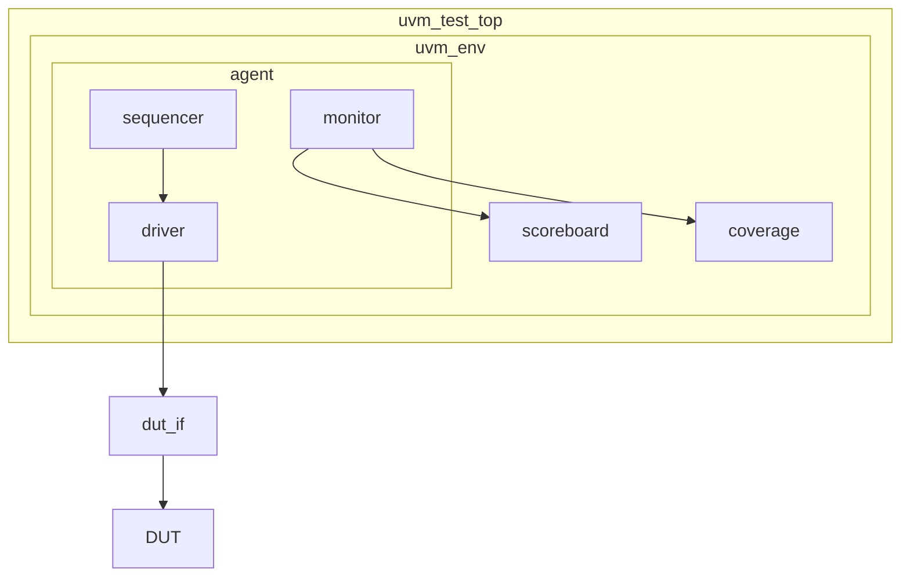
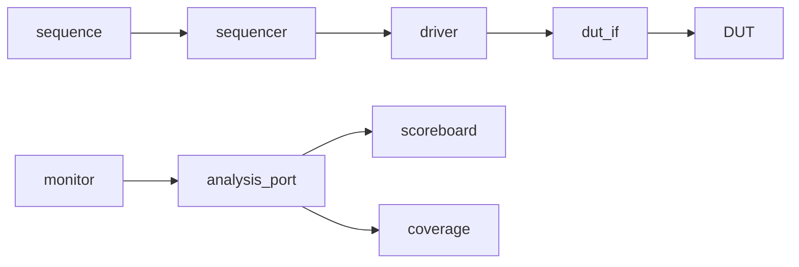

# UVM 入门

> [!abstract] 概述
> UVM（Universal Verification Methodology）是 Accellera 推出的标准化验证方法学，基于 SystemVerilog 语言，提供可重用验证组件、标准化验证结构、覆盖率驱动验证流程和事务级建模（TLM）。

---

## 学习路径指引

> [!tip] 推荐学习顺序
> 按照以下路径循序渐进，每个阶段建议配合动手实验。

```
阶段 1: 基础认知 (1-2 周)
├── 理解 UVM 优势与核心思想
├── 掌握 UVM 验证平台整体结构
└── 熟悉 Transaction、Sequence、Driver 的关系

阶段 2: 核心机制 (2-3 周)
├── Phase 机制 ──→ [[01-Phase机制]]
├── config_db 配置 ──→ [[02-config_db]]
├── Sequence 机制 ──→ [[03-Sequence机制]]
└── Transaction 随机化 ──→ [[05-Transaction随机与cfg联动]]

阶段 3: 组件深入 (2 周)
├── UVM 组件详解 ──→ [[04-组件]]
├── Agent / Env / Test 组装
└── TLM 端口与 FIFO

阶段 4: 实战搭建 (2-3 周)
├── UVM 模板参考 ──→ [[05-Verification/UVM-Template/00-总览|UVM 模板总览]]
├── 环境搭建实践 ──→ [[06-Environment/00-环境搭建|环境搭建]]
└── 覆盖率驱动验证 ──→ [[05-Verification/01-覆盖率|覆盖率]]

阶段 5: 进阶提升 (持续)
├── UVM 源码研究 ──→ [[11-UVM源码学习/UVM源代码研究|UVM 源码研究]]
├── Factory 机制深入
└── 自定义基类与扩展
```

---

## UVM 版本说明

> [!info] UVM 1.2 vs UVM 2020
> 目前工业界主要使用两个版本，了解差异有助于阅读不同来源的代码。

| 特性 | UVM 1.2 | UVM 2020 (IEEE 1800.2) |
|------|---------|------------------------|
| 标准来源 | Accellera | IEEE |
| Phase 机制 | 支持 | 增强，新增 `final_phase` |
| config_db | `uvm_config_db` | 兼容，推荐 `uvm_config_wrapper` |
| Sequence | 支持 | 增强 `uvm_sequence_library` |
| 覆盖率 | 基础支持 | 增强 `uvm_coverage` |
| 类型覆盖 | `uvm_object_registry` | 统一 `uvm_factory` 注册 |
| 报告机制 | `uvm_report_server` | 增强，支持 JSON 输出 |
| 兼容性 | 广泛支持 | 向下兼容 UVM 1.2 |

> [!warning] 版本选择建议
> - 新项目建议使用 **UVM 2020**，获得更好的标准化支持
> - 维护老项目时需确认仿真器对 UVM 2020 的支持程度
> - 大部分代码可无修改从 UVM 1.2 迁移到 UVM 2020

---

## 常见误区提醒

> [!danger] 新手易犯错误
> 以下是在学习和使用 UVM 时常见的误区，提前了解可避免走弯路。

### 误区 1: 混淆 `uvm_component` 和 `uvm_object`

```
错误做法: 在 run_phase 中 new 一个 component
正确做法: component 在 build_phase 中用 type_id::create 创建
原因:     component 必须参与 phase 执行，需要在 build 阶段注册到工厂
```

### 误区 2: `config_db` 路径写错

```
错误做法: uvm_config_db#(int)::set(null, "env.agent.drv", "vif", vif)
正确做法: uvm_config_db#(int)::set(this, "m_env.m_agent.m_drv", "vif", vif)
原因:     set 的第二个参数是相对于第一个参数的层次路径
```

### 误区 3: Sequence 中直接操作信号

```
错误做法: 在 sequence 中直接访问 vif 驱动信号
正确做法: sequence 只产生 transaction，由 driver 驱动信号
原因:     sequence 是 object，不应持有 component 才有的 vif
```

### 误区 4: 忘记调用 `super.phase_name()`

```
错误做法: function void build_phase(uvm_phase phase); ... endfunction
正确做法: function void build_phase(uvm_phase phase);
              super.build_phase(phase);  // 必须调用
              ...
          endfunction
原因:     父类 phase 中有必要的初始化逻辑
```

### 误区 5: Driver 中 `get_next_item` 和 `item_done` 不配对

```
错误做法: 只调用 get_next_item 不调用 item_done
正确做法: 每次 get_next_item 后必须调用 item_done
原因:     sequencer 等待 item_done 才会发送下一个 transaction
```

---

## UVM 优势

> [!tip] 为什么选择 UVM
> 与传统验证相比，UVM 在多个维度上带来质的飞跃。

```
传统验证                    UVM 验证
────────────                ────────────
手写测试框架         →       标准测试框架
难以重用            →       可重用 VIP
平台相关            →       平台无关
手动覆盖率收集       →       自动覆盖率收集
调试困难            →       标准报告机制
```

---

## UVM 核心概念

### 1. 事务（Transaction）

```systemverilog
class my_transaction extends uvm_sequence_item;
    rand bit [31:0] addr;
    rand bit [31:0] data;
    rand bit        read_write;

    `uvm_object_utils_begin(my_transaction)
        `uvm_field_int(addr, UVM_ALL_ON)
        `uvm_field_int(data, UVM_ALL_ON)
        `uvm_field_int(read_write, UVM_ALL_ON)
    `uvm_object_utils_end

    function new(string name = "my_transaction");
        super.new(name);
    endfunction
endclass
```

### 2. 序列（Sequence）

```systemverilog
class my_sequence extends uvm_sequence#(my_transaction);
    `uvm_object_utils(my_sequence)

    function new(string name = "my_sequence");
        super.new(name);
    endfunction

    virtual task body();
        `uvm_info("SEQ", "Starting sequence", UVM_MEDIUM)
        repeat(10) begin
            `uvm_do(req)  // 创建并发送 transaction
        end
        `uvm_info("SEQ", "Sequence completed", UVM_MEDIUM)
    endtask
endclass
```

### 3. 驱动器（Driver）

```systemverilog
class my_driver extends uvm_driver#(my_transaction);
    `uvm_component_utils(my_driver)

    virtual dut_if vif;

    function new(string name, uvm_component parent);
        super.new(name, parent);
    endfunction

    function void build_phase(uvm_phase phase);
        super.build_phase(phase);
        if (!uvm_config_db#(virtual dut_if)::get(this, "", "vif", vif))
            `uvm_fatal("NOVIF", "vif not configured")
    endfunction

    virtual task run_phase(uvm_phase phase);
        forever begin
            seq_item_port.get_next_item(req);
            drive_item(req);
            seq_item_port.item_done();
        end
    endfunction

    virtual protected task drive_item(my_transaction tr);
        @(posedge vif.clk);
        vif.valid = 1'b1;
        vif.addr  = tr.addr;
        vif.wdata = tr.data;
        vif.we    = tr.read_write;
    endtask
endclass
```

### 4. 监视器（Monitor）

```systemverilog
class my_monitor extends uvm_monitor;
    `uvm_component_utils(my_monitor)

    uvm_analysis_port#(my_transaction) ap;
    virtual dut_if vif;

    function new(string name, uvm_component parent);
        super.new(name, parent);
    endfunction

    function void build_phase(uvm_phase phase);
        super.build_phase(phase);
        ap = new("ap", this);
    endfunction

    virtual task run_phase(uvm_phase phase);
        forever begin
            @(posedge vif.clk);
            if (vif.valid && vif.ready) begin
                my_transaction tr = my_transaction::type_id::create("tr");
                tr.addr  = vif.addr;
                tr.data  = vif.rdata;
                tr.kind  = vif.we ? WRITE : READ;
                ap.write(tr);
            end
        end
    endtask
endclass
```

### 5. 代理（Agent）

```systemverilog
class my_agent extends uvm_agent;
    `uvm_component_utils(my_agent)

    my_driver    m_driver;
    my_monitor   m_monitor;
    my_sequencer m_sequencer;

    function new(string name, uvm_component parent);
        super.new(name, parent);
    endfunction

    function void build_phase(uvm_phase phase);
        super.build_phase(phase);
        m_monitor = my_monitor::type_id::create("m_monitor", this);
        if (is_active == UVM_ACTIVE) begin
            m_driver    = my_driver::type_id::create("m_driver", this);
            m_sequencer = my_sequencer::type_id::create("m_sequencer", this);
        end
    endfunction

    function void connect_phase(uvm_phase phase);
        if (is_active == UVM_ACTIVE)
            m_driver.seq_item_port.connect(m_sequencer.seq_item_export);
    endfunction
endclass
```

### 6. 环境（Environment）

```systemverilog
class my_env extends uvm_env;
    `uvm_component_utils(my_env)

    my_agent      m_agent;
    my_scoreboard m_sb;

    function new(string name, uvm_component parent);
        super.new(name, parent);
    endfunction

    function void build_phase(uvm_phase phase);
        super.build_phase(phase);
        m_agent = my_agent::type_id::create("m_agent", this);
        m_sb    = my_scoreboard::type_id::create("m_sb", this);
    endfunction

    function void connect_phase(uvm_phase phase);
        m_agent.m_monitor.ap.connect(m_sb.analysis_export);
    endfunction
endclass
```

### 7. 测试用例（Test）

```systemverilog
class my_test extends uvm_test;
    `uvm_component_utils(my_test)

    my_env m_env;

    function new(string name, uvm_component parent);
        super.new(name, parent);
    endfunction

    function void build_phase(uvm_phase phase);
        super.build_phase(phase);
        m_env = my_env::type_id::create("m_env", this);
        uvm_config_db#(uvm_active_passive_enum)::set(
            this, "m_env.m_agent", "is_active", UVM_ACTIVE);
    endfunction

    function void end_of_elaboration_phase(uvm_phase phase);
        super.end_of_elaboration_phase(phase);
        print();
    endfunction
endclass
```

### 8. 顶层模块（Top Module）

```systemverilog
module tb_top;
    import uvm_pkg::*;
    `include "uvm_macros.svh"

    reg clk;
    reg rst_n;

    dut u_dut (.*);

    initial begin
        uvm_config_db#(virtual dut_if)::set(
            uvm_root::get(), "*", "vif", u_dut.vif);
        run_test("my_test");
    end

    initial begin
        clk = 0;
        forever #5 clk = ~clk;
    end
endmodule
```

---

## UVM 验证平台结构



---

## 数据流



---

## 相关笔记

- [[01-Phase机制]] - UVM Phase 机制
- [[02-config_db]] - 配置数据库
- [[03-Sequence机制]] - Sequence 和 Sequencer
- [[04-组件]] - UVM 组件
- [[05-Transaction随机与cfg联动]] - Transaction 随机与 cfg 联动
- [[01-SV语法/00-入门|SystemVerilog 入门]] - SystemVerilog 基础
- [[06-Environment/00-环境搭建|环境搭建]] - UVM 环境搭建
- [[05-Verification/UVM-Template/00-总览|UVM 模板总览]] - UVM 验证环境模板
- [[11-UVM源码学习/UVM源代码研究|UVM 源码研究]] - UVM 源码深入学习
- [[00-总索引]] - 返回总索引

---

*创建时间: 2026-04-17*
*更新时间: 2026-04-17*
