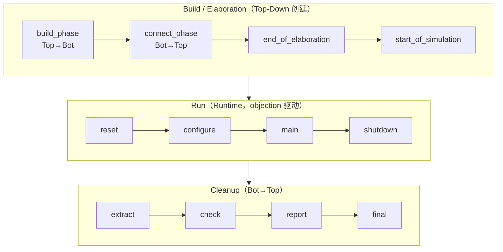

# UVM Phase 机制

> UVM 的 12 个 phase 及其执行顺序

## Phase 执行顺序图




> [!tip] 记忆
> - **build**：自上而下建组件
> - **connect**：自下而上连端口
> - **run**：`raise/drop_objection` 才会前进
> - **report**：统计与打印

---

## 详细说明

### 1. Build Phases

| Phase | 方向 | 用途 |
|-------|------|------|
| `build_phase` | Top-Down | 创建组件、设置配置 |
| `connect_phase` | Bottom-Up | 连接TLM端口 |
| `end_of_elaboration_phase` | Bottom-Up | 最终检查 |

### 2. Run Phases

```verilog
// 推荐使用 main_phase
task run_phase(uvm_phase phase);
    phase.raise_objection(this);
    `uvm_info("TAG", "Starting test...", UVM_LOW)
    // 测试逻辑
    phase.drop_objection(this);
endtask
```

### 3. Cleanup Phases

```verilog
function void extract_phase(uvm_phase phase);
    int cov;
    super.extract_phase(phase);
    uvm_config_db#(int)::get(this, "", "coverage", cov);
endfunction

function void report_phase(uvm_phase phase);
    super.report_phase(phase);
    if (uvm_report_info.get_id() == "TEST")
        $display("Test passed");
endfunction
```

---

## Objection 机制

```verilog
task run_phase(uvm_phase phase);
    phase.raise_objection(this);
    `uvm_info("RUN", "Starting...", UVM_MEDIUM)
    // 测试
    phase.drop_objection(this);
endtask
```

---

## 常见错误

```verilog
// 错误1：忘记raise objection
task run_phase(uvm_phase phase);
    // 不会执行，phase立即结束
endtask

// 错误2：忘记drop objection
task run_phase(uvm_phase phase);
    phase.raise_objection(this);
    // 测试完成后忘记drop
endtask

// 错误3：在build_phase中使用raise_objection
function void build_phase(uvm_phase phase);
    phase.raise_objection(this);  // 错误！
endfunction
```

---

tags: #UVM #Phase #核心

## 相关笔记

- [[02-UVM/00-入门|UVM 入门]] - UVM 基础入门
- [[02-config_db]] - config_db 配置机制
- [[03-Sequence机制]] - Sequence 激励生成
- [[04-组件]] - UVM 组件结构
- [[02-UVM/07-UVM验证环境搭建|环境搭建]] - UVM 环境搭建实践
