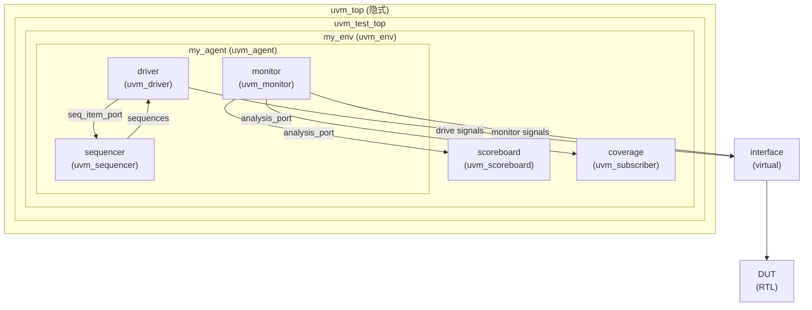
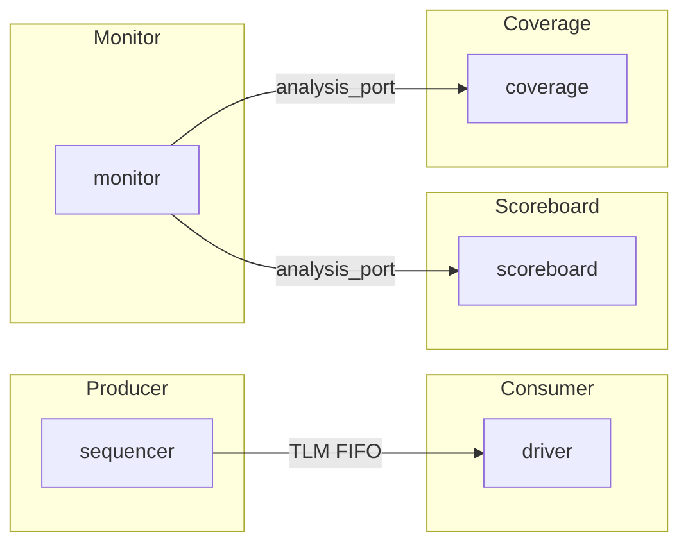
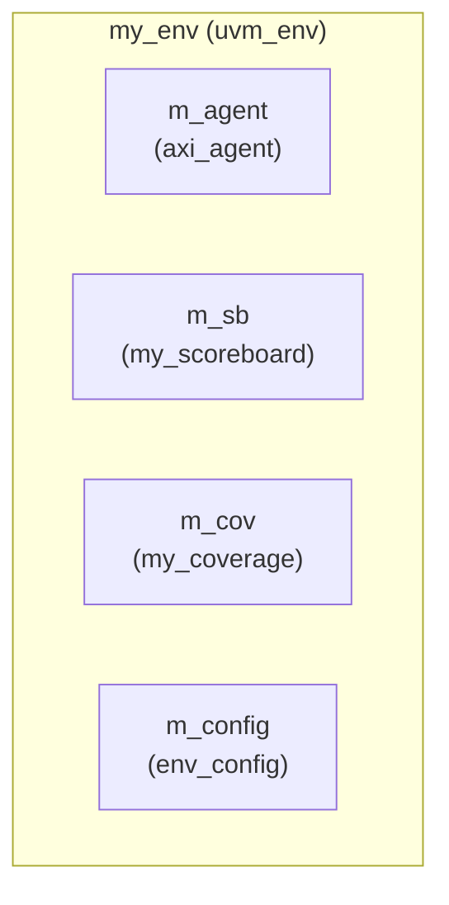
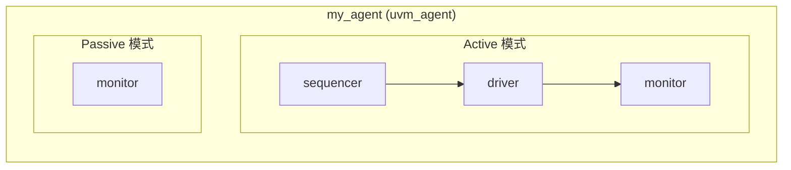
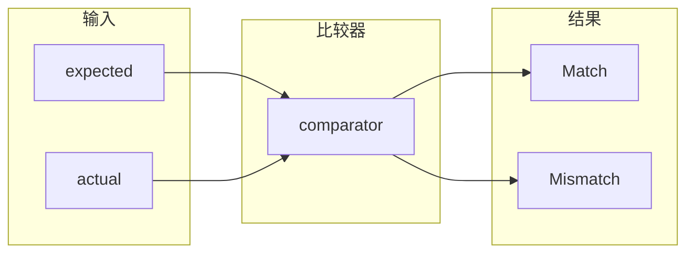
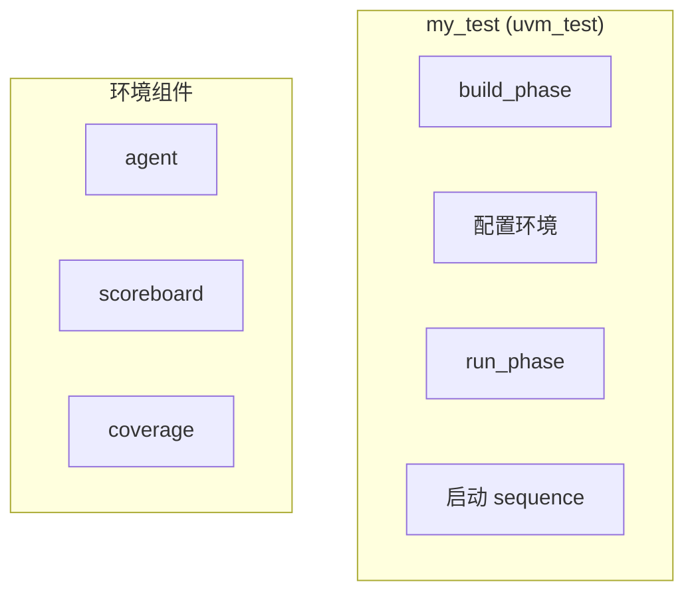

# 04-组件

> UVM 验证平台的组件层次与结构

## UVM 组件层次结构



## 组件类型总览

| 组件类型 | 基类 | 用途 |
|----------|------|------|
| Test | `uvm_test` | 测试用例顶层 |
| Environment | `uvm_env` | 验证环境容器 |
| Agent | `uvm_agent` | 协议驱动器封装 |
| Driver | `uvm_driver` | 驱动信号到 DUT |
| Sequencer | `uvm_sequencer` | 控制 sequence 发送 |
| Monitor | `uvm_monitor` | 监测 DUT 信号 |
| Scoreboard | `uvm_scoreboard` | 数据比对 |
| Coverage | `uvm_subscriber` | 功能覆盖率收集 |

## TLM 连接示意图



---

## 详细组件实现

### 1. uvm_env (Environment)

环境是验证平台的顶层容器，封装所有组件。



```systemverilog
class my_env extends uvm_env;
    `uvm_component_utils(my_env)

    my_agent     m_agent;
    my_scoreboard m_sb;
    my_coverage   m_cov;
    env_config    m_config;

    function new(string name, uvm_component parent);
        super.new(name, parent);
    endfunction

    function void build_phase(uvm_phase phase);
        super.build_phase(phase);

        // 从 config_db 获取配置
        if (!uvm_config_db#(env_config)::get(this, "", "config", m_config))
            `uvm_fatal("NOCFG", "env_config not set")

        // 创建组件
        m_agent = my_agent::type_id::create("m_agent", this);
        m_sb    = my_scoreboard::type_id::create("m_sb", this);
        m_cov   = my_coverage::type_id::create("m_cov", this);
    endfunction

    function void connect_phase(uvm_phase phase);
        super.connect_phase(phase);

        // 连接 analysis port
        m_agent.m_monitor.ap.connect(m_sb.analysis_export);
        m_agent.m_monitor.ap.connect(m_cov.analysis_export);
    endfunction

    function void end_of_elaboration_phase(uvm_phase phase);
        super.end_of_elaboration_phase(phase);
        print();
        print_topology();
    endfunction
endclass
```

### 2. uvm_agent

Agent 封装了 driver/monitor/sequencer，可配置为 active 或 passive 模式。



```systemverilog
class my_agent extends uvm_agent;
    `uvm_component_utils(my_agent)

    // Agent 行为配置
    uvm_active_passive_enum is_active;

    // 内部组件
    my_driver     m_driver;
    my_monitor    m_monitor;
    my_sequencer  m_sequencer;

    // Port
    uvm_analysis_port#(my_transaction) ap;

    function new(string name, uvm_component parent);
        super.new(name, parent);
    endfunction

    function void build_phase(uvm_phase phase);
        super.build_phase(phase);

        // 获取配置
        is_active = uvm_active_passive_enum'(
            uvm_config_db#(uvm_active_passive_enum)::get(this, "", "is_active", UVM_ACTIVE)
        );

        // 创建 monitor（始终创建）
        m_monitor = my_monitor::type_id::create("m_monitor", this);
        ap = new("ap", this);

        // 根据 is_active 决定是否创建 driver/sequencer
        if (is_active == UVM_ACTIVE) begin
            m_driver    = my_driver::type_id::create("m_driver", this);
            m_sequencer = my_sequencer::type_id::create("m_sequencer", this);
        end
    endfunction

    function void connect_phase(uvm_phase phase);
        super.connect_phase(phase);

        // 连接 driver 和 sequencer
        if (is_active == UVM_ACTIVE) begin
            m_driver.seq_item_port.connect(m_sequencer.seq_item_export);
        end

        // 连接 monitor port
        m_monitor.ap.connect(this.ap);
    endfunction
endclass
```

### 3. uvm_driver

Driver 从 sequencer 获取 transaction 并驱动到 DUT 接口。

```systemverilog
class my_driver extends uvm_driver#(my_transaction);
    `uvm_component_utils(my_driver)

    // 虚接口
    virtual dut_if vif;

    // 信号句柄
    logic clk;
    logic rst_n;

    function new(string name, uvm_component parent);
        super.new(name, parent);
    endfunction

    function void build_phase(uvm_phase phase);
        super.build_phase(phase);

        // 获取虚接口
        if (!uvm_config_db#(virtual dut_if)::get(this, "", "vif", vif))
            `uvm_fatal("NOVIF", "virtual interface must be set")
    endfunction

    task run_phase(uvm_phase phase);
        super.run_phase(phase);

        // 等待复位完成
        wait(vif.rst_n === 1'b0);
        @(posedge vif.rst_n);

        forever begin
            // 从 sequencer 获取下一个 item
            seq_item_port.get_next_item(req);

            // 驱动 transaction
            drive_transaction(req);

            // 通知 sequencer item 完成
            seq_item_port.item_done();
        end
    endtask

    virtual protected task drive_transaction(my_transaction tr);
        `uvm_info("DRIVER", $sformatf("Driving: %s", tr.convert2string()), UVM_HIGH)

        @(posedge vif.clk);
        vif.valid  <= 1'b1;
        vif.addr   <= tr.addr;
        vif.wdata  <= tr.data;
        vif.we     <= (tr.kind == WRITE);

        wait(vif.ready);

        @(posedge vif.clk);
        vif.valid  <= 1'b0;
    endtask
endclass
```

### 4. uvm_monitor

Monitor 监听 DUT 接口，收集事务并发送给 scoreboard 和 coverage。

```systemverilog
class my_monitor extends uvm_monitor;
    `uvm_component_utils(my_monitor)

    // Analysis port
    uvm_analysis_port#(my_transaction) ap;

    // 虚接口
    virtual dut_if vif;

    // 配置
    bit coverage_enable = 1;
    bit protocol_check_enable = 1;

    function new(string name, uvm_component parent);
        super.new(name, parent);
    endfunction

    function void build_phase(uvm_phase phase);
        super.build_phase(phase);
        ap = new("ap", this);
    endfunction

    task run_phase(uvm_phase phase);
        super.run_phase(phase);

        forever begin
            @(posedge vif.clk);

            // 检测有效事务
            if (vif.valid && vif.ready) begin
                my_transaction tr = new();

                // 采集数据
                tr.addr = vif.addr;
                tr.data = vif.we ? vif.wdata : vif.rdata;
                tr.kind = vif.we ? WRITE : READ;

                `uvm_info("MONITOR", $sformatf("Sampled: %s", tr.convert2string()), UVM_HIGH)

                // 发送事务
                ap.write(tr);
            end
        end
    endtask
endclass
```

### 5. uvm_sequencer

Sequencer 控制 sequence 的发送顺序。

```systemverilog
class my_sequencer extends uvm_sequencer#(my_transaction);
    `uvm_component_utils(my_sequencer)

    // Sequence 配置
    int max_concurrent_seq = 10;

    function new(string name, uvm_component parent);
        super.new(name, parent);
    endfunction

    function void build_phase(uvm_phase phase);
        super.build_phase(phase);
    endfunction
endclass
```

### 6. uvm_scoreboard

Scoreboard 比较参考模型和 DUT 输出。



```systemverilog
class my_scoreboard extends uvm_scoreboard;
    `uvm_component_utils(my_scoreboard)

    // Analysis exports
    uvm_analysis_export#(my_transaction) expected_export;
    uvm_analysis_export#(my_transaction) actual_export;

    // Comparator
    typedef uvm_in_order_class_comparator#(my_transaction) comp_t;
    comp_t comparator;

    // Queues for manual comparison
    my_transaction expected_q[$];
    my_transaction actual_q[$];

    int match_count;
    int mismatch_count;

    function new(string name, uvm_component parent);
        super.new(name, parent);
        match_count = 0;
        mismatch_count = 0;
    endfunction

    function void build_phase(uvm_phase phase);
        super.build_phase(phase);

        expected_export = new("expected_export", this);
        actual_export   = new("actual_export", this);
        comparator     = comp_t::type_id::create("comparator", this);
    endfunction

    function void connect_phase(uvm_phase phase);
        expected_export.connect(comparator.before_export);
        actual_export.connect(comparator.after_export);
    endfunction

    function void report_phase(uvm_phase phase);
        super.report_phase(phase);

        `uvm_info("SCOREBOARD",
            $sformatf("Results: Matches=%0d, Mismatches=%0d",
                      comparator.m_matches, comparator.m_mismatches), UVM_MEDIUM)
    endfunction
endclass
```

### 7. uvm_test

Test 是测试用例的顶层类。



```systemverilog
class my_test extends uvm_test;
    `uvm_component_utils(my_test)

    my_env m_env;
    my_sequence m_seq;

    function new(string name, uvm_component parent);
        super.new(name, parent);
    endfunction

    function void build_phase(uvm_phase phase);
        super.build_phase(phase);

        // 创建环境
        m_env = my_env::type_id::create("m_env", this);

        // 配置 agent
        uvm_config_db#(uvm_active_passive_enum)::set(
            this, "m_env.m_agent", "is_active", UVM_ACTIVE
        );

        // 配置虚接口
        uvm_config_db#(virtual dut_if)::set(
            this, "m_env.m_agent", "vif", dut_if
        );
    endfunction

    function void end_of_elaboration_phase(uvm_phase phase);
        super.end_of_elaboration_phase(phase);
        `uvm_info("TEST", "Environment built", UVM_MEDIUM)
        print_topology();
    endfunction

    task run_phase(uvm_phase phase);
        phase.raise_objection(this);

        // 创建并启动 sequence
        m_seq = my_sequence::type_id::create("m_seq");
        m_seq.start(m_env.m_agent.m_sequencer);

        // 等待一段时间
        #1000ns;

        phase.drop_objection(this);
    endfunction

    function void report_phase(uvm_phase phase);
        super.report_phase(phase);
        `uvm_info("TEST", "Test completed", UVM_MEDIUM)
    endfunction
endclass
```

---

## 组件配置机制

### set_config_* / get_config_*

```systemverilog
// Test 中设置
class my_test extends uvm_test;
    function void build_phase(uvm_phase phase);
        super.build_phase(phase);

        // 整数配置
        set_config_int("env.agent", "is_active", UVM_ACTIVE);

        // 字符串配置
        set_config_string("env.agent.driver", "mode", "EARLY_BWRITE");

        // 对象配置
        set_config_object("env.config", "cfg", cfg_obj);
    endfunction
endclass

// Driver 中获取
class my_driver extends uvm_driver;
    string mode;

    function void build_phase(uvm_phase phase);
        super.build_phase(phase);

        if (!get_config_string("mode", mode))
            mode = "NORMAL";
    endfunction
endclass
```

### uvm_config_db

```systemverilog
// 设置
// Testbench 顶层
initial begin
    // 虚接口
    uvm_config_db#(virtual dut_if)::set(uvm_root::get(), "*", "vif", dut_if);

    // 配置对象
    my_config cfg = new();
    uvm_config_db#(my_config)::set(uvm_root::get(), "env", "config", cfg);
end

// 获取
// Component 中
function void build_phase(uvm_phase phase);
    if (!uvm_config_db#(virtual dut_if)::get(this, "", "vif", vif))
        `uvm_fatal("NOVIF", "vif must be set")
endfunction
```

---

## 组件查找

```systemverilog
// 查找组件
my_component comp;
comp = my_component::get_parent();        // 获取父组件
comp = my_component::get_child("name");     // 获取子组件

// 打印层次
print();                // 打印组件树
print_topology();        // 打印完整拓扑
printConnections();      // 打印连接关系
```

---

## 相关链接

- [[01-Phase机制]] - UVM Phase 机制
- [[02-config_db]] - config_db 使用
- [[03-Sequence机制]] - Sequence 和 Sequencer
- [[06-TLM通信]] - TLM 通信机制
- [[02-UVM/00-入门|UVM 入门]] - UVM 入门
- [[00-总索引]] - 返回总索引

---

*创建时间: 2026-04-17*
*更新时间: 2026-04-17*
