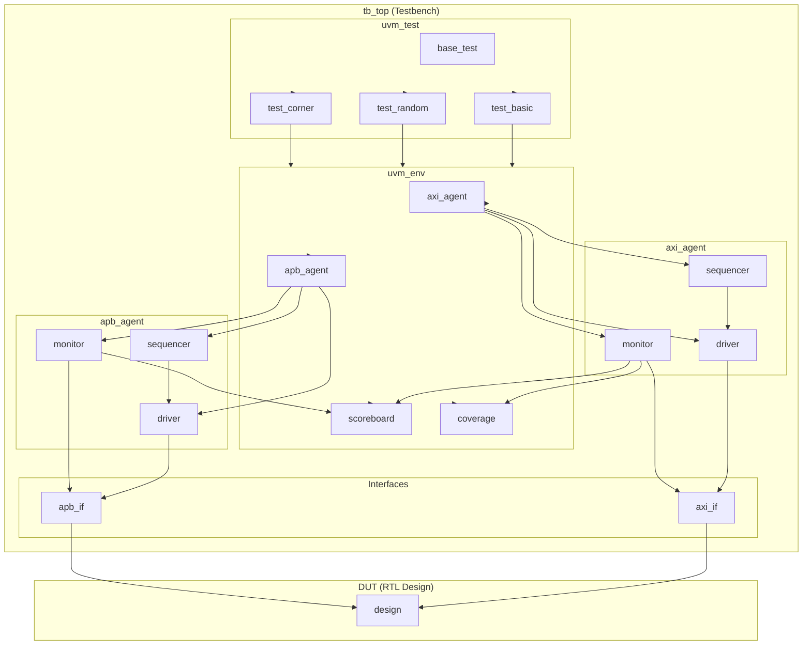
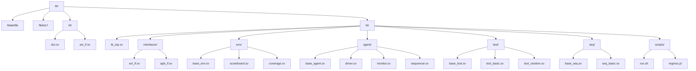

---
tags: [Environment, 鐜鎼缓, 宸ュ叿, 鏍稿績]
created: 2026-05-13
updated: 2026-06-02
---

# UVM 楠岃瘉鐜鎼缓

> 浠庨浂寮€濮嬫瀯寤哄畬鏁寸殑 UVM 楠岃瘉鐜

tags: #UVM #Environment #瀹炶返 #鏍稿績

## 楠岃瘉骞冲彴鏋舵瀯鍥?



## 鐩綍缁撴瀯



---

## 1. 椤跺眰妯″潡 (tb_top)

```verilog
`timescale 1ns/1ps
module tb_top;

    import uvm_pkg::*;
    `include "uvm_macros.svh"

    // 鏃堕挓鍜屽浣?
    bit clk;
    bit rst_n;

    // 鏃堕挓鐢熸垚
    initial begin
        clk = 0;
        forever #5 clk = ~clk;
    end

    // 澶嶄綅鐢熸垚
    initial begin
        rst_n = 0;
        #100;
        rst_n = 1;
    end

    // 鎺ュ彛瀹炰緥鍖?
    axi_if axi_intf(clk, rst_n);
    apb_if apb_intf(clk, rst_n);

    // DUT 瀹炰緥鍖?
    dut dut_inst (
        .clk(clk),
        .rst_n(rst_n),
        .axi_intf(axi_intf),
        .apb_intf(apb_intf)
    );

    // 閰嶇疆鏁版嵁搴撹缃?
    initial begin
        uvm_config_db#(virtual axi_if)::set(
            uvm_root::get(), "*", "axi_vif", axi_intf
        );
        uvm_config_db#(virtual apb_if)::set(
            uvm_root::get(), "*", "apb_vif", apb_intf
        );

        // 璁剧疆榛樿娴嬭瘯
        if ($value$plusargs("UVM_TESTNAME=%s", testname)) begin
            `uvm_info("TB", $sformatf("Running test: %s", testname), UVM_MEDIUM)
        end

        run_test();
    end

    // 娉㈠舰 Dump
    initial begin
        `ifdef DUMP_WAVEFORM
            $dumpfile("wave.vcd");
            $dumpvars(0, tb_top);
        `endif
    end

endmodule
```

---

## 2. 鎺ュ彛瀹氫箟 (interface)

```verilog
// axi_if.sv
interface axi_if (
    input bit clk,
    input bit rst_n
);

    // Write Address Channel
    logic [31:0]  awaddr;
    logic [7:0]    awlen;
    logic [2:0]    awsize;
    logic [1:0]    awburst;
    logic          awvalid;
    logic          awready;

    // Write Data Channel
    logic [31:0]  wdata;
    logic [3:0]   wstrb;
    logic         wlast;
    logic         wvalid;
    logic         wready;

    // Write Response Channel
    logic [1:0]   bresp;
    logic         bvalid;
    logic         bready;

    // Read Address Channel
    logic [31:0]  araddr;
    logic [7:0]   arlen;
    logic [2:0]   arsize;
    logic [1:0]   arburst;
    logic         arvalid;
    logic         arready;

    // Read Data Channel
    logic [31:0]  rdata;
    logic [1:0]   rresp;
    logic         rlast;
    logic         rvalid;
    logic         rready;

    // Protocol Checker (Optional)
    `ifdef AXI_PROTOCOL_CHECKER
        axi_protocol_checker checker (
            .clk(clk),
            .rst_n(rst_n),
            // ... signals
        );
    `endif

endinterface
```

---

## 3. 鐜缁勪欢 (base_env)

```verilog
class base_env extends uvm_env;

    `uvm_component_utils(base_env)

    // Agent
    axi_agent    m_axi_agent;
    apb_agent    m_apb_agent;

    // Scoreboard
    my_scoreboard m_sb;

    // Coverage
    my_coverage   m_cov;

    // Configuration
    env_config    m_cfg;

    function new(string name, uvm_component parent);
        super.new(name, parent);
    endfunction

    function void build_phase(uvm_phase phase);
        super.build_phase(phase);

        // 鑾峰彇閰嶇疆
        if (!uvm_config_db#(env_config)::get(this, "", "cfg", m_cfg))
            `uvm_fatal("NOCFG", "env_config not set")

        // 鍒涘缓缁勪欢
        m_axi_agent = axi_agent::type_id::create("m_axi_agent", this);
        m_apb_agent = apb_agent::type_id::create("m_apb_agent", this);
        m_sb        = my_scoreboard::type_id::create("m_sb", this);
        m_cov       = my_coverage::type_id::create("m_cov", this);
    endfunction

    function void connect_phase(uvm_phase phase);
        super.connect_phase(phase);

        // 杩炴帴 analysis ports
        m_axi_agent.monitor.ap.connect(m_sb.expected_export);
        m_axi_agent.monitor.ap.connect(m_cov.axi_cg);
        m_apb_agent.monitor.ap.connect(m_sb.actual_export);
    endfunction

    function void end_of_elaboration_phase(uvm_phase phase);
        super.end_of_elaboration_phase(phase);
        print_topology();
    endfunction

    function void report_phase(uvm_phase phase);
        super.report_phase(phase);
        `uvm_info("ENV", "Environment report", UVM_MEDIUM)
    endfunction

endclass
```

---

## 4. Agent 缁勪欢 (base_agent)

```verilog
class axi_agent extends uvm_agent;

    `uvm_component_utils(axi_agent)

    // Configuration
    uvm_active_passive_enum is_active;

    // Components
    axi_driver    m_driver;
    axi_monitor   m_monitor;
    axi_sequencer m_sequencer;

    // Port
    uvm_analysis_port#(axi_transaction) ap;

    function new(string name, uvm_component parent);
        super.new(name, parent);
    endfunction

    function void build_phase(uvm_phase phase);
        super.build_phase(phase);

        // 鑾峰彇閰嶇疆
        is_active = uvm_active_passive_enum'(
            uvm_config_db#(int)::get(this, "", "is_active", UVM_ACTIVE)
        );

        // 鍒涘缓 monitor锛堝缁堝垱寤猴級
        m_monitor = axi_monitor::type_id::create("m_monitor", this);
        ap = new("ap", this);

        // 鏍规嵁 is_active 鍒涘缓 driver/sequencer
        if (is_active == UVM_ACTIVE) begin
            m_driver    = axi_driver::type_id::create("m_driver", this);
            m_sequencer = axi_sequencer::type_id::create("m_sequencer", this);
        end
    endfunction

    function void connect_phase(uvm_phase phase);
        super.connect_phase(phase);

        // 杩炴帴 TLM ports
        if (is_active == UVM_ACTIVE) begin
            m_driver.seq_item_port.connect(m_sequencer.seq_item_export);
        end

        // 杩炴帴 monitor 鍒?agent port
        m_monitor.ap.connect(this.ap);
    endfunction

endclass
```

---

## 5. Driver 瀹炵幇

```verilog
class axi_driver extends uvm_driver#(axi_transaction);

    `uvm_component_utils(axi_driver)

    virtual axi_if vif;

    function new(string name, uvm_component parent);
        super.new(name, parent);
    endfunction

    function void build_phase(uvm_phase phase);
        super.build_phase(phase);
        if (!uvm_config_db#(virtual axi_if)::get(this, "", "vif", vif))
            `uvm_fatal("NOVIF", "vif must be set")
    endfunction

    task run_phase(uvm_phase phase);
        super.run_phase(phase);

        forever begin
            seq_item_port.get_next_item(req);
            drive_transaction(req);
            seq_item_port.item_done();
        end
    endtask

    virtual protected task drive_transaction(axi_transaction tr);
        `uvm_info("DRV", $sformatf("Driving: %s", tr.convert2string()), UVM_HIGH)

        if (tr.read_write == WRITE)
            drive_write(tr);
        else
            drive_read(tr);
    endtask

    virtual protected task drive_write(axi_transaction tr);
        // Drive AW channel
        @(posedge vif.clk);
        vif.awvalid <= 1'b1;
        vif.awaddr  <= tr.addr;
        vif.awlen   <= tr.len;
        vif.awsize  <= tr.size;
        vif.awburst <= tr.burst;

        wait(vif.awready);

        @(posedge vif.clk);
        vif.awvalid <= 1'b0;

        // Drive W channel
        foreach (tr.data[i]) begin
            @(posedge vif.clk);
            vif.wvalid <= 1'b1;
            vif.wdata  <= tr.data[i];
            vif.wstrb  <= 4'hF;
            vif.wlast  <= (i == tr.data.size() - 1);
        end

        @(posedge vif.clk);
        vif.wvalid <= 1'b0;

        // Wait for B channel
        wait(vif.bvalid);
        @(posedge vif.clk);
        tr.response = vif.bresp;
    endtask

endclass
```

---

## 6. Monitor 瀹炵幇

```verilog
class axi_monitor extends uvm_monitor;

    `uvm_component_utils(axi_monitor)

    uvm_analysis_port#(axi_transaction) ap;

    virtual axi_if vif;

    function new(string name, uvm_component parent);
        super.new(name, parent);
    endfunction

    function void build_phase(uvm_phase phase);
        super.build_phase(phase);
        ap = new("ap", this);
    endfunction

    task run_phase(uvm_phase phase);
        super.run_phase(phase);

        fork
            monitor_write_addr();
            monitor_write_data();
            monitor_write_resp();
            monitor_read_addr();
            monitor_read_data();
        join
    endtask

    task monitor_write_addr();
        axi_transaction tr;
        forever begin
            @(posedge vif.clk);
            if (vif.awvalid && vif.awready) begin
                tr = axi_transaction::type_id::create("tr");
                tr.read_write = WRITE;
                tr.addr = vif.awaddr;
                tr.len  = vif.awlen;
                tr.size = vif.awsize;
                tr.burst = vif.awburst;
            end
        end
    endtask

    task monitor_write_data();
        axi_transaction tr;
        forever begin
            @(posedge vif.clk);
            if (vif.wvalid && vif.wready) begin
                if (tr != null) begin
                    tr.data.push_back(vif.wdata);
                    if (vif.wlast) begin
                        `uvm_info("MON", $sformatf("Captured: %s", tr.convert2string()), UVM_HIGH)
                        ap.write(tr);
                    end
                end
            end
        end
    endtask

endclass
```

---

## 7. 娴嬭瘯鐢ㄤ緥 (base_test)

```verilog
class base_test extends uvm_test;

    `uvm_component_utils(base_test)

    base_env m_env;

    function new(string name, uvm_component parent);
        super.new(name, parent);
    endfunction

    function void build_phase(uvm_phase phase);
        super.build_phase(phase);

        // 鍒涘缓鐜
        m_env = base_env::type_id::create("m_env", this);

        // 閰嶇疆 agent 妯″紡
        uvm_config_db#(uvm_active_passive_enum)::set(
            this, "m_env.m_axi_agent", "is_active", UVM_ACTIVE
        );
        uvm_config_db#(uvm_active_passive_enum)::set(
            this, "m_env.m_apb_agent", "is_active", UVM_ACTIVE
        );

        // 閰嶇疆榛樿 sequence
        uvm_config_db#(uvm_object_wrapper)::set(
            this,
            "m_env.m_axi_agent.sequencer.main_phase",
            "default_sequence",
            axi_base_seq::get_type()
        );
    endfunction

    function void end_of_elaboration_phase(uvm_phase phase);
        super.end_of_elaboration_phase(phase);
        `uvm_info("TEST", "Test built successfully", UVM_MEDIUM)
        print_topology();
    endfunction

endclass
```

---

## 8. Makefile

```makefile
# ============== Configuration ==============
PROJECT     = axi_verification
TOP_MODULE  = tb_top
WORK_DIR    = work
COV_DIR     = coverage

XRUN_HOME   ?= /path/to/questa
UVM_HOME    ?= $(XRUN_HOME)/verif_src/uvm_1.2

# Test configuration
TEST        ?= base_test
SEED        ?= random
VERBOSITY   ?= UVM_MEDIUM

# ============== Targets ==============
.PHONY: all compile run clean regress debug

all: compile run

compile:
	@mkdir -p $(WORK_DIR) $(COV_DIR)
	xrun \
		-sv \
		-uvm \
		-uvmhome $(UVM_HOME) \
		-f filelist.f \
		-timescale 1ns/1ps \
		-coverage bcesft \
		-l compile.log

run: compile
	xrun \
		-R \
		-seed $(SEED) \
		+UVM_TESTNAME=$(TEST) \
		+UVM_VERBOSITY=$(VERBOSITY) \
		+UVM_OBJECTION_TRACE \
		-l sim.log

debug:
	xrun -sv -uvm -uvmhome $(UVM_HOME) -f filelist.f \
		-gui +UVM_TESTNAME=$(TEST)

# ============== Regression ==============
TESTS = base_test random_test corner_test stress_test

regress:
	@mkdir -p logs
	@for test in $(TESTS); do \
		$(MAKE) TEST=$$test run > logs/$$test.log 2>&1 || echo "FAILED: $$test"; \
	done

# ============== Coverage ==============
cov_merge:
	imc -merge -input "$(wildcard $(COV_DIR)/*.ucdb)" -out $(COV_DIR)/merged.ucdb

cov_report:
	imc -load $(COV_DIR)/merged.ucdb -html -execRep

# ============== Clean ==============
clean:
	rm -rf $(WORK_DIR) INCA_libs *.log *.wlf *.jou
	rm -rf $(COV_DIR)

cleanall: clean
	rm -rf transcripts wave.* *.vcd
```

---

## 9. filelist.f 鏍煎紡

```bash
# filelist.f

# Include directories
+incdir+./tb/interfaces
+incdir+./tb/env
+incdir+./tb/test

# Defines
+define+UVM_OBJECTION_TRACE
+define+DUMP_WAVEFORM

# RTL files
./rtl/dut.sv
./rtl/axi_slave.sv

# Interface files
./tb/interfaces/axi_if.sv
./tb/interfaces/apb_if.sv

# Environment
./tb/env/base_env.sv
./tb/env/scoreboard.sv
./tb/env/coverage.sv

# Agent
./tb/agent/base_agent.sv
./tb/agent/driver.sv
./tb/agent/monitor.sv
./tb/agent/sequencer.sv

# Testbench
./tb/test/base_test.sv
./tb/test/test_basic.sv

# Sequences
./tb/seq/base_seq.sv
./tb/seq/seq_basic.sv

# Top module
./tb/tb_top.sv
```

---

## 鐩稿叧閾炬帴

- [[02-UVM/00-鍏ラ棬|UVM 鍏ラ棬]] - UVM 鍏ラ棬
- [[01-Phase鏈哄埗]] - UVM Phase 鏈哄埗
- [[04-缁勪欢]] - UVM 缁勪欢
- [[00-xrun]] - xrun 浠跨湡鍣?
- [[00-imc]] - imc 瑕嗙洊鐜囧伐鍏?
- [[00-Makefile]] - Makefile 妯℃澘
- [[00-鎬荤储寮昡] - 杩斿洖鎬荤储寮?

---

*鍒涘缓鏃堕棿: 2026-04-17*
*鏇存柊鏃堕棿: 2026-04-17*

