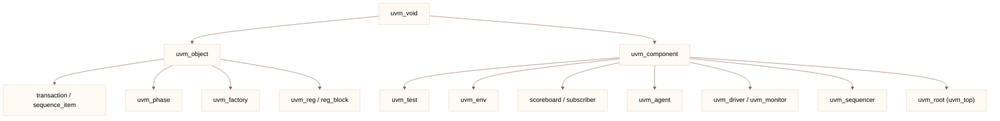

# 08-源代码研究

> [!abstract] 目标
> 不看文档、直接看 **Accellera UVM 开源库**搞懂：
> 启动链（run_test）、factory、phase、component 树、objection、config_db、sequence/sequencer。
>
> 适用版本：**UVM 1.2**（`uvm-1.2`）与 IEEE 1800.2 结构同源；差异在文件名/命名空间，思路可复用。

> [!info] 资料与源码位置
> - 官方发布：https://www.accellera.org/downloads/standards/uvm （`uvm-1.2.tar.gz`）
> - 解压后核心库：`uvm-1.2/src/`
> - 文档：`uvm-1.2/docs/pdf/UVM_Class_Reference.pdf` + `UVM_UserGuide_1.2.pdf`
> - 原系列导读（可选）：微信「IC验证者之家」08-源代码研究专辑

---

## 1. 源码包结构

```text
uvm-1.2/
├── src/                    ★ 全部类与宏
│   ├── uvm_pkg.sv          顶层 package
│   ├── base/               核心：factory、phase、objection、cmdline
│   ├── comps/              component、driver、monitor、scoreboard 等
│   ├── seq/                sequence、sequencer、seq_item
│   ├── regs/               RAL 寄存器模型
│   ├── tlm/                tlm_fifo、analysis、ports/exports
│   ├── macros/             `uvm_object_utils 等宏展开
│   └── dpi/                uvm_hdl_* 后门
├── examples/
├── docs/
└── Makefile / simulator 脚本
```

> [!tip] 看源码顺序
> `uvm_pkg.sv` → `base/uvm_globals.svh` / `uvm_version` → `base/uvm_factory` → `base/uvm_phase` → `base/uvm_component` → `base/uvm_root` → `seq/*` → `base/uvm_objection`。

---

## 2. 类层次（最重要的一张图）



| 基类 | 职责 | 必须实现 |
|------|------|----------|
| `uvm_object` | 数据、事务、配置 | `create` / `convert2string` |
| `uvm_component` | 层次、phase、config | 构造 + `uvm_component_utils` |
| `uvm_root` | 全局树根、run_test | 无（只读使用） |

---

## 3. 启动链：`run_test` 源码要点

文件：`base/uvm_root.svh`（及 `base/uvm_globals.svh` 中 `run_test()`）

```text
run_test()  全局函数
  └─ uvm_root::run_test(test_name)
        ├─ 若 test_name 为空，读 +UVM_TESTNAME=
        ├─ factory.create_object_by_type(... "uvm_test_top" 父为 null)
        │     默认创建 uvm_top 下的 test 实例（名字 uvm_test_top）
        ├─ uvm_root 是 uvm_component 树根
        └─ m_do_initial_run / phase 服务启动
```

> [!warning] 和 TB module 的关系
> `run_test()` 在 **module 的 initial** 里调用；它与 `tb_top` 并列，不谁实例化谁。
> 只有 DUT 在 module 里；UVM 树从 `uvm_top` 长出来。详见 [[02-UVM/11-run_test与TestBench启动]]。

### 典型调用

```systemverilog
module tb_top;
  dut_if intf();
  dut u_dut(.clk(intf.clk), ...);
  initial begin
    uvm_config_db#(virtual dut_if)::set(null, "uvm_test_top", "vif", intf);
    run_test("my_test"); // 或 +UVM_TESTNAME=my_test
  end
endmodule
```

---

## 4. Factory（`base/uvm_factory.svh`）

核心状态：

```text
m_type_names      type name → wrapper
m_types           uvm_object_wrapper*
m_type_overrides  类型覆盖链
m_inst_overrides  实例覆盖（路径正则）
```

### create 路径

```text
create_object_by_name / by_type
  → 查 inst override (full path)
  → 查 type override
  → wrapper.create_object / create_component
  → 若无 override，用注册的原始 wrapper
```

宏 `uvm_object_utils` / `uvm_component_utils` 把 `type_id::get_type()` 注册进 factory；`set_type_override_by_type` 只改 **后续 create**，不改已实例化对象。

详细笔记：[[02-UVM/09-factory机制]]

```systemverilog
// 源码级跟踪技巧
// 在 create 后打印
uvm_factory f = uvm_factory::get();
f.debug_create_by_type(my_driver::get_type(), "uvm_test_top.env.agent", "drv");
```

---

## 5. Component 树（`base/uvm_component.svh` + `uvm_root`）

```text
m_children  name → uvm_component
m_parent
m_name / full name 拼接：parent.get_full_name() + "." + name
```

| API | 源码行为 |
|-----|----------|
| `new(name, parent)` | 挂到 parent，查重名报 fatal |
| `get_full_name()` | 从根拼路径 |
| `get_child(name)` | `m_children` |
| `uvm_top` | 全局 `uvm_root` 单例 |

树上查找：`get_component` / `uvm_top.find("uvm_test_top.env.agent")`。

---

## 6. Phase（`base/uvm_phase.svh` 等）

```text
build_phase
  → connect_phase
  → end_of_elaboration_phase
  → start_of_simulation_phase
  → run_phase (task，与 reset/main/shutdown 等 runtime 并行)
  → extract / check / report / final
```

### objection（`base/uvm_objection.svh`）

```text
raise_objection(obj, description, count)
drop_objection(...)
当所有 count 归零 → 调用 phase 的 done → 进入下一 phase
```

| 陷阱 | 机制 |
|------|------|
| test 立刻结束 | 忘记 raise / 过早 drop |
| 永不结束 | 某 component 永不 drop |
| timeout | `run_test` 有 +UVM_TIMEOUT |

> [!tip] 读 phase 源码时关注
> `m_run_phase`、`phase_ready_to_end`、`m_phase_process`；runtime 子 phase 用 `phase.raise_objection`。

---

## 7. config_db（`base/uvm_config_db` + `base/uvm_misc` / `uvm_globals`）

实现要点：

```text
set(inst_name, field_name, value, cntx)
get(inst_name, field_name, ...)
内部是 m_rsc 字典：count 反向、路径 match（通配）
```

- `uvm_config_db#(virtual dut_if)` 是 `uvm_config_db` 的参数化包装
- `set` 优先级：**子路径更近的 set 覆盖更外层**
- `get` 时按 **完整路径** 查找，匹配顺序：精确 → 通配 → 上层

调试：

```systemverilog
uvm_config_db#(virtual dut_if)::dump(); // 某些版本有 dump 接口
// 或看 UVM 中间打印 + get 未命中 warning
```

---

## 8. Sequence 体系（`seq/`）

| 文件/类 | 作用 |
|---------|------|
| `uvm_sequence_item` | 继承 transaction，带 sequence/sequencer 回指 |
| `uvm_sequence` | `body()` 产生 item |
| `uvm_sequencer` | 仲裁、lock、fifo |
| `uvm_seq_item_pull_port` | driver 与 sequencer 通道 |

```text
seq.start(sqr)
  → start_item → wait_for_grant
  → finish_item → start_item/finish_item 之间 driver 用 seq_item_port.get_next_item
  → 响应 RSP：response_handler
```

优先级 / lock：`uvm_sequencer_arbitration`（源码 `m_select`、`lock_req`）。

---

## 9. TLM（`tlm/`）

| 类 | 用法 |
|----|------|
| `uvm_analysis_port/imp` | monitor 广播 |
| `uvm_tlm_fifo` | 缓冲 |
| `uvm_blocking_put/get_port` | 点对点 |
| `uvm_subscriber` | 写到覆盖组 |

注意 [[06-UVM-Template/14-analysis_imp多端口陷阱]]：多 port 连一个 imp 要 `uvm_analysis_imp_decl`。

---

## 10. RAL 源码入口（`regs/`）

```text
uvm_reg_block
uvm_reg / uvm_reg_field
uvm_reg_map
uvm_reg_predictor / uvm_reg_adapter
```

与 [[02-UVM/12-寄存器模型RAL]] 对应；读源码重点：`do_write/do_read`、`uvm_reg::predict`、`frontdoor/backdoor` 分派。

---

## 11. 推荐阅读路径（1–2 周）

| 阶段 | 读什么 | 目标 |
|------|--------|------|
| D1 | `uvm_pkg`、`uvm_globals`、`run_test` | 启动 |
| D2 | `uvm_factory` + 覆盖 | 多态创建 |
| D3 | `uvm_component` / `uvm_root` | 树与 full name |
| D4 | `uvm_phase` + `objection` | 何时换 phase |
| D5 | `uvm_driver` / `uvm_sequencer` / `uvm_sequence` | 激励链 |
| D6 | `uvm_config_db` | 配置 |
| D7 | `tlm` analysis + FIFO | 数据流 |
| D8 | `regs` | RAL |
| D9 | 用 `+UVM_VERBOSITY=UVM_DEBUG` 跑 example | 跟打印 |
| D10 | 自己改 factory / phase 写小实验 | 固化 |

---

## 12. 调试与验证源码理解

```bash
# 只编译 UVM + example（VCS）
vcs -sverilog -ntb_opts uvm-1.2 \
  $UVM_HOME/examples/simple/sequence/ex14/... \
  +UVM_TESTNAME=...
```

| 手段 | 说明 |
|------|------|
| `+UVM_VERBOSITY` | 打印层次、phase、factory |
| `uvm_top.print_topology()` | end_of_elaboration 后打印树 |
| `$display` + `breakpoint` | Verdi / DVE 断点 `uvm_root::run_test` |
| 改 `uvm_factory` 临时 log | 看 create 是否走 override |
| 单元试验 | 新建最小 env 看 objection 何时结束 |

```systemverilog
virtual function void end_of_elaboration_phase(uvm_phase phase);
  uvm_top.print_topology();
  uvm_factory::get().print();
endfunction
```

---

## 13. 常见误区

| 误区 | 正确理解 |
|------|----------|
| factory 能改已建对象 | 只影响 create |
| config_db 全局随便 set | 要用 **路径** 对准 |
| 所有 component 都在 test 下 | 树根是 `uvm_top`，test 是其子 |
| run_phase 必须 raise | 可以不 raise，但仿真立即结束 runtime |
| 源码要从头读到尾 | 按启动链读 20% 覆盖 80% |

---

## 14. 与本库其它篇的关系

- [[02-UVM/11-run_test与TestBench启动]] — 启动图与 module 边界
- [[02-UVM/09-factory机制]] — factory 专题
- [[02-UVM/10-uvm_component与uvm_root]] — 组件树
- [[02-UVM/01-Phase机制]] / [[02-UVM/12-寄存器模型RAL]]
- [[06-UVM-Template/00-总览]] — 用模板反推源码行为

---

*更新: 2026-09-27*
