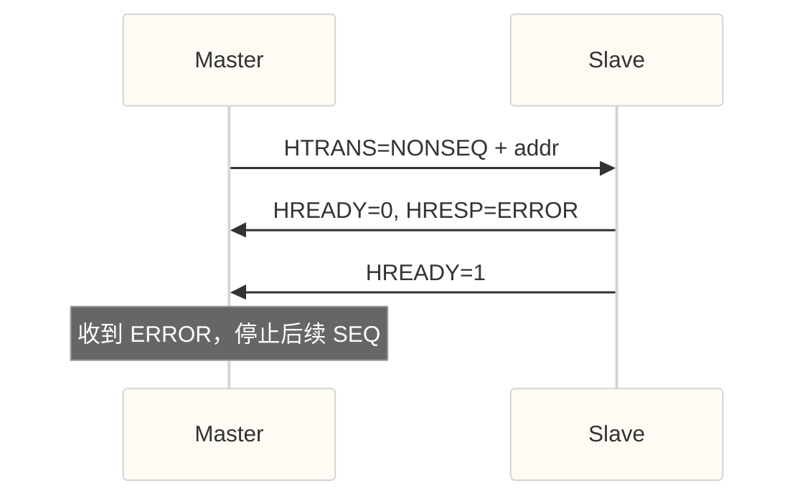

# 00-AHB 协议

> [!abstract] 概述
> Advanced High-performance Bus — AMBA 系列中高性能系统总线，常在 Cortex 本地总线与外设之间作骨干。
> 比 APB 快（流水、burst），比 AXI 简单（单通道地址/数据复用策略、2 个响应码变体）。

---

## 1. 与 APB / AXI 对比

| 特性 | APB | **AHB** | AXI |
|------|-----|---------|-----|
| 流水 | 无 | 有 | 有 |
| Burst | 无 | INCR4/8/16, WRAP | FIXED/INCR/WRAP |
| 通道 | 单 | 地址/数据 | 5 |
| 响应 | PREADY/PSLVERR | HRESP | BRESP/RRESP |
| 乱序 | 无 | 无（同拍序） | 有（ID） |
| 典型 | 低速外设 | CPU/高性能外设 | SoC 互联 |

---

## 2. 核心信号

### 时钟与复位

| 信号 | 方向 | 说明 |
|------|------|------|
| HCLK | — | 总线时钟 |
| HRESETn | 低有效复位 |

### 地址阶段

| 信号 | 说明 |
|------|------|
| HADDR | 地址 |
| HTRANS | IDLE/NONSEQ/SEQ/BUSY |
| HSIZE | 1/2/4/8… 字节 |
| HBURST | SINGLE/INCR/WRAP4/INCR4… |
| HWRITE | 0=读 1=写 |
| HPROT | 保护属性 |
| HMASTER / HMASTLOCK | 多主、锁定（AHB-Lite 简化） |

### 数据阶段

| 信号 | 说明 |
|------|------|
| HWDATA | 写数据（地址后一拍） |
| HRDATA | 读数据 |
| HREADY | 从设备等待（插入 wait） |
| HRESP | OKAY / ERROR / RETRY / SPLIT |

---

## 3. 传输类型 HTRANS

| 编码 | 名称 | 含义 |
|------|------|------|
| 00 | IDLE | 空闲 |
| 01 | BUSY | 主设备未准备好，burst 中插空 |
| 10 | NONSEQ | burst 第一拍 / 单笔 |
| 11 | SEQ | burst 后续拍 |

> [!tip] 地址/数据流水
> 本拍 **地址阶段** 对应 **下一拍数据阶段**。`HREADY=0` 时地址与数据一起 stall。

---

## 4. Burst 类型

| HBURST | 说明 | 地址 |
|--------|------|------|
| SINGLE | 单笔 | — |
| INCR | 未定义长度递增 | +size |
| WRAP4 | 4 拍回绕 | 4×size 边界 |
| INCR4 / INCR8 / INCR16 | 定长递增 | +size |
| WRAP8 / WRAP16 | 8/16 拍回绕 | 对齐边界 |

```text
INCR4: A0, A0+S, A0+2S, A0+3S
WRAP4 (起始 A0，边界 4S):
       若 A0=base+3S → base+3S, base, base+S, base+2S
```

---

## 5. 响应 HRESP

| 编码 | 名 | 说明 |
|------|----|------|
| 0 | OKAY | 成功 |
| 1 | ERROR | 从设备错误 |
| 2 | RETRY | 暂时不能服务，主设备应重发 |
| 3 | SPLIT | 从设备请求拆分（AHB-Arbiter） |

**ERROR 时序**：从设备可先给 `HREADY=0, HRESP=ERROR`（2 拍），再 `HREADY=1`。



---

## 6. 仲裁（AHB 多主）

- Arbiter：`HBUSREQx / HGRANTx / HLOCKx`
- 优先级 + 固定/轮转
- **HMASTLOCK** 锁定期间不能切换 master
- AHB-Lite 常简化为单主

---

## 7. 等待与延迟

从设备用 **HREADY** 插 wait state：

```text
addr phase (clk0) → slave 插 N 拍 HREADY=0 → HREADY=1 收数据
```

主设备在 burst 中可用 **HTRANS=BUSY** 表示「数据未就绪」。

---

## 8. 验证要点速查

| # | 检查 |
|---|------|
| H1 | IDLE/NONSEQ/SEQ/BUSY 合法迁移 |
| H2 | burst 地址序列（INCR/WRAP） |
| H3 | HREADY stall 时地址/数据保持 |
| H4 | ERROR 后 master 停止 SEQ |
| H5 | 4KB 不要求（AHB 可跨，看实现） |
| H6 | 大小传输（HSIZE）字节 lane |
| H7 | 多主仲裁与 HMASTLOCK |
| H8 | 复位后 HTRANS=IDLE |

```systemverilog
// 地址保持（stall）
property p_stable_addr;
  @(posedge hclk) disable iff (!hresetn)
  (!hready && htrans[1]) |=> $stable(haddr) && $stable(htrans);
endproperty
```

### 覆盖点

- HTRANS 四类
- HBURST 全集 × HSIZE
- HRESP 四种（尤其 ERROR/RETRY）
- wait 插入长度分布
- 多 master 切换（若有仲裁）

---

## 9. 与 APB 桥

```text
AHB ←→ APB Bridge
AHB NONSEQ/SEQ 转成 APB SETUP/ACCESS
HRESP ← PSLVERR 映射为 ERROR
```

常见 bug：**burst 到 APB** 被错误合并/拆分、READY 握手不匹配。

---

## 相关

- [[03-Protocol/APB/00-APB]]
- [[03-Protocol/AXI/00-AXI]]
- [[03-Protocol/10-握手协议]]
- [[03-Protocol/AXI/02-AXI验证要点]]

---

*更新: 2026-09-27*
