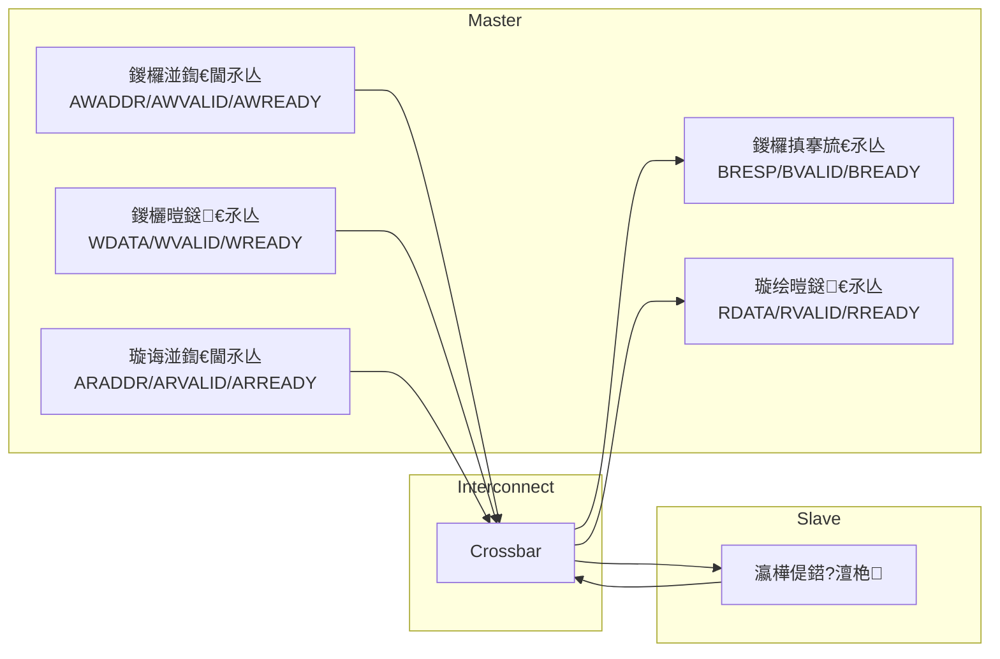
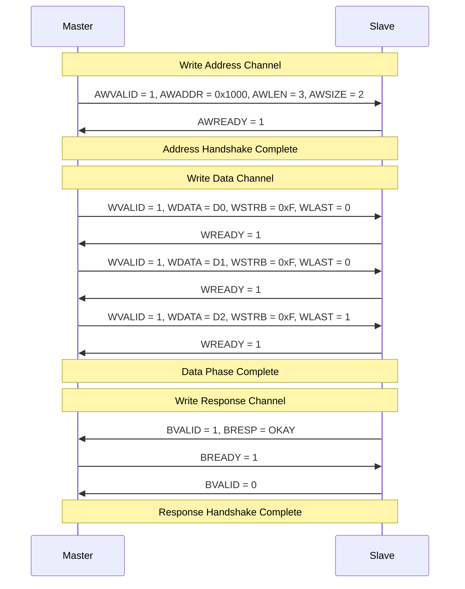
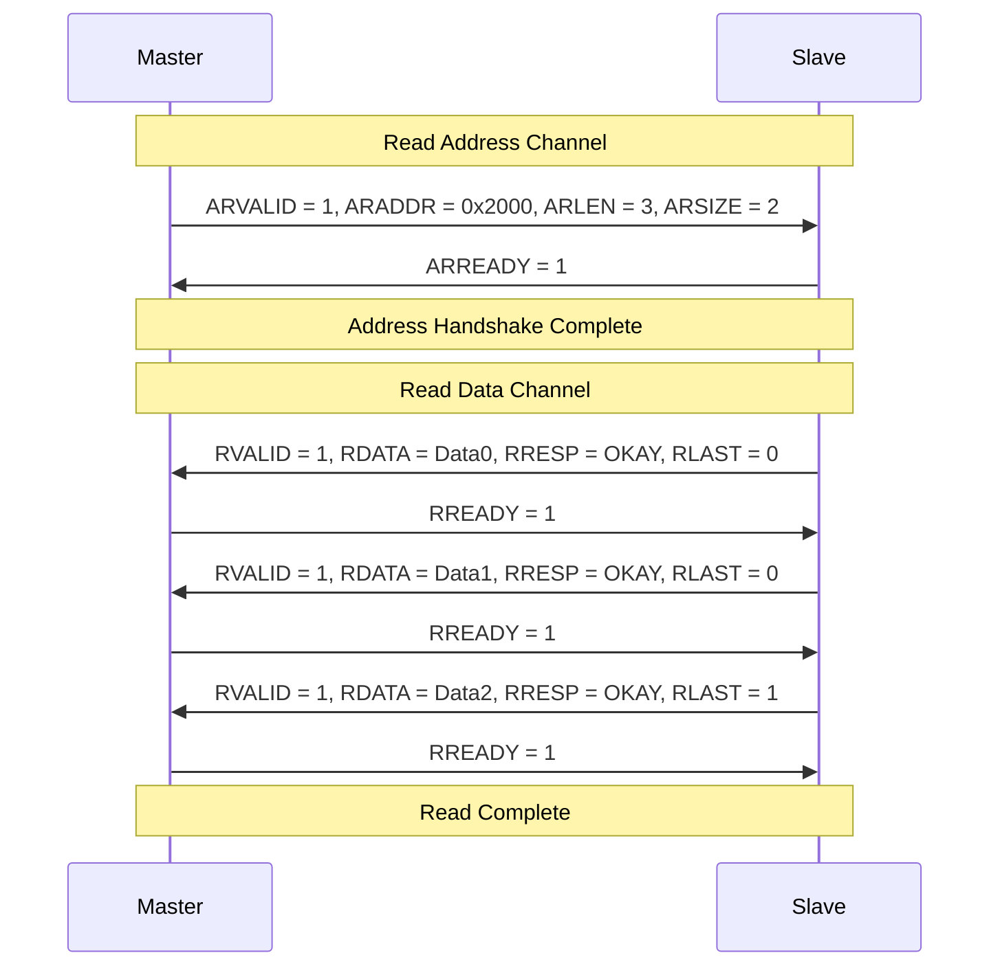
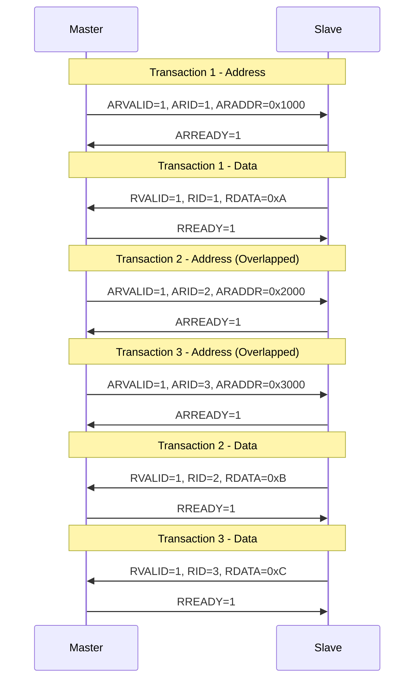
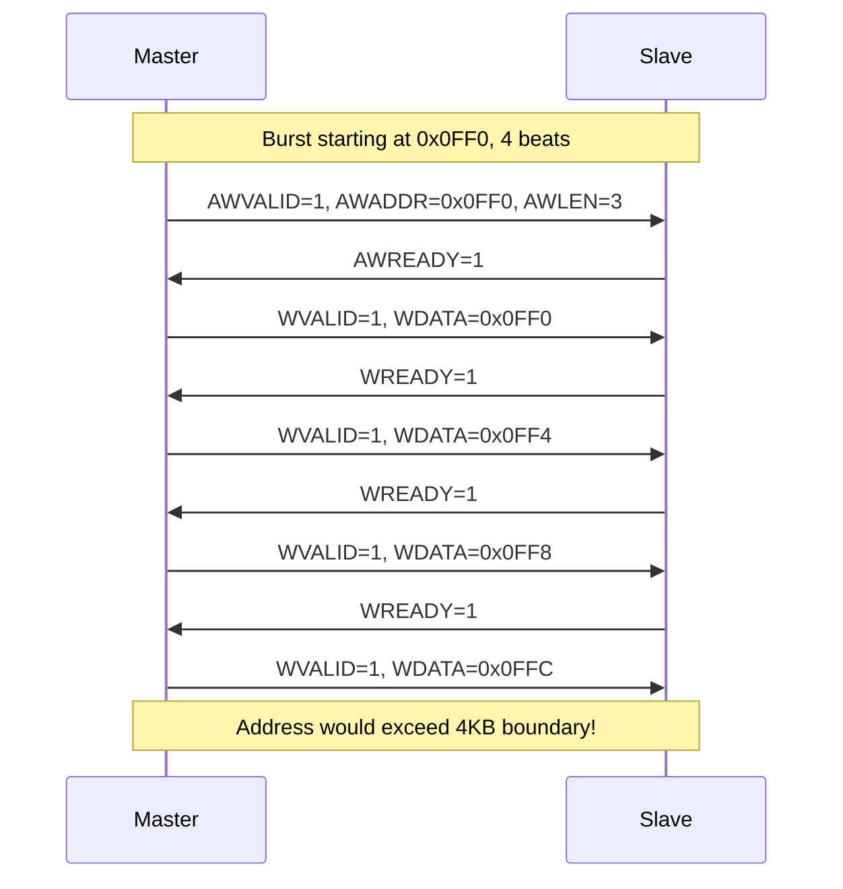

---
tags: [Protocol, AXI, AMBA, 鏍稿績]
created: 2026-04-17
updated: 2026-04-17
---

# AXI 鍗忚

> [!abstract] 姒傝堪
> Advanced eXtensible Interface 鈥?AMBA 4.0 楂樻€ц兘鎬荤嚎锛屽箍娉涘簲鐢ㄤ簬 SoC 涓鐞嗗櫒銆丏MA銆佸璁句箣闂寸殑楂橀€熸暟鎹紶杈撱€?
---

## 鍗忚姒傝堪

> [!tip] 鏍稿績鐗规€?> - 鐙珛鐨勫湴鍧€/鎺у埗鍜屾暟鎹€氶亾
> - 鏀寔闈炲榻愭暟鎹紶杈?> - 鏀寔绐佸彂浼犺緭
> - 鐙珛鐨勮鍐欐暟鎹€氶亾
> - 鏀寔涔卞簭浼犺緭
> - 鏄撲簬娣诲姞瀵勫瓨鍣ㄧ骇娴佹按绾?
### AXI 閫氶亾鏋舵瀯



---

## 淇″彿瀹氫箟

### 鍏ㄥ眬淇″彿

| 淇″彿 | 鏂瑰悜 | 璇存槑 |
|------|------|------|
| ACLK | Input | 鏃堕挓锛屾墍鏈変俊鍙峰湪鏃堕挓涓婂崌娌块噰鏍?|
| ARESETn | Input | 澶嶄綅锛堜綆鏈夋晥锛?|

### 鍐欏湴鍧€閫氶亾 (Write Address Channel)

| 淇″彿 | 浣嶅 | 璇存槑 |
|------|------|------|
| AWID | 4-12bit | 浜嬪姟鏍囪瘑绗︼紝鐢ㄤ簬鍖归厤鍝嶅簲 |
| AWADDR | 32/64bit | 鍐欒捣濮嬪湴鍧€ |
| AWLEN | 8bit | 绐佸彂闀垮害 (0-255) |
| AWSIZE | 3bit | 绐佸彂澶у皬 (瀛楄妭鏁? |
| AWBURST | 2bit | 绐佸彂绫诲瀷 |
| AWVALID | 1bit | 鍦板潃鏈夋晥鎸囩ず |
| AWREADY | 1bit | 浠庢満灏辩华鎺ユ敹 |
| AWQOS | 4bit | QoS 鏍囪瘑绗?|
| AWREGION | 4bit | 鍖哄煙鏍囪瘑绗?|
| AWLOCK | 1bit | 閿佷俊鍙?(AXI3) |
| AWCACHE | 4bit | 缂撳瓨绫诲瀷 |
| AWPROT | 3bit | 淇濇姢绫诲瀷 |

### 鍐欐暟鎹€氶亾 (Write Data Channel)

| 淇″彿 | 浣嶅 | 璇存槑 |
|------|------|------|
| WID | 4-12bit | 鏁版嵁鏍囪瘑绗?(AXI3) |
| WDATA | 32/64/128/256/512bit | 鍐欐暟鎹?|
| WSTRB | WDATA/8 bit | 瀛楄妭浣胯兘 |
| WLAST | 1bit | 绐佸彂鏈€鍚庝竴涓暟鎹?|
| WVALID | 1bit | 鏁版嵁鏈夋晥鎸囩ず |
| WREADY | 1bit | 浠庢満灏辩华鎺ユ敹 |

### 鍐欏搷搴旈€氶亾 (Write Response Channel)

| 淇″彿 | 浣嶅 | 璇存槑 |
|------|------|------|
| BID | 4-12bit | 鍝嶅簲鏍囪瘑绗?|
| BRESP | 2bit | 鍐欏搷搴?|
| BVALID | 1bit | 鍝嶅簲鏈夋晥鎸囩ず |
| BREADY | 1bit | 涓绘満灏辩华鎺ユ敹 |

### 璇诲湴鍧€閫氶亾 (Read Address Channel)

| 淇″彿 | 浣嶅 | 璇存槑 |
|------|------|------|
| ARID | 4-12bit | 璇讳簨鍔℃爣璇嗙 |
| ARADDR | 32/64bit | 璇昏捣濮嬪湴鍧€ |
| ARLEN | 8bit | 绐佸彂闀垮害 |
| ARSIZE | 3bit | 绐佸彂澶у皬 |
| ARBURST | 2bit | 绐佸彂绫诲瀷 |
| ARVALID | 1bit | 鍦板潃鏈夋晥鎸囩ず |
| ARREADY | 1bit | 浠庢満灏辩华 |

### 璇绘暟鎹€氶亾 (Read Data Channel)

| 淇″彿 | 浣嶅 | 璇存槑 |
|------|------|------|
| RID | 4-12bit | 璇绘暟鎹爣璇嗙 |
| RDATA | 32/64/128/256/512bit | 璇绘暟鎹?|
| RRESP | 2bit | 璇诲搷搴?|
| RLAST | 1bit | 绐佸彂鏈€鍚庝竴涓暟鎹?|
| RVALID | 1bit | 鏁版嵁鏈夋晥鎸囩ず |
| RREADY | 1bit | 涓绘満灏辩华鎺ユ敹 |

---

## 绐佸彂绫诲瀷

| AWBURST | 绫诲瀷 | 璇存槑 | 鍦板潃璁＄畻 |
|----------|------|------|----------|
| 2'b00 | FIXED | 鍥哄畾鍦板潃锛屾墍鏈変紶杈撲娇鐢ㄥ悓涓€鍦板潃 | addr = start_addr |
| 2'b01 | INCR | 閫掑鍦板潃锛屾瘡鎷嶅湴鍧€閫掑 | addr = start_addr + Burst_length 脳 Size |
| 2'b10 | WRAP | 鍥炵幆绐佸彂锛岃秴鐣屽悗鍥炵粫 | addr = start_addr + Burst_length 脳 Size (鍥炵粫) |

### 绐佸彂闀垮害绾︽潫

| 绐佸彂绫诲瀷 | 闀垮害鑼冨洿 | AXI3 | AXI4 |
|----------|----------|------|------|
| INCR | 1-256 | 1-16 | 1-256 |
| WRAP | 2/4/8/16 | 2-16 | 2-16 |
| FIXED | 2-16 | 2-16 | 2-16 |

---

## 鏃跺簭鍥?
### 鍐欐搷浣滄椂搴?


### 璇绘搷浣滄椂搴?


### OUTSTANDING 璇绘搷浣?(3 Outstanding)



### 绐佸彂杈圭晫 (4KB Boundary)



---

## 鍝嶅簲鐮?
| BRESP/RRESP | 鍊?| 璇存槑 |
|-------------|-----|------|
| OKAY | 2'b00 | 姝ｅ父璁块棶鎴愬姛 |
| EXOKAY | 2'b01 | 鐙崰璁块棶鎴愬姛 |
| SLVERR | 2'b10 | 浠庢満閿欒 |
| DECERR | 2'b11 | 瑙ｇ爜閿欒 |

---

## 甯哥敤浠ｇ爜

### UVM Transaction 瀹氫箟

```verilog
class axi_transaction extends uvm_sequence_item;
    typedef enum {READ, WRITE} rw_e;
    typedef enum {OKAY, EXOKAY, SLVERR, DECERR} resp_e;

    rand rw_e      read_write;
    rand bit [31:0] addr;
    rand bit [7:0]  len;        // AXI4: 0-255
    rand bit [2:0] size;       // 0=1B, 1=2B, 2=4B, 3=8B
    rand bit [1:0]  burst;      // 00=FIXED, 01=INCR, 10=WRAP
    rand bit [3:0]  cache;
    rand bit [2:0]  prot;
    rand bit [31:0] data[];
    rand bit [3:0]  strb;

    bit [11:0] id;
    resp_e     response;

    `uvm_object_utils_begin(axi_transaction)
        `uvm_field_enum(rw_e, read_write, UVM_ALL_ON)
        `uvm_field_int(addr, UVM_ALL_ON)
        `uvm_field_int(len, UVM_ALL_ON)
        `uvm_field_int(size, UVM_ALL_ON)
        `uvm_field_int(burst, UVM_ALL_ON)
        `uvm_field_int(id, UVM_ALL_ON)
    `uvm_object_utils_end

    function new(string name = "axi_transaction");
        super.new(name);
    endfunction

    function void post_randomize();
        data = new[len + 1];
        foreach(data[i]) data[i] = $random();
    endfunction

    function string convert2string();
        return $sformatf("AXI %s: addr=0x%h, len=%0d, id=%0d",
            read_write.name(), addr, len, id);
    endfunction
endclass
```

### Driver 椹卞姩妯℃澘

```verilog
class axi_driver extends uvm_driver#(axi_transaction);
    `uvm_component_utils(axi_driver)

    virtual axi_if vif;

    function new(string name, uvm_component parent);
        super.new(name, parent);
    endfunction

    function void build_phase(uvm_phase phase);
        super.build_phase(phase);
        if (!uvm_config_db#(virtual axi_if)::get(this, "", "vif", vif))
            `uvm_fatal("NOVIF", "virtual interface must be set")
    endfunction

    task run_phase(uvm_phase phase);
        forever begin
            seq_item_port.get_next_item(req);
            if (req.read_write == WRITE)
                drive_write(req);
            else
                drive_read(req);
            seq_item_port.item_done();
        end
    endtask

    virtual protected task drive_write(axi_transaction req);
        @(posedge vif.clk);
        vif.awvalid <= 1'b1;
        vif.awaddr  <= req.addr;
        vif.awlen   <= req.len;
        vif.awsize  <= req.size;
        vif.awburst <= req.burst;
        vif.awid    <= req.id;

        wait(vif.awready);

        foreach (req.data[i]) begin
            @(posedge vif.clk);
            vif.wvalid <= 1'b1;
            vif.wdata  <= req.data[i];
            vif.wstrb  <= 4'hF;
            vif.wlast  <= (i == req.data.size() - 1);
        end

        @(posedge vif.clk);
        vif.awvalid <= 1'b0;
        vif.wvalid  <= 1'b0;

        wait(vif.bvalid);
        @(posedge vif.bclk);
        req.response = vif.bresp;
    endtask
endclass
```

### Monitor 鐩戞祴妯℃澘

```verilog
class axi_monitor extends uvm_monitor;
    `uvm_component_utils(axi_monitor)

    uvm_analysis_port#(axi_transaction) ap;

    virtual axi_if vif;

    function new(string name, uvm_component parent);
        super.new(name, parent);
    endfunction

    function void build_phase(uvm_phase phase);
        super.build_phase(phase);
        ap = new("ap", this);
    endfunction

    task run_phase(uvm_phase phase);
        fork
            monitor_write_addr();
            monitor_write_data();
            monitor_write_resp();
            monitor_read_addr();
            monitor_read_data();
        join
    endtask

    task monitor_write_addr();
        axi_transaction tr;
        forever begin
            @(posedge vif.clk);
            if (vif.awvalid && vif.awready) begin
                tr = axi_transaction::type_id::create("tr");
                tr.read_write = WRITE;
                tr.addr = vif.awaddr;
                tr.len  = vif.awlen;
                tr.size = vif.awsize;
                tr.burst = vif.awburst;
                tr.id   = vif.awid;
            end
        end
    endtask
endclass
```

---

## 甯歌闂

> [!warning] 璁捐闄烽槺
> AXI 澶氶€氶亾骞惰鐗规€у鏄撳鑷磋璁￠棶棰橈紝浠ヤ笅鏄父瑙佸潙鐐瑰拰瑙ｅ喅鏂规銆?
### 1. 姝婚攣闂

```verilog
// 鉂?閿欒锛氬悓鏃朵緷璧栧涓€氶亾灏辩华
always @(posedge clk) begin
    if (awvalid && awready && wvalid && wready)
        state <= next_state;
end

// 鉁?姝ｇ‘锛氬垎姝ユ彙鎵?always @(posedge clk) begin
    if (awvalid && awready)
        addr_phase_done <= 1'b1;
    if (wvalid && wready && wlast)
        data_phase_done <= 1'b1;
end
```

### 2. 甯﹀鍒╃敤鐜囦紭鍖?
```verilog
// 鎻愰珮甯﹀鐨勬柟娉?constraint burst_len {
    len inside {[8:16]};  // 杈冨ぇ鐨勭獊鍙戦暱搴?}

// 浣跨敤 OUTSTANDING
class axi_sequencer extends uvm_sequencer#(axi_transaction);
    // 閰嶇疆 outstanding 鏁伴噺
endclass
```

### 3. 4KB 杈圭晫妫€鏌?
```verilog
function bit check_4kb_boundary(bit [31:0] addr, bit [7:0] len, bit [2:0] size);
    int bytes_per_beat = 1 << size;
    int total_bytes = (len + 1) * bytes_per_beat;
    int aligned_addr = addr & ~32'hFFF;  // 4KB aligned
    return ((addr + total_bytes) & ~32'hFFF) != aligned_addr;
endfunction
```

---

## 鐩稿叧閾炬帴

- [[03-Protocol/00-鍗忚绱㈠紩|鍗忚绱㈠紩]] - 杩斿洖鍗忚绱㈠紩
- [[03-Protocol/APB/00-APB|APB]] - APB 鍗忚
- [[03-Protocol/I2C/00-I2C|I2C]] - I2C 鍗忚
- [[03-Protocol/SPI/00-SPI|SPI]] - SPI 鍗忚
- [[07-Projects/02-AXI楠岃瘉/00-椤圭洰姒傝堪|AXI 楠岃瘉椤圭洰]] - AXI 楠岃瘉瀹炴垬椤圭洰
- [[02-UVM/00-鍏ラ棬|UVM 鍏ラ棬]] - UVM 楠岃瘉鏂规硶瀛?- [[00-鎬荤储寮昡] - 杩斿洖鎬荤储寮?
---

*鍒涘缓鏃堕棿: 2026-04-17*
*鏇存柊鏃堕棿: 2026-04-17*

