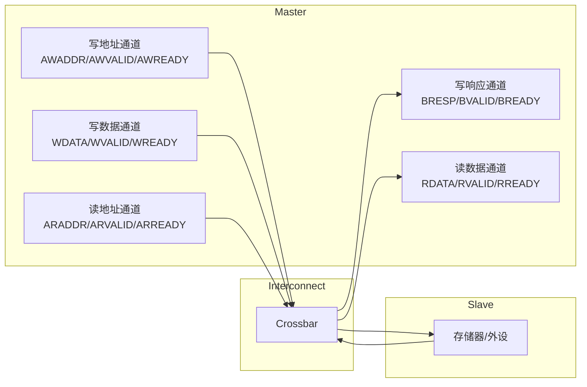
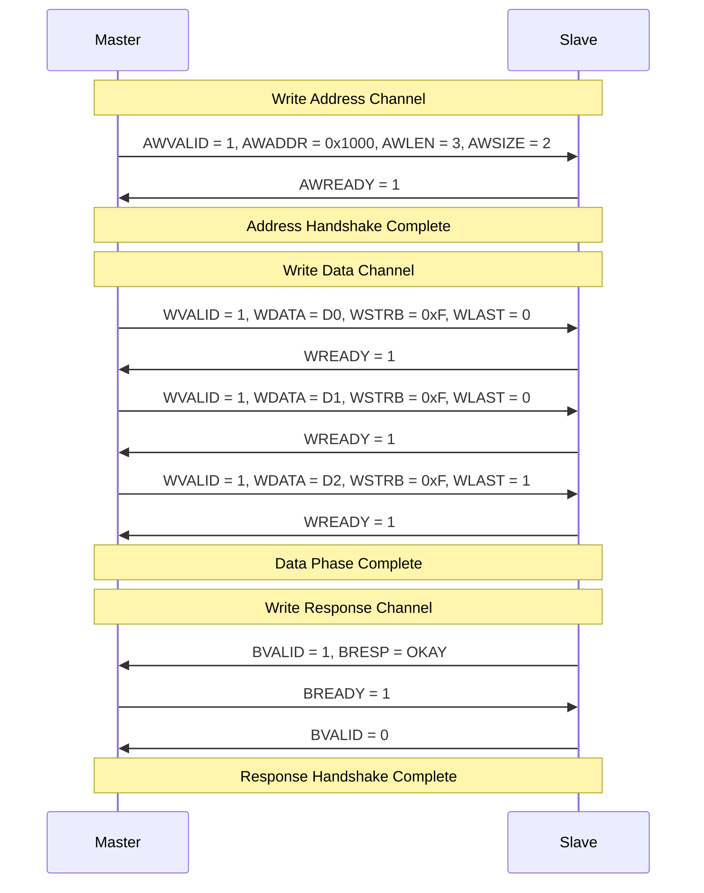
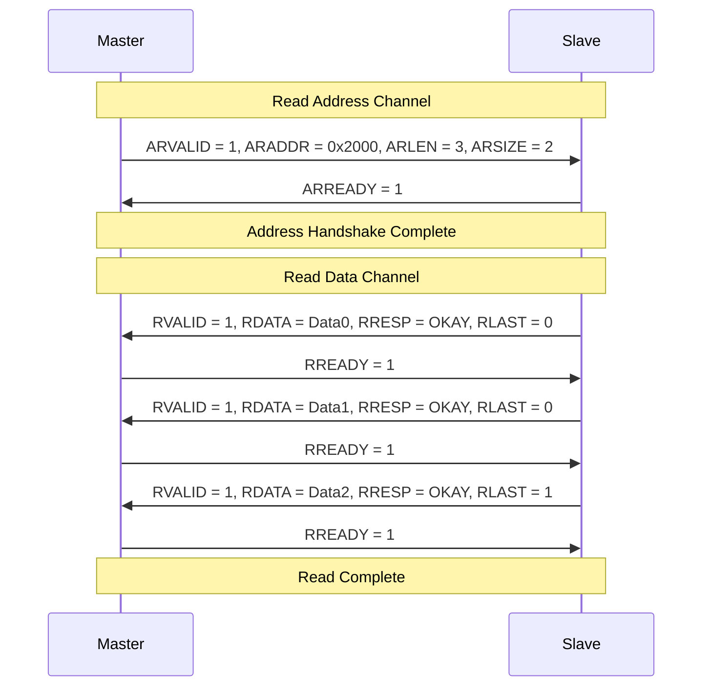
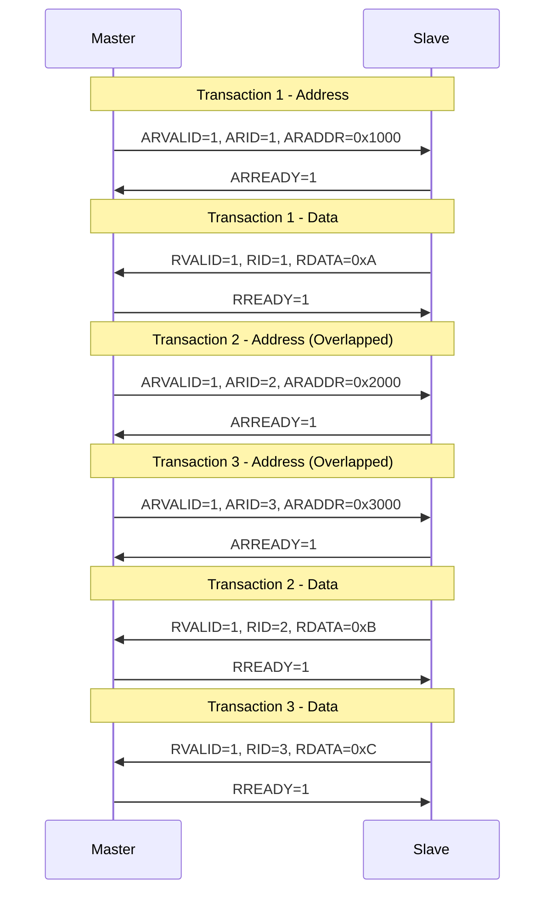
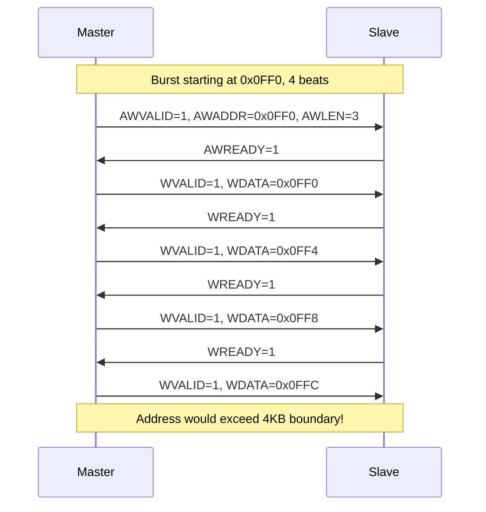

# AXI 协议

> [!abstract] 概述
> Advanced eXtensible Interface — AMBA 4.0 高性能总线，广泛应用于 SoC 中处理器、DMA、外设之间的高速数据传输。

---

## 协议概述

> [!tip] 核心特性
> - 独立的地址/控制和数据通道
> - 支持非对齐数据传输
> - 支持突发传输
> - 独立的读写数据通道
> - 支持乱序传输
> - 易于添加寄存器级流水线

### AXI 通道架构



---

## 信号定义

### 全局信号

| 信号 | 方向 | 说明 |
|------|------|------|
| ACLK | Input | 时钟，所有信号在时钟上升沿采样 |
| ARESETn | Input | 复位（低有效） |

### 写地址通道 (Write Address Channel)

| 信号 | 位宽 | 说明 |
|------|------|------|
| AWID | 4-12bit | 事务标识符，用于匹配响应 |
| AWADDR | 32/64bit | 写起始地址 |
| AWLEN | 8bit | 突发长度 (0-255) |
| AWSIZE | 3bit | 突发大小 (字节数) |
| AWBURST | 2bit | 突发类型 |
| AWVALID | 1bit | 地址有效指示 |
| AWREADY | 1bit | 从机就绪接收 |
| AWQOS | 4bit | QoS 标识符 |
| AWREGION | 4bit | 区域标识符 |
| AWLOCK | 1bit | 锁信号 (AXI3) |
| AWCACHE | 4bit | 缓存类型 |
| AWPROT | 3bit | 保护类型 |

### 写数据通道 (Write Data Channel)

| 信号 | 位宽 | 说明 |
|------|------|------|
| WID | 4-12bit | 数据标识符 (AXI3) |
| WDATA | 32/64/128/256/512bit | 写数据 |
| WSTRB | WDATA/8 bit | 字节使能 |
| WLAST | 1bit | 突发最后一个数据 |
| WVALID | 1bit | 数据有效指示 |
| WREADY | 1bit | 从机就绪接收 |

### 写响应通道 (Write Response Channel)

| 信号 | 位宽 | 说明 |
|------|------|------|
| BID | 4-12bit | 响应标识符 |
| BRESP | 2bit | 写响应 |
| BVALID | 1bit | 响应有效指示 |
| BREADY | 1bit | 主机就绪接收 |

### 读地址通道 (Read Address Channel)

| 信号 | 位宽 | 说明 |
|------|------|------|
| ARID | 4-12bit | 读事务标识符 |
| ARADDR | 32/64bit | 读起始地址 |
| ARLEN | 8bit | 突发长度 |
| ARSIZE | 3bit | 突发大小 |
| ARBURST | 2bit | 突发类型 |
| ARVALID | 1bit | 地址有效指示 |
| ARREADY | 1bit | 从机就绪 |

### 读数据通道 (Read Data Channel)

| 信号 | 位宽 | 说明 |
|------|------|------|
| RID | 4-12bit | 读数据标识符 |
| RDATA | 32/64/128/256/512bit | 读数据 |
| RRESP | 2bit | 读响应 |
| RLAST | 1bit | 突发最后一个数据 |
| RVALID | 1bit | 数据有效指示 |
| RREADY | 1bit | 主机就绪接收 |

---

## 突发类型

| AWBURST | 类型 | 说明 | 地址计算 |
|----------|------|------|----------|
| 2'b00 | FIXED | 固定地址，所有传输使用同一地址 | addr = start_addr |
| 2'b01 | INCR | 递增地址，每拍地址递增 | addr = start_addr + Burst_length × Size |
| 2'b10 | WRAP | 回环突发，超界后回绕 | addr = start_addr + Burst_length × Size (回绕) |

### 突发长度约束

| 突发类型 | 长度范围 | AXI3 | AXI4 |
|----------|----------|------|------|
| INCR | 1-256 | 1-16 | 1-256 |
| WRAP | 2/4/8/16 | 2-16 | 2-16 |
| FIXED | 2-16 | 2-16 | 2-16 |

---

## 时序图

### 写操作时序



### 读操作时序



### OUTSTANDING 读操作 (3 Outstanding)



### 突发边界 (4KB Boundary)



---

## 响应码

| BRESP/RRESP | 值 | 说明 |
|-------------|-----|------|
| OKAY | 2'b00 | 正常访问成功 |
| EXOKAY | 2'b01 | 独占访问成功 |
| SLVERR | 2'b10 | 从机错误 |
| DECERR | 2'b11 | 解码错误 |

---

## 常用代码

### UVM Transaction 定义

```systemverilog
class axi_transaction extends uvm_sequence_item;
    typedef enum {READ, WRITE} rw_e;
    typedef enum {OKAY, EXOKAY, SLVERR, DECERR} resp_e;

    rand rw_e      read_write;
    rand bit [31:0] addr;
    rand bit [7:0]  len;        // AXI4: 0-255
    rand bit [2:0] size;       // 0=1B, 1=2B, 2=4B, 3=8B
    rand bit [1:0]  burst;      // 00=FIXED, 01=INCR, 10=WRAP
    rand bit [3:0]  cache;
    rand bit [2:0]  prot;
    rand bit [31:0] data[];
    rand bit [3:0]  strb;

    bit [11:0] id;
    resp_e     response;

    `uvm_object_utils_begin(axi_transaction)
        `uvm_field_enum(rw_e, read_write, UVM_ALL_ON)
        `uvm_field_int(addr, UVM_ALL_ON)
        `uvm_field_int(len, UVM_ALL_ON)
        `uvm_field_int(size, UVM_ALL_ON)
        `uvm_field_int(burst, UVM_ALL_ON)
        `uvm_field_int(id, UVM_ALL_ON)
    `uvm_object_utils_end

    function new(string name = "axi_transaction");
        super.new(name);
    endfunction

    function void post_randomize();
        data = new[len + 1];
        foreach(data[i]) data[i] = $random();
    endfunction

    function string convert2string();
        return $sformatf("AXI %s: addr=0x%h, len=%0d, id=%0d",
            read_write.name(), addr, len, id);
    endfunction
endclass
```

### Driver 驱动模板

```systemverilog
class axi_driver extends uvm_driver#(axi_transaction);
    `uvm_component_utils(axi_driver)

    virtual axi_if vif;

    function new(string name, uvm_component parent);
        super.new(name, parent);
    endfunction

    function void build_phase(uvm_phase phase);
        super.build_phase(phase);
        if (!uvm_config_db#(virtual axi_if)::get(this, "", "vif", vif))
            `uvm_fatal("NOVIF", "virtual interface must be set")
    endfunction

    task run_phase(uvm_phase phase);
        forever begin
            seq_item_port.get_next_item(req);
            if (req.read_write == WRITE)
                drive_write(req);
            else
                drive_read(req);
            seq_item_port.item_done();
        end
    endtask

    virtual protected task drive_write(axi_transaction req);
        @(posedge vif.clk);
        vif.awvalid <= 1'b1;
        vif.awaddr  <= req.addr;
        vif.awlen   <= req.len;
        vif.awsize  <= req.size;
        vif.awburst <= req.burst;
        vif.awid    <= req.id;

        wait(vif.awready);

        foreach (req.data[i]) begin
            @(posedge vif.clk);
            vif.wvalid <= 1'b1;
            vif.wdata  <= req.data[i];
            vif.wstrb  <= 4'hF;
            vif.wlast  <= (i == req.data.size() - 1);
        end

        @(posedge vif.clk);
        vif.awvalid <= 1'b0;
        vif.wvalid  <= 1'b0;

        wait(vif.bvalid);
        @(posedge vif.bclk);
        req.response = vif.bresp;
    endtask
endclass
```

### Monitor 监测模板

```systemverilog
class axi_monitor extends uvm_monitor;
    `uvm_component_utils(axi_monitor)

    uvm_analysis_port#(axi_transaction) ap;

    virtual axi_if vif;

    function new(string name, uvm_component parent);
        super.new(name, parent);
    endfunction

    function void build_phase(uvm_phase phase);
        super.build_phase(phase);
        ap = new("ap", this);
    endfunction

    task run_phase(uvm_phase phase);
        fork
            monitor_write_addr();
            monitor_write_data();
            monitor_write_resp();
            monitor_read_addr();
            monitor_read_data();
        join
    endtask

    task monitor_write_addr();
        axi_transaction tr;
        forever begin
            @(posedge vif.clk);
            if (vif.awvalid && vif.awready) begin
                tr = axi_transaction::type_id::create("tr");
                tr.read_write = WRITE;
                tr.addr = vif.awaddr;
                tr.len  = vif.awlen;
                tr.size = vif.awsize;
                tr.burst = vif.awburst;
                tr.id   = vif.awid;
            end
        end
    endtask
endclass
```

---

## 常见问题

> [!warning] 设计陷阱
> AXI 多通道并行特性容易导致设计问题，以下是常见坑点和解决方案。

### 1. 死锁问题

```systemverilog
// ❌ 错误：同时依赖多个通道就绪
always @(posedge clk) begin
    if (awvalid && awready && wvalid && wready)
        state <= next_state;
end

// ✅ 正确：分步握手
always @(posedge clk) begin
    if (awvalid && awready)
        addr_phase_done <= 1'b1;
    if (wvalid && wready && wlast)
        data_phase_done <= 1'b1;
end
```

### 2. 带宽利用率优化

```systemverilog
// 提高带宽的方法
constraint burst_len {
    len inside {[8:16]};  // 较大的突发长度
}

// 使用 OUTSTANDING
class axi_sequencer extends uvm_sequencer#(axi_transaction);
    // 配置 outstanding 数量
endclass
```

### 3. 4KB 边界检查

```systemverilog
function bit check_4kb_boundary(bit [31:0] addr, bit [7:0] len, bit [2:0] size);
    int bytes_per_beat = 1 << size;
    int total_bytes = (len + 1) * bytes_per_beat;
    int aligned_addr = addr & ~32'hFFF;  // 4KB aligned
    return ((addr + total_bytes) & ~32'hFFF) != aligned_addr;
endfunction
```

---

## 相关链接

- [[03-Protocol/00-协议索引|协议索引]] - 返回协议索引
- [[03-Protocol/APB/00-APB|APB]] - APB 协议
- [[03-Protocol/I2C/00-I2C|I2C]] - I2C 协议
- [[03-Protocol/SPI/00-SPI|SPI]] - SPI 协议
- [[08-Projects/02-AXI验证/00-项目概述|AXI 验证项目]] - AXI 验证实战项目
- [[02-UVM/00-入门|UVM 入门]] - UVM 验证方法学
- [[00-总索引]] - 返回总索引

---

*创建时间: 2026-04-17*
*更新时间: 2026-04-17*
