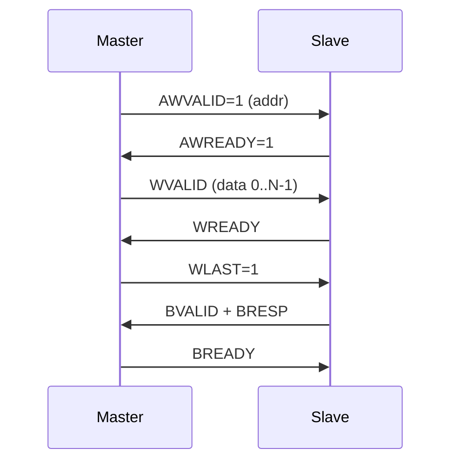

# 01-AXI事务与突发详解

> [!abstract] 本文目标
> 把 AXI **地址/数据/响应** 通道信号、**突发类型**、**对齐/字节通道**、**乱序与 ID** 讲透，作为写 AXI VIP / 查协议异常的底书。
> 配套：[[03-Protocol/AXI/00-AXI]] · [[03-Protocol/AXI/02-AXI验证要点]]

---

## 1. 五通道握手（必须背）

| 通道 | 主→从 | 从→主 | 载荷要点 |
|------|-------|-------|----------|
| **AW** Write Address | AWVALID | AWREADY | AWADDR, AWLEN, AWSIZE, AWBURST, AWID, AWLOCK, AWCACHE, AWPROT, AWQOS |
| **W** Write Data | WVALID | WREADY | WDATA, WSTRB, WLAST, WID |
| **B** Write Resp | BVALID | BREADY | BRESP, BID |
| **AR** Read Address | ARVALID | ARREADY | 同 AW |
| **R** Read Data | RVALID | RREADY | RDATA, RRESP, RLAST, RID |

> [!tip] 握手规则
> 1. VALID 不能等 READY 再拉高（否则死锁）
> 2. VALID 拉高后不能撤回（直到 READY）
> 3. READY 可在 VALID 前/同拍拉高
> 4. 每个通道独立，可流水



---

## 2. 突发类型与长度

| AWBURST | 名称 | 地址规则 |
|---------|------|----------|
| 2'b00 | FIXED | 每拍同地址（FIFO） |
| 2'b01 | INCR | 递增（最常用） |
| 2'b10 | WRAP | 对齐到 4K 边界回绕 |
| 2'b11 | 保留 | — |

```text
AWLEN  = beats - 1   (AXI3: 1..16, AXI4: 1..256)
AWSIZE = log2(bytes per beat)  // 0=1B ... 7=128B
Beats  = AWLEN + 1
Bytes  = 2^AWSIZE
Total  = Beats * 2^AWSIZE
```

> [!warning] 4KB 边界
> 单笔 burst **不得跨 4KB**（地址位 [11:0] 不能借位）。WRAP 长度只能是 2/4/8/16 beats。

---

## 3. 地址计算（INCR）

```text
Aligned_Address = (ADDR / (2^SIZE)) * (2^SIZE)
Next = Aligned + 2^SIZE
```

**非对齐**：第一拍 low byte lanes 可能无效（STRB=0），后续对齐。

### WSTRB / RSTRB

```text
WSTRB[i] = 1 → WDATA[8i+7:8i] 有效
读侧由 slave 决定数据；写侧 master 用 strobe 掩掉部分字节
```

---

## 4. ID 与乱序

- **相同 ID**：必须按发出顺序返回（B/R）
- **不同 ID**：可乱序，slave 可多 outstanding
- interconnect 可插入 wait、改 ID

```text
Master AWID=1 (seq A)
Master AWID=2 (seq B)
Slave 可先完成 B 再完成 A
但同 ID=1 的多笔必须保序
```

> [!info] AXI3 vs AXI4
> - AXI3：WID 与 AWID 对应；写 interleaving 有限
> - AXI4：去掉 WID，写数据必须顺序；burst 到 256

---

## 5. 响应码 BRESP/RRESP

| 编码 | 名称 | 含义 |
|------|------|------|
| 00 | OKAY | 成功 |
| 01 | EXOKAY | 独占访问成功 |
| 10 | SLVERR | slave 错（功能/超时） |
| 11 | DECERR | 译码错（非法地址） |

写通道：**B** 只返回一次 burst 级响应；
读通道：**每拍 RRESP**，需与 RLAST 配合。

---

## 6. 锁定与独占

| 信号 | 用途 |
|------|------|
| AxLOCK (AXI3) | locked 传输，连发阻塞其它 master |
| AxLOCK (AXI4) | **exclusive**（1 bit） |
| Excl | 跨 beat 扫描某地址，monitor 用 slave 状态 |

Exclusive 流程：
1. exclusive read 标记地址
2. 其它 master 不可写该行
3. exclusive write 成功 → EXOKAY，否则 OKAY（失败）

---

## 7. CACHE / PROT / QOS

| 字段 | 含义 |
|------|------|
| AxCACHE | bufferable / cacheable / allocate |
| AxPROT | privileged / secure / instruction |
| AxQOS | QoS 优先级（AXI4） |
| AxREGION | 从设备分区（AXI4） |

验证点：**PROT 路径**（secure vs non-secure 译码）、CACHE 与互联配置一致。

---

## 8. 常见信号清单（便于写 trans）

```systemverilog
class axi_trans extends uvm_sequence_item;
  rand bit [31:0] addr;
  rand bit [7:0]  len;     // beats-1
  rand bit [2:0]  size;
  rand bit [1:0]  burst;   // FIXED/INCR/WRAP
  rand bit [3:0]  id;
  rand bit [1:0]  resp;
  rand bit [255:0] data[]; // 动态，按 beats
  rand bit [31:0] strb[];  // 写
endclass
```

---

## 9. 时序图（INCR 写）

```text
clk     _|‾|_|‾|_|‾|_|‾|_|‾|_|‾|_
AWVALID ___/‾‾‾‾\_______________
AWREADY ___/‾‾\_________________
AWADDR  ====A0==================
WVALID  ______/‾‾‾‾‾‾\__________
WREADY  ______/‾‾\______________
WDATA   ______D0 D1 D2 D3_______
WLAST   _________________/‾\____
BVALID  _____________________/‾\_
BREADY  _____________________/‾\_
```

---

## 相关

- [[03-Protocol/AXI/00-AXI]]
- [[03-Protocol/AXI/02-AXI验证要点]]
- [[02-UVM/13-虚拟Sequence]]

---

*更新: 2026-09-27*
