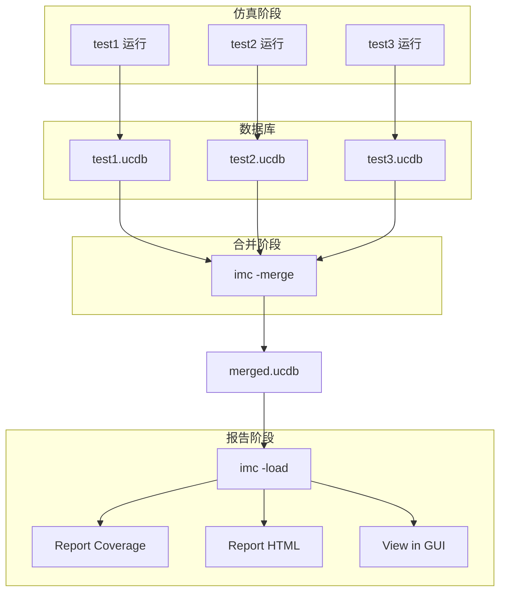

# 00-imc

> Integrated Coverage - 覆盖率分析工具

## 概述

imc (Integrated Coverage Manager) 是 Intel FPGA Verification Suite 中的覆盖率分析和报告工具，用于查看、合并和分析仿真覆盖率数据。

## 基本语法

```bash
imc [options]
```

### 常用模式

| 模式 | 说明 |
|------|------|
| imc (无参数) | 启动 GUI |
| imc -batch | 批处理模式 |
| imc -load | 加载覆盖率数据库 |
| imc -merge | 合并覆盖率 |
| imc -code | 生成代码覆盖率报告 |
| imc -html | 生成 HTML 报告 |

---

## 命令行选项

### 加载和保存

| 选项 | 说明 |
|------|------|
| `-load <db>` | 加载覆盖率数据库 |
| `-save <db>` | 保存覆盖率数据库 |
| `-session <file>` | 加载会话文件 |
| `-out <dir>` | 输出目录 |

### 合并

| 选项 | 说明 |
|------|------|
| `-merge` | 合并模式 |
| `-out <db>` | 合并输出文件 |
| `-input <db1,db2,...>` | 输入文件列表 |
| `-灌入 <name>=<value>` | 合并选项 |

### 报告生成

| 选项 | 说明 |
|------|------|
| `-code` | 生成代码覆盖率报告 |
| `-detail` | 详细报告 |
| `-html` | 生成 HTML 报告 |
| `-execRep` | 执行报告生成后打开 |
| `-cvg` | 功能覆盖率报告 |
| `-show tests` | 显示测试列表 |

### 过滤

| 选项 | 说明 |
|------|------|
| `-annotate` | 生成注释文件 |
| `-tests <test1,test2>` | 指定测试 |
| `-modules <mod1,mod2>` | 指定模块 |
| `-lines <n>` | 最小行覆盖率 |

---

## 常用命令

### 启动 GUI

```bash
# 直接启动 GUI
imc

# 加载已有数据库
imc -load coverage/verilog.ucdb

# 加载并打开
imc -load coverage/test.ucdb -session my_session.ses
```

### 合并覆盖率数据库

```bash
# 合并多个测试的覆盖率
imc -merge \
    -input "coverage/test1.ucdb,coverage/test2.ucdb,coverage/test3.ucdb" \
    -out coverage/merged.ucdb

# 使用通配符
imc -merge \
    -input coverage/*.ucdb \
    -out coverage/merged.ucdb
```

### 生成报告

```bash
# 生成详细报告
imc -load coverage/merged.ucdb \
    -code -detail \
    -out coverage/report

# 生成 HTML 报告
imc -load coverage/merged.ucdb \
    -html \
    -execRep \
    -out coverage/html_report

# 生成功能覆盖率报告
imc -load coverage/merged.ucdb \
    -cvg \
    -out coverage/cvg_report
```

### 批处理模式

```bash
# 生成报告到文件
imc -batch \
    -load coverage/merged.ucdb \
    -code -detail \
    -out coverage/report.txt \
    2>&1 | tee imc.log

# 生成测试列表
imc -batch \
    -load coverage/merged.ucdb \
    -show tests \
    -show details
```

---

## imc 命令文件

### .tcl 命令文件

```tcl
# generate_report.tcl
database -open cov_db -into merged.ucdb -shlib -code bcesft

load_database merged.ucdb

# 设置覆盖率目标
set coverage_option -weight 100

# 生成报告
report -all -file coverage_report.txt
report -coverage -detail -file detail_report.txt

# HTML 报告
report -html -out html_report

# 退出
exit
```

### 使用命令文件

```bash
imc -load merged.ucdb -do generate_report.tcl
```

---

## Makefile 集成

```makefile
# ============== Coverage Targets ==============
COV_DIR  = coverage
COV_DB   = $(COV_DIR)/merged.ucdb

.PHONY: cov_merge cov_report cov_view cov_clean

# Merge coverage databases
cov_merge: $(COV_DIR)
	@echo "Merging coverage databases..."
	@imc -batch -merge \
		-input "$(wildcard $(COV_DIR)/*.ucdb)" \
		-out $(COV_DB) \
		-log $(COV_DIR)/merge.log

# Generate coverage report
cov_report: $(COV_DB)
	@echo "Generating coverage report..."
	@imc -batch \
		-load $(COV_DB) \
		-code -detail \
		-out $(COV_DIR)/report.txt

	@imc -batch \
		-load $(COV_DB) \
		-html \
		-out $(COV_DIR)/html \
		-hierarchy * \
		-cvg

# View coverage in GUI
cov_view: $(COV_DB)
	imc -load $(COV_DB)

# Clean coverage files
cov_clean:
	rm -rf $(COV_DIR)/*.ucdb
	rm -rf $(COV_DIR)/html
	rm -f $(COV_DIR)/*.txt
```

---

## 覆盖率类型详解

### 代码覆盖率 (Code Coverage)

| 类型 | 说明 | 启用选项 |
|------|------|----------|
| **Line** | 语句覆盖 | `b` |
| **Branch** | 分支覆盖 | `c` |
| **Condition** | 条件覆盖 | `e` |
| **FSM** | 状态机覆盖 | `s` |
| **Toggle** | 翻转覆盖 | `t` |
| **Path** | 路径覆盖 | `f` |

### 功能覆盖率 (Functional Coverage)

```verilog
// 覆盖组定义
covergroup my_cg @(posedge clk);
    option.per_instance = 1;

    cp_cmd: coverpoint cmd {
        bins read  = {READ};
        bins write = {WRITE};
        bins idle  = {IDLE};
    }

    cp_addr: coverpoint addr {
        bins low  = {[0:12'hFFF]};
        bins high = {[12'h1000:12'hFFFF]};
    }

    cross_cmd_addr: cross cp_cmd, cp_addr;
endgroup
```

---

## 覆盖率分析工作流



---

## 常用 imc 命令 (GUI)

### 覆盖率目标设置

```
Coverage -> Set Goal...
Coverage -> Coverage Options...
```

### 报告导出

```
Reports -> Generate Report...
Reports -> Export to CSV...
Reports -> Generate HTML...
```

### 覆盖率过滤

```
Filter -> By Module...
Filter -> By Test...
Filter -> By Coverage Type...
```

---

## 常见问题

### 1. 合并失败

```bash
# 检查数据库是否损坏
imc -batch -load test.ucdb -show tests

# 清理后重新合并
rm -f merged.ucdb
imc -merge -input "*.ucdb" -out merged.ucdb
```

### 2. 覆盖率不显示

```bash
# 检查是否使用了正确的覆盖率选项
# 仿真时需要添加 -coverage all
xrun -coverage all -covfile coverage.cfg -R

# 检查数据库是否生成
ls -la coverage/*.ucdb
```

### 3. 内存不足

```bash
# 使用分区合并
imc -merge -input "test*.ucdb" -out merged.ucdb -part 1000
```

---

## 相关链接

- [[00-xrun]] - xrun 仿真器
- [[01-覆盖率]] - 覆盖率知识
- [[00-Makefile]] - Makefile 模板
- [[00-总索引]] - 返回总索引

---

*创建时间: 2026-04-17*
*更新时间: 2026-04-17*
