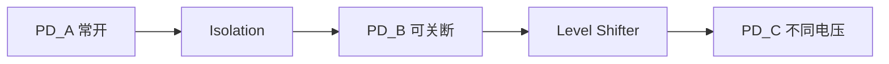

# 19-UPF低功耗仿真

> [!abstract] 解决什么
> 电源域关断/保留/隔离后，RTL 里看不见的问题：**隔离未生效 X 传播、电平转换单元遗漏、上电时序、状态丢失**。
> 用 UPF（IEEE 1801）+ Power-aware 仿真（PAS）验证。

---

## 1. 低功耗结构

```text
Power Domain
  supply_set (VDD/VSS)
  isolation cells  断电域输出隔离
  level shifters   跨电压域
  retention        寄存器/存储保持
  switch / PSW     电源开关
```



---

## 2. UPF 最小骨架

```tcl
# power domain
create_power_domain PD_PERI -elements {u_peri}

# supply
create_supply_net VDD_PERI
create_supply_set SS_PERI -function {power VDD_PERI} -function {ground VSS}

# isolation
set_isolation iso_peri -domain PD_PERI \
  -isolation_signal iso_en -isolation_sense high \
  -clamp_value 0 -location parent
set_isolation_control iso_peri -domain PD_PERI \
  -isolation_signal iso_en -isolation_sense high

# retention
set_retention ret_peri -domain PD_PERI \
  -retention_signal save -restore_signal restore

# level shifter
set_level_shifter ls_peri -domain PD_PERI -applies_to both
```

---

## 3. Power-aware 仿真做什么

| 检查 | 说明 |
|------|------|
| X 注入 | 关断域输出为 X |
| 隔离生效 | 隔离使能后 clamp 0/1 |
| 恢复 | 上电后状态/保持正确 |
| 跨域 | 电平转换后无 X/错电平 |
| 连通 | supply 连接完整性 |
| 时序 | power up/down 序列 |

工具：VCS-NLP、Xcelium LP、Questa Power-aware、PowerPro 等。

---

## 4. TB 与电源序列

```systemverilog
// 电源控制（时序）
task power_down_peri();
  // 1. 打开 isolation
  force tb.u_isl_en = 1;
  // 2. 等待稳定
  repeat (10) @(posedge clk);
  // 3. 关断域
  uvm_hdl_force("tb.VDD_PERI", 0);
  // 4. 释放 isolation 配置（视策略）
endtask

task power_up_peri();
  uvm_hdl_force("tb.VDD_PERI", 1);
  repeat (20) @(posedge clk);
  // restore
  force tb.u_save = 1; ...
  force tb.u_isl_en = 0;
endtask
```

> [!tip] 用 **virtual sequence** 串业务与电源开关，见 [[02-UVM/13-虚拟Sequence]]。

---

## 5. 用例矩阵

| # | 用例 |
|---|------|
| L1 | 复位 + 全域常开 |
| L2 | 单域下电，接口隔离 |
| L3 | 保持域关电后内容保留 |
| L4 | 上电恢复 + 业务正确 |
| L5 | 多域开关交错 |
| L6 | 下电中中断/DMA 事务 |
| L7 | 跨域信号（电平转换） |
| L8 | 电压切换（DVS）毛刺 |
| L9 | 非法序列：漏隔离下电（应 error） |

---

## 6. Scoreboard / 断言

```systemverilog
// 隔离使能时输出必须 clamp
property p_isolated;
  @(posedge clk) (iso_en) |-> (pd_out == clamp_val);
endproperty

// 关电后域内寄存器不访问
property p_no_access;
  @(posedge clk) (!pd_power) |-> !reg_wr;
endproperty
```

| 检查 | 手段 |
|------|------|
| isolation | SVA + PAS |
| retention | 前后门读比对 |
| X 检测 | `$isunknown` 采样 |
| 电源序列 | 虚拟 seq + cover |

---

## 7. 覆盖

```systemverilog
cp_pd_state : coverpoint pd_on;
cp_iso      : coverpoint iso_en;
cp_domain   : coverpoint domain_id;
x_state_iso : cross cp_pd_state, cp_iso;
// 序列覆盖：off→on→busy→off
```

---

## 8. 与 RTL 级低功耗

| 层次 | 做法 |
|------|------|
| RTL | 时钟门控、retention 插入点代码 |
| UPF | 声明域/隔离/保持 |
| GLS | 网表含隔离单元真实行为 |
| Power | SAIF 估功耗 |

---

## 9. 常见 bug

| 现象 | 原因 |
|------|------|
| 下电后周围全 X | 漏 isolation / clamp 值错 |
| 上电丢数据 | retention 未 save |
| 跨域数据错 | 漏 level shifter |
| 时钟毛刺 | 门控使能与时钟切换冲突 |
| 复位不同步 | 跨域复位 |

---

## 相关

- [[05-Verification/09-低功耗与多域验证]]
- [[05-Verification/11-复位类型与层次架构]]
- [[05-Verification/12-复位树与域交叉验证]]
- [[05-Verification/18-门级仿真与SDF]]

---

*更新: 2026-09-27*
