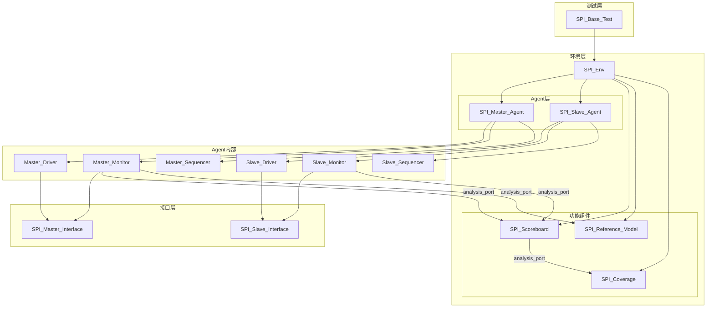
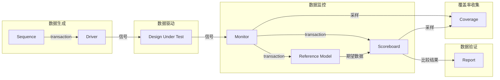

---
tags:
  - Project
  - SPI
  - UVM
  - Architecture
  - 实战
created: 2026-06-02
status: 进行中
---

# SPI验证环境架构

## 1. UVM组件层次图



## 2. 各组件职责说明

### 2.1 测试层（Test Layer）

#### SPI_Base_Test
- **职责**：测试用例的基类，提供通用配置和工厂覆盖
- **关键任务**：
  - 创建和配置环境
  - 设置配置对象
  - 控制测试流程
  - 收集测试结果

### 2.2 环境层（Environment Layer）

#### SPI_Env
- **职责**：顶层环境容器，管理所有组件
- **关键任务**：
  - 例化和连接所有Agent
  - 例化功能组件（Scoreboard、Reference Model）
  - 管理配置数据库
  - 提供统一的测试接口

### 2.3 Agent层（Agent Layer）

#### SPI_Master_Agent
- **职责**：SPI主设备代理，驱动和监控主设备行为
- **组件**：
  - **Master_Driver**：驱动SPI主设备信号
  - **Master_Monitor**：监控SPI总线活动
  - **Master_Sequencer**：管理主设备序列

#### SPI_Slave_Agent
- **职责**：SPI从设备代理，模拟从设备响应
- **组件**：
  - **Slave_Driver**：驱动从设备响应信号
  - **Slave_Monitor**：监控从设备接口
  - **Slave_Sequencer**：管理从设备序列

### 2.4 功能组件（Functional Components）

#### SPI_Scoreboard
- **职责**：数据比对和结果验证
- **关键任务**：
  - 接收主设备发送的数据
  - 接收从设备接收的数据
  - 比对数据一致性
  - 记录错误和统计信息

#### SPI_Reference_Model
- **职责**：参考模型，预测期望行为
- **关键任务**：
  - 根据配置计算期望输出
  - 处理协议时序
  - 生成期望数据流

#### SPI_Coverage
- **职责**：覆盖率收集和分析
- **关键任务**：
  - 收集功能覆盖率
  - 监控代码覆盖率
  - 生成覆盖率报告

## 3. 接口定义

### 3.1 SPI Master Interface

```verilog
interface spi_master_interface(
    input logic clk,
    input logic rst_n
);
    
    // 信号定义
    logic sck;          // 时钟输出
    logic mosi;         // 主出从入
    logic miso;         // 主入从出
    logic ss_n;         // 从设备选择（低有效）
    
    // 配置信号
    logic [1:0] spi_mode;   // SPI模式
    logic [4:0] clk_div;    // 时钟分频
    logic [1:0] data_width; // 数据位宽
    
    // 状态信号
    logic busy;         // 忙标志
    logic done;         // 传输完成
    
    // 时钟块定义
    clocking master_cb @(posedge clk);
        default input #1 output #1;
        output sck;
        output mosi;
        input miso;
        output ss_n;
        output spi_mode;
        output clk_div;
        output data_width;
        input busy;
        input done;
    endclocking
    
    clocking monitor_cb @(posedge clk);
        default input #1 output #1;
        input sck;
        input mosi;
        input miso;
        input ss_n;
        input spi_mode;
        input clk_div;
        input data_width;
        input busy;
        input done;
    endclocking
    
    // Modport定义
    modport master(
        clocking master_cb,
        input clk,
        input rst_n
    );
    
    modport monitor(
        clocking monitor_cb,
        input clk,
        input rst_n
    );
    
endinterface
```

### 3.2 SPI Slave Interface

```verilog
interface spi_slave_interface(
    input logic clk,
    input logic rst_n
);
    
    // 信号定义
    logic sck;          // 时钟输入
    logic mosi;         // 主出从入
    logic miso;         // 主入从出
    logic ss_n;         // 从设备选择（低有效）
    
    // 状态信号
    logic rx_valid;     // 接收数据有效
    logic [31:0] rx_data; // 接收数据
    logic tx_ready;     // 发送就绪
    logic [31:0] tx_data; // 发送数据
    
    // 时钟块定义
    clocking slave_cb @(posedge clk);
        default input #1 output #1;
        input sck;
        input mosi;
        output miso;
        input ss_n;
        output rx_valid;
        output rx_data;
        input tx_ready;
        input tx_data;
    endclocking
    
    clocking monitor_cb @(posedge clk);
        default input #1 output #1;
        input sck;
        input mosi;
        input miso;
        input ss_n;
        input rx_valid;
        input rx_data;
        input tx_ready;
        input tx_data;
    endclocking
    
    // Modport定义
    modport slave(
        clocking slave_cb,
        input clk,
        input rst_n
    );
    
    modport monitor(
        clocking monitor_cb,
        input clk,
        input rst_n
    );
    
endinterface
```

## 4. 配置对象

### 4.1 SPI环境配置

```verilog
class spi_env_config extends uvm_object;
    
    // Agent配置
    bit has_master_agent = 1;
    bit has_slave_agent = 1;
    
    // 功能组件配置
    bit has_scoreboard = 1;
    bit has_reference_model = 1;
    bit has_coverage = 1;
    
    // 接口配置
    virtual spi_master_interface master_vif;
    virtual spi_slave_interface slave_vif;
    
    // 配置参数
    spi_mode_t spi_mode = SPI_MODE_0;
    data_width_t data_width = DATA_WIDTH_8;
    int clk_div = 4;
    
    `uvm_object_utils_begin(spi_env_config)
        `uvm_field_int(has_master_agent, UVM_ALL_ON)
        `uvm_field_int(has_slave_agent, UVM_ALL_ON)
        `uvm_field_int(has_scoreboard, UVM_ALL_ON)
        `uvm_field_int(has_reference_model, UVM_ALL_ON)
        `uvm_field_int(has_coverage, UVM_ALL_ON)
        `uvm_field_enum(spi_mode_t, spi_mode, UVM_ALL_ON)
        `uvm_field_enum(data_width_t, data_width, UVM_ALL_ON)
        `uvm_field_int(clk_div, UVM_ALL_ON)
    `uvm_object_utils_end
    
    function new(string name = "spi_env_config");
        super.new(name);
    endfunction
    
endclass
```

### 4.2 SPI Agent配置

```verilog
class spi_agent_config extends uvm_object;
    
    // Agent类型
    agent_type_t agent_type = MASTER;
    
    // 接口配置
    virtual spi_master_interface master_vif;
    virtual spi_slave_interface slave_vif;
    
    // 配置参数
    spi_mode_t spi_mode = SPI_MODE_0;
    data_width_t data_width = DATA_WIDTH_8;
    int clk_div = 4;
    
    // 功能开关
    bit has_driver = 1;
    bit has_monitor = 1;
    bit has_sequencer = 1;
    
    `uvm_object_utils_begin(spi_agent_config)
        `uvm_field_enum(agent_type_t, agent_type, UVM_ALL_ON)
        `uvm_field_enum(spi_mode_t, spi_mode, UVM_ALL_ON)
        `uvm_field_enum(data_width_t, data_width, UVM_ALL_ON)
        `uvm_field_int(clk_div, UVM_ALL_ON)
        `uvm_field_int(has_driver, UVM_ALL_ON)
        `uvm_field_int(has_monitor, UVM_ALL_ON)
        `uvm_field_int(has_sequencer, UVM_ALL_ON)
    `uvm_object_utils_end
    
    function new(string name = "spi_agent_config");
        super.new(name);
    endfunction
    
endclass
```

### 4.3 配置数据库使用

```verilog
// 在测试中设置配置
class spi_base_test extends uvm_test;
    
    spi_env_config env_cfg;
    spi_agent_config master_cfg;
    spi_agent_config slave_cfg;
    
    function void build_phase(uvm_phase phase);
        super.build_phase(phase);
        
        // 创建配置对象
        env_cfg = spi_env_config::type_id::create("env_cfg");
        master_cfg = spi_agent_config::type_id::create("master_cfg");
        slave_cfg = spi_agent_config::type_id::create("slave_cfg");
        
        // 配置参数
        env_cfg.spi_mode = SPI_MODE_0;
        env_cfg.data_width = DATA_WIDTH_8;
        
        master_cfg.agent_type = MASTER;
        slave_cfg.agent_type = SLAVE;
        
        // 设置到配置数据库
        uvm_config_db#(spi_env_config)::set(this, "*", "env_cfg", env_cfg);
        uvm_config_db#(spi_agent_config)::set(this, "*master*", "agent_cfg", master_cfg);
        uvm_config_db#(spi_agent_config)::set(this, "*slave*", "agent_cfg", slave_cfg);
        
        // 设置接口
        uvm_config_db#(virtual spi_master_interface)::set(this, "*", "master_vif", master_vif);
        uvm_config_db#(virtual spi_slave_interface)::set(this, "*", "slave_vif", slave_vif);
        
    endfunction
    
endclass
```

## 5. 数据流架构

### 5.1 数据流图



### 5.2 TLM连接

```verilog
// 在环境中的连接
class spi_env extends uvm_env;
    
    spi_master_agent master_agent;
    spi_slave_agent slave_agent;
    spi_scoreboard scoreboard;
    spi_reference_model ref_model;
    spi_coverage coverage;
    
    function void connect_phase(uvm_phase phase);
        super.connect_phase(phase);
        
        // Master Monitor到Scoreboard
        master_agent.monitor.item_collected_port.connect(
            scoreboard.master_export
        );
        
        // Slave Monitor到Scoreboard
        slave_agent.monitor.item_collected_port.connect(
            scoreboard.slave_export
        );
        
        // Master Monitor到Reference Model
        master_agent.monitor.item_collected_port.connect(
            ref_model.master_export
        );
        
        // Scoreboard到Coverage
        scoreboard.analysis_port.connect(
            coverage.analysis_export
        );
        
    endfunction
    
endclass
```

## 6. 工厂覆盖机制

### 6.1 组件工厂覆盖

```verilog
// 在测试中覆盖组件
class spi_mode0_test extends spi_base_test;
    
    `uvm_component_utils(spi_mode0_test)
    
    function new(string name = "spi_mode0_test", uvm_component parent = null);
        super.new(name, parent);
    endfunction
    
    function void build_phase(uvm_phase phase);
        // 设置工厂覆盖
        set_type_override_by_type(
            spi_master_sequence::get_type(),
            spi_mode0_sequence::get_type()
        );
        
        super.build_phase(phase);
        
        // 覆盖配置
        env_cfg.spi_mode = SPI_MODE_0;
        
    endfunction
    
endclass
```

## 相关链接

- [[00-项目概述|项目概述]]
- [[01-验证计划|验证计划]]
- [[03-测试用例|测试用例]]
- [[04-覆盖率模型|覆盖率模型]]
- [[02-UVM/04-组件|UVM组件详解]]
- [[02-UVM/06-TLM通信|TLM通信机制]]
- [[05-Verification/UVM-Template/01-interface|接口模板]]
- [[05-Verification/UVM-Template/08-agent|Agent模板]]
- [[05-Verification/UVM-Template/09-env|环境模板]]

---

**创建时间**：2026-06-02
**最后更新**：2026-06-02
**负责人**：验证团队
