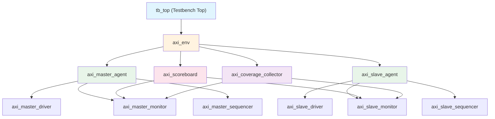

---
tags: [Project, AXI, UVM, Architecture, 瀹炴垬]
created: 2026-06-02
updated: 2026-06-02
---

# AXI 楠岃瘉鐜鏋舵瀯

> [!abstract] 姒傝堪
> 鏈枃妗ｅ畾涔?AXI 楠岃瘉鐜鐨?UVM 缁勪欢灞傛銆丄gent 璁捐鍜?Scoreboard 璁捐銆傜幆澧冩灦鏋勬槸浠ｇ爜瀹炵幇鐨勮摑鍥俱€?
鍓嶇疆绗旇锛歔[00-椤圭洰姒傝堪]] | [[01-楠岃瘉璁″垝]] | [[05-Verification/UVM-Template/00-鎬昏|UVM 楠岃瘉妯℃澘]]

---

## UVM 缁勪欢灞傛



---

## AXI Agent 璁捐

### Master Agent

> [!info] Master Agent 鑱岃矗
> 浜х敓 AXI 涓昏澶囦簨鍔★細鍙戦€佽鍐欒姹傦紝鎺ユ敹鍐欏搷搴斿拰璇绘暟鎹€?
#### Master Driver

```verilog
class axi_master_driver extends uvm_driver #(axi_transaction);
  `uvm_component_utils(axi_master_driver)

  virtual axi_if vif;

  // 浠诲姟锛氶┍鍔ㄥ啓鍦板潃閫氶亾
  task drive_write_address(axi_transaction tr);
    @(posedge vif.clk);
    vif.awaddr  <= tr.addr;
    vif.awlen   <= tr.len;
    vif.awsize  <= tr.size;
    vif.awburst <= tr.burst;
    vif.awid    <= tr.id;
    vif.awvalid <= 1'b1;
    // 绛夊緟 READY 鎻℃墜
    do @(posedge vif.clk); while (!vif.awready);
    vif.awvalid <= 1'b0;
  endtask

  // 浠诲姟锛氶┍鍔ㄥ啓鏁版嵁閫氶亾
  task drive_write_data(axi_transaction tr);
    for (int i = 0; i <= tr.len; i++) begin
      @(posedge vif.clk);
      vif.wdata  <= tr.data[i];
      vif.wstrb  <= tr.strb[i];
      vif.wlast  <= (i == tr.len);
      vif.wvalid <= 1'b1;
      do @(posedge vif.clk); while (!vif.wready);
    end
    vif.wvalid <= 1'b0;
    vif.wlast  <= 1'b0;
  endtask

  // 浠诲姟锛氶┍鍔ㄨ鍦板潃閫氶亾
  task drive_read_address(axi_transaction tr);
    @(posedge vif.clk);
    vif.araddr  <= tr.addr;
    vif.arlen   <= tr.len;
    vif.arsize  <= tr.size;
    vif.arburst <= tr.burst;
    vif.arid    <= tr.id;
    vif.arvalid <= 1'b1;
    do @(posedge vif.clk); while (!vif.arready);
    vif.arvalid <= 1'b0;
  endtask
endclass
```

鍏抽敭璁捐鐐癸細
- 鍐欏湴鍧€鍜屽啓鏁版嵁鍙苟琛岄┍鍔紙鐙珛 `fork...join`锛?- VALID 淇″彿涓嶈兘渚濊禆 READY锛堝崗璁姹傦級
- 鏀寔澶?ID 浜嬪姟涔卞簭鍙戦€?
#### Master Monitor

```verilog
class axi_master_monitor extends uvm_monitor;
  `uvm_component_utils(axi_master_monitor)

  virtual axi_if vif;
  uvm_analysis_port #(axi_transaction) wr_addr_ap;
  uvm_analysis_port #(axi_transaction) wr_data_ap;
  uvm_analysis_port #(axi_transaction) wr_resp_ap;
  uvm_analysis_port #(axi_transaction) rd_addr_ap;
  uvm_analysis_port #(axi_transaction) rd_data_ap;

  // 鐩戞帶鍐欏湴鍧€閫氶亾
  task monitor_write_address();
    forever begin
      @(posedge vif.clk);
      if (vif.awvalid && vif.awready) begin
        axi_transaction tr = axi_transaction::type_id::create("tr");
        tr.addr  = vif.awaddr;
        tr.len   = vif.awlen;
        tr.size  = vif.awsize;
        tr.burst = vif.awburst;
        tr.id    = vif.awid;
        wr_addr_ap.write(tr);
      end
    end
  endtask
endclass
```

鍏抽敭璁捐鐐癸細
- 姣忎釜閫氶亾鐙珛鐩戞帶绾跨▼
- 閫氳繃 analysis_port 骞挎挱浜嬪姟鍒?scoreboard 鍜?coverage
- 琚姩閲囨牱锛屼笉椹卞姩浠讳綍淇″彿

#### Master Sequencer

```verilog
class axi_master_sequencer extends uvm_sequencer #(axi_transaction);
  `uvm_component_utils(axi_master_sequencer)
endclass
```

---

### Slave Agent

> [!info] Slave Agent 鑱岃矗
> 妯℃嫙 AXI 浠庤澶囪涓猴細鎺ユ敹璇诲啓璇锋眰锛岃繑鍥炲搷搴斿拰鏁版嵁銆?
#### Slave Driver

```verilog
class axi_slave_driver extends uvm_driver #(axi_transaction);
  `uvm_component_utils(axi_slave_driver)

  virtual axi_if vif;

  // 浠诲姟锛氭帴鏀跺啓鍦板潃骞惰繑鍥炲搷搴?  task receive_write();
    forever begin
      // 绛夊緟鍐欏湴鍧€鎻℃墜
      @(posedge vif.clk iff (vif.awvalid && vif.awready));
      // 绛夊緟鍐欐暟鎹畬鎴?(WLAST)
      @(posedge vif.clk iff (vif.wvalid && vif.wready && vif.wlast));
      // 闅忔満寤惰繜鍚庤繑鍥炲啓鍝嶅簲
      repeat ($urandom_range(1, 10)) @(posedge vif.clk);
      vif.bresp <= 2'b00;  // OKAY
      vif.bvalid <= 1'b1;
      @(posedge vif.clk iff vif.bready);
      vif.bvalid <= 1'b0;
    end
  endtask

  // 浠诲姟锛氭帴鏀惰鍦板潃骞惰繑鍥炴暟鎹?  task receive_read();
    forever begin
      @(posedge vif.clk iff (vif.arvalid && vif.arready));
      // 闅忔満寤惰繜鍚庤繑鍥炶鏁版嵁
      repeat ($urandom_range(1, 10)) @(posedge vif.clk);
      for (int i = 0; i <= ar_len; i++) begin
        vif.rdata <= mem[ar_addr + i * (1 << ar_size)];
        vif.rresp <= 2'b00;
        vif.rlast <= (i == ar_len);
        vif.rvalid <= 1'b1;
        @(posedge vif.clk iff vif.rready);
      end
      vif.rvalid <= 1'b0;
      vif.rlast  <= 1'b0;
    end
  endtask
endclass
```

鍏抽敭璁捐鐐癸細
- 闅忔満寤惰繜妯℃嫙鐪熷疄浠庤澶囪涓?- 鏀寔瀛樺偍鍣ㄦā鍨?(memory model) 瀛樺偍鍐欏叆鏁版嵁
- 鍙厤缃搷搴旂被鍨嬶紙OKAY/SLVERR/DECERR锛夌敤浜庡紓甯告祴璇?
#### Slave Monitor

涓?Master Monitor 缁撴瀯鐩稿悓锛屼粠浠庤澶囪瑙掗噰鏍蜂俊鍙枫€傞€氳繃 analysis_port 灏嗚娴嬪埌鐨勪簨鍔″彂閫佸埌 Scoreboard銆?
---

## Scoreboard 璁捐

> [!important] 姣斿绛栫暐
> Scoreboard 鎺ユ敹 Master Monitor 鍜?Slave Monitor 鐨勪簨鍔★紝杩涜鏁版嵁涓€鑷存€у拰鍗忚鍚堣鎬ф瘮瀵广€?
```verilog
class axi_scoreboard extends uvm_scoreboard;
  `uvm_component_utils(axi_scoreboard)

  // 鎺ユ敹绔彛
  uvm_analysis_imp_master #(axi_transaction, axi_scoreboard) master_export;
  uvm_analysis_imp_slave  #(axi_transaction, axi_scoreboard) slave_export;

  // 棰勬湡闃熷垪
  axi_transaction expected_q[$];
  axi_transaction actual_q[$];

  // Master 绔啓鍏ラ鏈熸暟鎹?  function void write_master(axi_transaction tr);
    expected_q.push_back(tr);
    try_compare();
  endfunction

  // Slave 绔啓鍏ュ疄闄呮暟鎹?  function void write_slave(axi_transaction tr);
    actual_q.push_back(tr);
    try_compare();
  endfunction

  // 姣斿閫昏緫
  function void try_compare();
    while (expected_q.size() > 0 && actual_q.size() > 0) begin
      axi_transaction exp = expected_q.pop_front();
      axi_transaction act = actual_q.pop_front();

      if (exp.addr != act.addr) begin
        `uvm_error("SCB", $sformatf("鍦板潃涓嶅尮閰? exp=0x%0h, act=0x%0h", exp.addr, act.addr))
      end
      if (exp.data[0] != act.data[0]) begin
        `uvm_error("SCB", $sformatf("鏁版嵁涓嶅尮閰? exp=0x%0h, act=0x%0h", exp.data[0], act.data[0]))
      end
      if (exp.resp != act.resp) begin
        `uvm_error("SCB", $sformatf("鍝嶅簲涓嶅尮閰? exp=%0d, act=%0d", exp.resp, act.resp))
      end
    end
  endfunction
endclass
```

### Scoreboard 姣斿缁村害

| 姣斿椤?| 璇存槑 | 涓ラ噸绾?|
|--------|------|--------|
| 鍦板潃涓€鑷存€?| 鍐欏叆鍦板潃涓庤鍑哄湴鍧€鍖归厤 | ERROR |
| 鏁版嵁涓€鑷存€?| 鍐欏叆鏁版嵁涓庤鍑烘暟鎹尮閰?| ERROR |
| 鍝嶅簲鐮佹纭€?| 鍝嶅簲鐮佺鍚堥鏈?| ERROR |
| 绐佸彂闀垮害 | 鍐?璇荤獊鍙戦暱搴︿竴鑷?| ERROR |
| ID 淇濆簭鎬?| 鐩稿悓 ID 浜嬪姟淇濆簭 | WARNING |
| WLAST/RLAST | 鏈€鍚庝竴涓?beat 鏍囪姝ｇ‘ | ERROR |

---

## Interface 璁捐

```verilog
interface axi_if(input logic clk, input logic rst_n);
  // 鍐欏湴鍧€閫氶亾
  logic [31:0] awaddr;
  logic [ 7:0] awlen;
  logic [ 2:0] awsize;
  logic [ 1:0] awburst;
  logic [ 3:0] awid;
  logic        awvalid;
  logic        awready;

  // 鍐欐暟鎹€氶亾
  logic [31:0] wdata;
  logic [ 3:0] wstrb;
  logic        wlast;
  logic        wvalid;
  logic        wready;

  // 鍐欏搷搴旈€氶亾
  logic [ 1:0] bresp;
  logic [ 3:0] bid;
  logic        bvalid;
  logic        bready;

  // 璇诲湴鍧€閫氶亾
  logic [31:0] araddr;
  logic [ 7:0] arlen;
  logic [ 2:0] arsize;
  logic [ 1:0] arburst;
  logic [ 3:0] arid;
  logic        arvalid;
  logic        arready;

  // 璇绘暟鎹€氶亾
  logic [31:0] rdata;
  logic [ 1:0] rresp;
  logic [ 3:0] rid;
  logic        rlast;
  logic        rvalid;
  logic        rready;

  // SVA 鏂█
  // 鍙傝€? [[05-Verification/UVM-Template/Driver鎻℃墜鏃跺簭闄烽槺|鎻℃墜鏃跺簭闄烽槺]]
endinterface
```

鍙傝€冿細[[05-Verification/UVM-Template/01-interface|Interface 妯℃澘]]

---

## Env 椤跺眰缁勮

```verilog
class axi_env extends uvm_env;
  `uvm_component_utils(axi_env)

  axi_master_agent    m_agent;
  axi_slave_agent     s_agent;
  axi_scoreboard      sb;
  axi_coverage_collector cov;

  function void build_phase(uvm_phase phase);
    super.build_phase(phase);
    m_agent = axi_master_agent::type_id::create("m_agent", this);
    s_agent = axi_slave_agent::type_id::create("s_agent", this);
    sb      = axi_scoreboard::type_id::create("sb", this);
    cov     = axi_coverage_collector::type_id::create("cov", this);
  endfunction

  function void connect_phase(uvm_phase phase);
    super.connect_phase(phase);
    // Monitor analysis_port 杩炴帴 Scoreboard
    m_agent.monitor.wr_addr_ap.connect(sb.master_export);
    m_agent.monitor.rd_data_ap.connect(sb.master_export);
    s_agent.monitor.wr_resp_ap.connect(sb.slave_export);
    s_agent.monitor.rd_addr_ap.connect(sb.slave_export);
    // Monitor analysis_port 杩炴帴 Coverage
    m_agent.monitor.wr_addr_ap.connect(cov.analysis_export);
  endfunction
endclass
```

鍙傝€冿細[[05-Verification/UVM-Template/09-env|Env 妯℃澘]] | [[02-UVM/06-TLM閫氫俊|TLM 閫氫俊]]

---

## 缁勪欢鑱岃矗姹囨€?
```mermaid
graph LR
    subgraph "鏁版嵁娴佹柟鍚?
        SQ[Sequencer] -->|seq_item| D[Driver]
        D -->|淇″彿椹卞姩| DUT[DUT]
        DUT -->|淇″彿鍝嶅簲| M[Monitor]
        M -->|analysis_port| SB[Scoreboard]
        M -->|analysis_port| COV[Coverage]
    end

    style SQ fill:#e8f5e9
    style D fill:#e1f5fe
    style DUT fill:#fff3e0
    style M fill:#f3e5f5
    style SB fill:#fce4ec
    style COV fill:#fce4ec
```

| 缁勪欢 | 绫诲瀷 | 鑱岃矗 |
|------|------|------|
| Sequencer | 涓诲姩 | 璋冨害 sequence item 鍒?driver |
| Driver | 涓诲姩 | 灏?transaction 杞寲涓轰俊鍙风骇婵€鍔?|
| Monitor | 琚姩 | 閲囬泦淇″彿绾ф椿鍔紝杞寲涓?transaction |
| Scoreboard | 琚姩 | 姣斿棰勬湡涓庡疄闄呯粨鏋?|
| Coverage | 琚姩 | 鏀堕泦鍔熻兘瑕嗙洊鐜?|

---

## 鐩稿叧閾炬帴

### UVM 缁勪欢妯℃澘
- [[05-Verification/UVM-Template/01-interface|Interface 妯℃澘]]
- [[05-Verification/UVM-Template/02-transaction|Transaction 妯℃澘]]
- [[05-Verification/UVM-Template/03-sequence|Sequence 妯℃澘]]
- [[05-Verification/UVM-Template/04-driver|Driver 妯℃澘]]
- [[05-Verification/UVM-Template/05-monitor|Monitor 妯℃澘]]
- [[05-Verification/UVM-Template/07-scoreboard|Scoreboard 妯℃澘]]
- [[05-Verification/UVM-Template/08-agent|Agent 妯℃澘]]
- [[05-Verification/UVM-Template/09-env|Env 妯℃澘]]

### UVM 鏈哄埗
- [[02-UVM/01-Phase鏈哄埗|Phase 鏈哄埗]]
- [[02-UVM/02-config_db|config_db]]
- [[02-UVM/03-Sequence鏈哄埗|Sequence 鏈哄埗]]
- [[02-UVM/06-TLM閫氫俊|TLM 閫氫俊]]

### 甯歌闄烽槺
- [[05-Verification/UVM-Template/Driver鎻℃墜鏃跺簭闄烽槺|Driver 鎻℃墜鏃跺簭闄烽槺]]
- [[05-Verification/UVM-Template/UVM-Analysis-Port鏁版嵁娴亅Analysis Port 鏁版嵁娴乚]
- [[05-Verification/UVM-Template/uvm_analysis_imp澶氱鍙ｉ櫡闃眧uvm_analysis_imp 澶氱鍙ｉ櫡闃盷]

### 鏈」鐩?- [[00-椤圭洰姒傝堪]]
- [[01-楠岃瘉璁″垝]]
- [[03-娴嬭瘯鐢ㄤ緥]]

