# AXI 测试用例

> [!abstract] 概述
> 本文档定义 AXI 验证环境中的具体测试用例，包括基础读写、突发传输、乱序响应和边界条件四大类。每个测试用例包含目的、激励策略、检查点和预期结果。

前置笔记：[[00-项目概述]] | [[01-验证计划]] | [[02-环境架构]]

---

## 测试用例分类总览

```mermaid
graph TD
    TC[测试用例] --> BASIC[基础读写测试]
    TC --> BURST[突发传输测试]
    TC --> ORDER[乱序响应测试]
    TC --> EDGE[边界条件测试]

    BASIC --> TC01[TC-01 单次写读回验证]
    BASIC --> TC02[TC-02 连续写后读]
    BASIC --> TC03[TC-03 读写交替]
    BASIC --> TC04[TC-04 不同 burst size]

    BURST --> TC05[TC-05 INCR 突发长度遍历]
    BURST --> TC06[TC-06 WRAP 突发验证]
    BURST --> TC07[TC-07 FIXED 突发验证]
    BURST --> TC08[TC-08 非对齐地址突发]
    BURST --> TC09[TC-09 最大突发长度]

    ORDER --> TC10[TC-10 多 ID 读乱序]
    ORDER --> TC11[TC-11 相同 ID 保序]
    ORDER --> TC12[TC-12 多 ID 写乱序]
    ORDER --> TC13[TC-13 读数据交织]

    EDGE --> TC14[TC-14 地址边界 0x0000_0000]
    EDGE --> TC15[TC-15 地址边界 0xFFFF_FFFC]
    EDGE --> TC16[TC-16 SLVERR 响应]
    EDGE --> TC17[TC-17 DECERR 响应]
    EDGE --> TC18[TC-18 独占访问]
    EDGE --> TC19[TC-19 压力测试]
```



---

## 一、基础读写测试

### TC-01: 单次写读回验证

> [!note] 测试目的
> 验证最基本的写后读数据一致性。

| 属性 | 值 |
|------|-----|
| 用例 ID | TC-01 |
| 覆盖功能点 | FT-BURST-02, FT-RESP-01, FT-HSK-01 |
| 测试场景 | TS-BASIC-01, TS-BASIC-02 |

**激励策略：**
- 随机地址，INCR 突发，长度 1 (单次传输)
- burst size 随机 (1/2/4 字节)
- 写入后立即读回同一地址

**检查点：**
- 写响应为 OKAY
- 读回数据与写入数据一致
- 地址、burst 参数匹配

```verilog
class axi_tc_single_wr_rd extends axi_base_test;
  `uvm_component_utils(axi_tc_single_wr_rd)

  task run_phase(uvm_phase phase);
    axi_master_single_wr_rd_seq wr_rd_seq;

    phase.raise_objection(this);
    wr_rd_seq = axi_master_single_wr_rd_seq::type_id::create("wr_rd_seq");

    // 配置: INCR 突发, 长度 1, 随机地址和数据
    wr_rd_seq.addr_mode  = ADDR_RANDOM;
    wr_rd_seq.burst_type = AXI_BURST_INCR;
    wr_rd_seq.burst_len  = 0;  // 长度 1
    wr_rd_seq.burst_size = SIZE_RANDOM;

    wr_rd_seq.start(m_env.m_agent.sequencer);

    #100ns;
    phase.drop_objection(this);
  endtask
endclass
```

---

### TC-02: 连续写后读

> [!note] 测试目的
> 验证对多个不同地址连续写入后再连续读出的正确性。

| 属性 | 值 |
|------|-----|
| 用例 ID | TC-02 |
| 覆盖功能点 | FT-BURST-02, FT-RESP-01, FT-CH-01 |

**激励策略：**
- 连续 N 次写操作 (N 随机 4~16)
- 地址递增，无重叠
- 全部写完后连续 N 次读回

**检查点：**
- 所有写响应为 OKAY
- 所有读回数据与写入数据逐一匹配
- 写响应数量 = 写请求数量

---

### TC-03: 读写交替

> [!note] 测试目的
> 验证读写通道并行工作的正确性。

| 属性 | 值 |
|------|-----|
| 用例 ID | TC-03 |
| 覆盖功能点 | FT-CH-01, FT-HSK-04 |

**激励策略：**
- 写-读-写-读交替进行
- 使用不同地址避免数据冲突
- Master driver 使用 fork 并行驱动读写

**检查点：**
- 读写通道互不干扰
- 各自数据正确

---

### TC-04: 不同 burst size

> [!note] 测试目的
> 验证不同传输粒度下数据选通 (WSTRB) 的正确性。

| 属性 | 值 |
|------|-----|
| 用例 ID | TC-04 |
| 覆盖功能点 | FT-BURST-05, FT-INTER-03 |

**激励策略：**
- 遍历 burst size: 1B, 2B, 4B (32-bit 总线)
- 每种 size 写后读回验证
- WSTRB 根据 size 和对齐生成

**检查点：**
- WSTRB 低位连续 1 的个数 = 2^size
- 读回数据仅在 WSTRB 有效的字节位置匹配

---

## 二、突发传输测试

### TC-05: INCR 突发长度遍历

> [!note] 测试目的
> 验证 INCR 突发在各种长度下的正确性。

| 属性 | 值 |
|------|-----|
| 用例 ID | TC-05 |
| 覆盖功能点 | FT-BURST-02, FT-BURST-04, TS-BURST-01 |

**激励策略：**
- 遍历突发长度: 1, 2, 4, 8, 16, 32, 64, 128, 256
- 每种长度随机地址，INCR 突发
- burst size = 4B (全字)

**检查点：**
- 每个 beat 地址递增 = 2^size
- 总共传输 len+1 个 beat
- WLAST 仅在最后一个 beat 为高
- 写响应仅在最后一个 beat 后返回一个

```verilog
class axi_tc_incr_len extends axi_base_test;
  `uvm_component_utils(axi_tc_incr_len)

  task run_phase(uvm_phase phase);
    int lengths[] = '{1, 2, 4, 8, 16, 32, 64, 128, 256};

    phase.raise_objection(this);

    foreach (lengths[i]) begin
      axi_master_burst_seq seq;
      seq = axi_master_burst_seq::type_id::create($sformatf("seq_%0d", lengths[i]));
      seq.burst_type = AXI_BURST_INCR;
      seq.burst_len  = lengths[i] - 1;  // AXI LEN = actual_length - 1
      seq.burst_size = 3'b010;           // 4 bytes
      seq.addr       = 32'h0000_1000 + i * 'h1000;
      seq.num_beats  = lengths[i];
      seq.start(m_env.m_agent.sequencer);
    end

    #200ns;
    phase.drop_objection(this);
  endtask
endclass
```

---

### TC-06: WRAP 突发验证

> [!note] 测试目的
> 验证 WRAP 突发的地址回绕行为。

| 属性 | 值 |
|------|-----|
| 用例 ID | TC-06 |
| 覆盖功能点 | FT-BURST-03, TS-BURST-02 |

**激励策略：**
- WRAP 突发，合法长度 (2/4/8/16)
- 起始地址故意设在回绕边界附近
- burst size = 4B

**检查点：**
- 地址递增到 wrap_boundary 后回绕到 wrap_low
- 回绕计算: `wrap_boundary = (addr / (len * size)) * (len * size)`
- 所有 beat 数据正确存储

```verilog
// WRAP 地址计算示例
function automatic logic [31:0] calc_wrap_addr(
    logic [31:0] start_addr,
    logic [ 7:0] len,
    logic [ 2:0] size,
    int          beat_idx
);
  int burst_bytes = (len + 1) * (1 << size);
  int wrap_low    = (start_addr / burst_bytes) * burst_bytes;
  int wrap_high   = wrap_low + burst_bytes;
  int addr        = start_addr + beat_idx * (1 << size);
  if (addr >= wrap_high)
    addr = addr - burst_bytes;
  return addr[31:0];
endfunction
```

---

### TC-07: FIXED 突发验证

> [!note] 测试目的
> 验证 FIXED 突发下地址保持不变。

| 属性 | 值 |
|------|-----|
| 用例 ID | TC-07 |
| 覆盖功能点 | FT-BURST-01, TS-BURST-03 |

**激励策略：**
- FIXED 突发，长度 4
- 同一地址重复写入不同数据
- 验证最终存储值为最后一次写入

**检查点：**
- 所有 beat 地址相同
- 读回数据为最后一次写入的值

---

### TC-08: 非对齐地址突发

> [!note] 测试目的
> 验证起始地址未对齐到 burst size 时的传输行为。

| 属性 | 值 |
|------|-----|
| 用例 ID | TC-08 |
| 覆盖功能点 | FT-BURST-06, TS-BURST-04 |

**激励策略：**
- burst size = 4B (字对齐)
- 起始地址设置为非对齐: 0x0000_0001, 0x0000_0002, 0x0000_0003
- INCR 突发，长度 4

**检查点：**
- 第一个 beat 的 WSTRB 根据对齐偏移正确设置
- 后续 beat 地址递增并自然对齐
- 数据存储位置正确

---

### TC-09: 最大突发长度

> [!note] 测试目的
> 验证 AXI4 最大突发长度 256 (LEN=255) 的正确性。

| 属性 | 值 |
|------|-----|
| 用例 ID | TC-09 |
| 覆盖功能点 | FT-BURST-04, TS-BURST-05 |

**激励策略：**
- INCR 突发，LEN = 255 (256 beats)
- burst size = 1B (避免地址越界)
- 地址从 0x0000_0000 开始

**检查点：**
- 256 个 beat 全部正确传输
- WLAST 仅在第 256 个 beat 为高
- 写响应在最后一个 beat 后返回

---

## 三、乱序响应测试

### TC-10: 多 ID 读乱序

> [!note] 测试目的
> 验证不同 ID 的读事务可以乱序完成。

| 属性 | 值 |
|------|-----|
| 用例 ID | TC-10 |
| 覆盖功能点 | FT-ORDER-01, FT-ORDER-03, TS-ORDER-01 |

**激励策略：**
- 同时发送 4 个不同 ID 的读请求
- Slave 端随机延迟返回数据 (不同 ID 延迟不同)
- 不要求按发送顺序返回

**检查点：**
- 每个 ID 的读数据与其发出的地址匹配
- RID 与 ARID 正确对应
- 不要求 ID 间顺序

```verilog
class axi_tc_rd_out_of_order extends axi_base_test;
  `uvm_component_utils(axi_tc_rd_out_of_order)

  task run_phase(uvm_phase phase);
    axi_master_multi_id_rd_seq seq;

    phase.raise_objection(this);
    seq = axi_master_multi_id_rd_seq::type_id::create("seq");

    // 配置 4 个不同 ID，各自随机延迟
    seq.num_ids     = 4;
    seq.id_values   = '{4'h0, 4'h1, 4'h2, 4'h3};
    seq.randomize_delays = 1;

    seq.start(m_env.m_agent.sequencer);

    #500ns;
    phase.drop_objection(this);
  endtask
endclass
```

---

### TC-11: 相同 ID 保序

> [!note] 测试目的
> 验证相同 ID 的事务必须按发送顺序完成。

| 属性 | 值 |
|------|-----|
| 用例 ID | TC-11 |
| 覆盖功能点 | FT-ORDER-02, TS-ORDER-02 |

**激励策略：**
- 发送 4 个相同 ID 的读请求到不同地址
- Slave 端随机延迟
- Scoreboard 检查返回顺序

**检查点：**
- 相同 ID 的读数据按发送顺序返回
- 地址和数据逐一匹配

---

### TC-12: 多 ID 写乱序

> [!note] 测试目的
> 验证不同 ID 的写事务可以乱序完成并正确返回响应。

| 属性 | 值 |
|------|-----|
| 用例 ID | TC-12 |
| 覆盖功能点 | FT-ORDER-04, TS-ORDER-03 |

**激励策略：**
- 同时发送 4 个不同 ID 的写请求
- Slave 端随机延迟返回写响应
- BID 必须与 AWID 对应

**检查点：**
- BID 与 AWID 正确对应
- 写响应可乱序返回
- 每个 ID 的写数据已正确存储

---

### TC-13: 读数据交织

> [!note] 测试目的
> 验证不同 ID 的读数据 beat 可以交织返回。

| 属性 | 值 |
|------|-----|
| 用例 ID | TC-13 |
| 覆盖功能点 | FT-INTER-01, TS-INTER-01 |

**激励策略：**
- 发送 2 个不同 ID 的长突发读请求
- Slave 端交替返回不同 ID 的数据 beat
- 每个 beat 携带正确的 RID

**检查点：**
- 按 RID 分组后，每个 ID 的数据序列正确
- RLAST 仅在各 ID 最后一个 beat 为高
- 总 beat 数正确

```verilog
// Slave 交织返回示例
task slave_interleave_read();
  // ID0: 4 beats, ID1: 4 beats
  // 交织返回: ID0-beat0, ID1-beat0, ID0-beat1, ID1-beat1, ...
  for (int i = 0; i < 4; i++) begin
    drive_read_beat(.id(0), .data(data0[i]), .last(i==3));
    drive_read_beat(.id(1), .data(data1[i]), .last(i==3));
  end
endtask
```

---

## 四、边界条件测试

### TC-14: 地址边界 0x0000_0000

> [!note] 测试目的
> 验证从地址 0 开始的传输正确性。

| 属性 | 值 |
|------|-----|
| 用例 ID | TC-14 |
| 覆盖功能点 | FT-BURST-06, TS-EDGE-01 |

**激励策略：**
- 起始地址 = 0x0000_0000
- INCR 突发，长度 8

**检查点：**
- 地址从 0 正确递增
- 无溢出或异常行为

---

### TC-15: 地址边界 0xFFFF_FFFC

> [!note] 测试目的
> 验证接近地址空间上限时的行为。

| 属性 | 值 |
|------|-----|
| 用例 ID | TC-15 |
| 覆盖功能点 | FT-BURST-06, TS-EDGE-02 |

**激励策略：**
- 起始地址 = 0xFFFF_FFFC
- burst size = 4B, 短突发
- 观察地址溢出行为

**检查点：**
- 地址回绕或从设备响应符合预期
- 不应导致仿真挂死

---

### TC-16: SLVERR 响应

> [!note] 测试目的
> 验证从设备返回 SLVERR 时 Master 的处理。

| 属性 | 值 |
|------|-----|
| 用例 ID | TC-16 |
| 覆盖功能点 | FT-RESP-03, TS-EDGE-03 |

**激励策略：**
- Slave 端配置特定地址返回 SLVERR
- 写操作和读操作分别测试

**检查点：**
- BRESP/RRESP = 2'b10
- Scoreboard 记录错误但不误报
- Master 可选择重试或报错 (取决于设计)

---

### TC-17: DECERR 响应

> [!note] 测试目的
> 验证地址解码错误时的 DECERR 响应。

| 属性 | 值 |
|------|-----|
| 用例 ID | TC-17 |
| 覆盖功能点 | FT-RESP-04, TS-EDGE-04 |

**激励策略：**
- 访问未映射的地址空间
- Interconnect 返回 DECERR

**检查点：**
- BRESP/RRESP = 2'b11
- 系统不崩溃

---

### TC-18: 独占访问

> [!note] 测试目的
> 验证独占读写 (Exclusive Access) 的成功和失败场景。

| 属性 | 值 |
|------|-----|
| 用例 ID | TC-18 |
| 覆盖功能点 | FT-RESP-02, TS-EDGE-05 |

**激励策略：**
- 独占读 (EXCLUSIVE) 后独占写 -- 成功场景
- 独占读后其他 Master 写入同一地址 -- 失败场景
- 验证 EXOKAY 和 OKAY 响应

**检查点：**
- 成功: BRESP = EXOKAY (2'b01)
- 失败: BRESP = OKAY (2'b00)，独占标记被清除

---

### TC-19: 压力测试

> [!note] 测试目的
> 高并发场景下环境的稳定性和数据正确性。

| 属性 | 值 |
|------|-----|
| 用例 ID | TC-19 |
| 覆盖功能点 | FT-CH-01, FT-ORDER-01, TS-EDGE-06 |

**激励策略：**
- 同时发起 8 个不同 ID 的读写事务
- Slave 端最大随机延迟
- 运行 10000 个随机事务
- 无间断持续压力

**检查点：**
- 无仿真挂死 (watchdog timer)
- 无数据丢失或错位
- 覆盖率快速收敛

```verilog
class axi_tc_stress extends axi_base_test;
  `uvm_component_utils(axi_tc_stress)

  task run_phase(uvm_phase phase);
    axi_master_stress_seq stress_seq;

    phase.raise_objection(this);
    stress_seq = axi_master_stress_seq::type_id::create("stress_seq");
    stress_seq.num_transactions = 10000;
    stress_seq.num_ids         = 8;
    stress_seq.max_delay       = 50;

    stress_seq.start(m_env.m_agent.sequencer);

    #1ms;
    phase.drop_objection(this);
  endtask
endclass
```

---

## 测试用例执行矩阵

| 用例 ID | 类型 | 预计时间 | 依赖 | 优先级 |
|---------|------|---------|------|--------|
| TC-01 | 基础 | 5 min | Env 搭建完成 | P0 |
| TC-02 | 基础 | 5 min | TC-01 | P0 |
| TC-03 | 基础 | 5 min | TC-01 | P0 |
| TC-04 | 基础 | 10 min | TC-01 | P1 |
| TC-05 | 突发 | 15 min | TC-01 | P0 |
| TC-06 | 突发 | 10 min | TC-05 | P1 |
| TC-07 | 突发 | 5 min | TC-05 | P1 |
| TC-08 | 突发 | 10 min | TC-05 | P1 |
| TC-09 | 突发 | 10 min | TC-05 | P1 |
| TC-10 | 乱序 | 15 min | TC-05 | P0 |
| TC-11 | 乱序 | 10 min | TC-10 | P0 |
| TC-12 | 乱序 | 15 min | TC-05 | P1 |
| TC-13 | 乱序 | 15 min | TC-10 | P1 |
| TC-14 | 边界 | 5 min | TC-01 | P1 |
| TC-15 | 边界 | 5 min | TC-01 | P1 |
| TC-16 | 边界 | 10 min | TC-01 | P1 |
| TC-17 | 边界 | 10 min | TC-01 | P2 |
| TC-18 | 边界 | 15 min | TC-01 | P1 |
| TC-19 | 边界 | 30 min | TC-10 | P1 |

---

## 相关链接

### 本项目
- [[00-项目概述]] -- 项目整体规划
- [[01-验证计划]] -- 功能点与覆盖率目标
- [[02-环境架构]] -- UVM 环境组件设计

### UVM Sequence 参考
- [[02-UVM/03-Sequence机制|Sequence 机制]]
- [[05-Verification/UVM-Template/03-sequence|Sequence 模板]]
- [[05-Verification/UVM-Template/02-transaction|Transaction 模板]]

### 协议参考
- [[03-Protocol/AXI/00-AXI|AXI 协议]]

### 验证方法
- [[05-Verification/00-验证计划|验证计划方法论]]
- [[05-Verification/01-覆盖率|覆盖率]]
