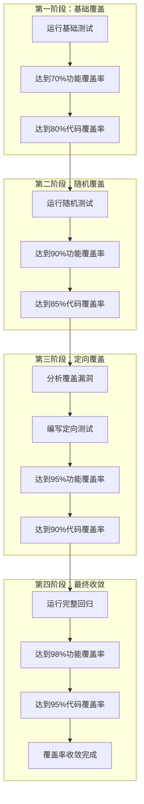
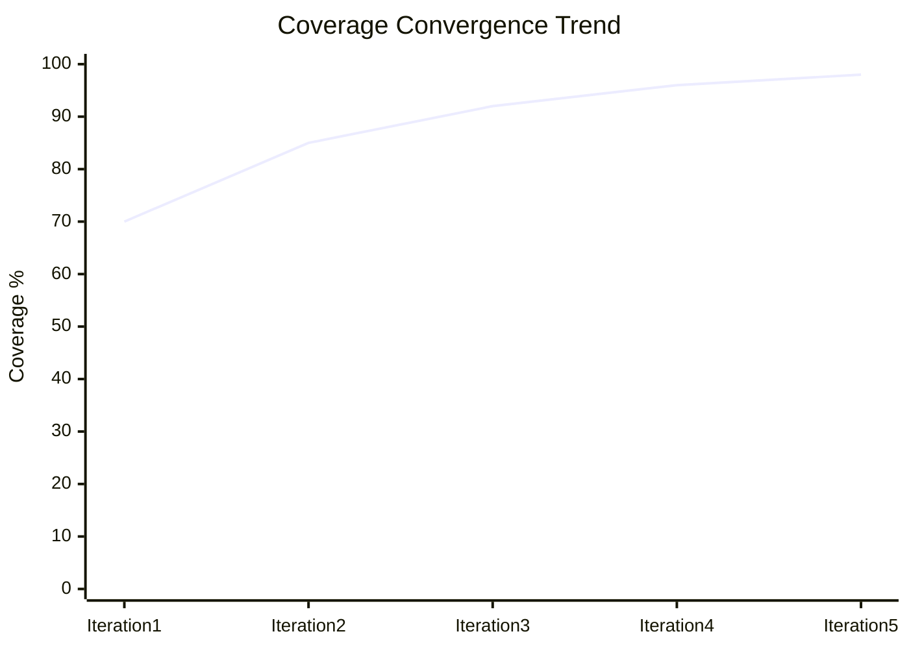
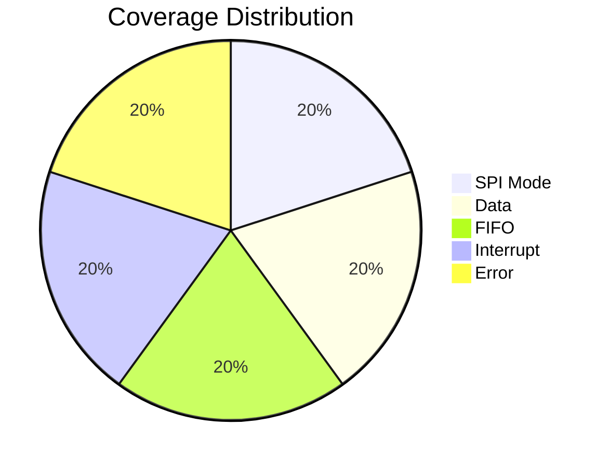

---
tags:
  - Project
  - SPI
  - Coverage
  - 实战
created: 2026-06-02
status: 进行中
---

# SPI覆盖率模型

## 1. 功能覆盖率定义

### 1.1 SPI模式覆盖

```systemverilog
class spi_mode_coverage extends uvm_subscriber #(spi_transaction);
    
    `uvm_component_utils(spi_mode_coverage)
    
    // 覆盖组定义
    covergroup spi_mode_cg;
        
        // SPI模式覆盖
        cp_spi_mode: coverpoint tr.spi_mode {
            bins mode0 = {0};
            bins mode1 = {1};
            bins mode2 = {2};
            bins mode3 = {3};
        }
        
        // 数据位宽覆盖
        cp_data_width: coverpoint tr.data_width {
            bins width8 = {0};
            bins width16 = {1};
            bins width32 = {2};
        }
        
        // 交叉覆盖
        cx_mode_width: cross cp_spi_mode, cp_data_width;
        
    endgroup
    
    spi_transaction tr;
    
    function new(string name = "spi_mode_coverage", uvm_component parent = null);
        super.new(name, parent);
        spi_mode_cg = new();
    endfunction
    
    function void write(spi_transaction t);
        tr = t;
        spi_mode_cg.sample();
    endfunction
    
endclass
```

### 1.2 数据值覆盖

```systemverilog
class spi_data_coverage extends uvm_subscriber #(spi_transaction);
    
    `uvm_component_utils(spi_data_coverage)
    
    covergroup spi_data_cg;
        
        // 数据值覆盖
        cp_tx_data: coverpoint tr.tx_data {
            bins zero = {0};
            bins max_8 = {8'hFF};
            bins max_16 = {16'hFFFF};
            bins max_32 = {32'hFFFFFFFF};
            bins alternating_1 = {32'hAAAAAAAA};
            bins alternating_2 = {32'h55555555};
            bins random = default;
        }
        
        // 数据模式覆盖
        cp_data_pattern: coverpoint tr.data_pattern {
            bins all_zeros = {0};
            bins all_ones = {1};
            bins walking_ones = {2};
            bins walking_zeros = {3};
            bins random_pattern = {4};
        }
        
        // 交叉覆盖
        cx_data_pattern: cross cp_tx_data, cp_data_pattern;
        
    endgroup
    
    spi_transaction tr;
    
    function new(string name = "spi_data_coverage", uvm_component parent = null);
        super.new(name, parent);
        spi_data_cg = new();
    endfunction
    
    function void write(spi_transaction t);
        tr = t;
        spi_data_cg.sample();
    endfunction
    
endclass
```

### 1.3 FIFO状态覆盖

```systemverilog
class spi_fifo_coverage extends uvm_subscriber #(spi_transaction);
    
    `uvm_component_utils(spi_fifo_coverage)
    
    covergroup spi_fifo_cg;
        
        // FIFO状态覆盖
        cp_fifo_status: coverpoint tr.fifo_status {
            bins empty = {0};
            bins almost_empty = {1};
            bins half_full = {2};
            bins almost_full = {3};
            bins full = {4};
        }
        
        // FIFO操作覆盖
        cp_fifo_operation: coverpoint tr.fifo_operation {
            bins write_only = {0};
            bins read_only = {1};
            bins write_read = {2};
            bins overflow = {3};
            bins underflow = {4};
        }
        
        // 交叉覆盖
        cx_fifo_status_op: cross cp_fifo_status, cp_fifo_operation;
        
    endgroup
    
    spi_transaction tr;
    
    function new(string name = "spi_fifo_coverage", uvm_component parent = null);
        super.new(name, parent);
        spi_fifo_cg = new();
    endfunction
    
    function void write(spi_transaction t);
        tr = t;
        spi_fifo_cg.sample();
    endfunction
    
endclass
```

### 1.4 中断覆盖

```systemverilog
class spi_interrupt_coverage extends uvm_subscriber #(spi_transaction);
    
    `uvm_component_utils(spi_interrupt_coverage)
    
    covergroup spi_interrupt_cg;
        
        // 中断类型覆盖
        cp_interrupt_type: coverpoint tr.interrupt_type {
            bins tx_complete = {0};
            bins rx_complete = {1};
            bins fifo_threshold = {2};
            bins error = {3};
            bins no_interrupt = {4};
        }
        
        // 中断使能覆盖
        cp_interrupt_enable: coverpoint tr.interrupt_enable {
            bins disabled = {0};
            bins enabled = {1};
        }
        
        // 中断清除覆盖
        cp_interrupt_clear: coverpoint tr.interrupt_clear {
            bins not_cleared = {0};
            bins cleared = {1};
        }
        
        // 交叉覆盖
        cx_interrupt: cross cp_interrupt_type, cp_interrupt_enable, cp_interrupt_clear;
        
    endgroup
    
    spi_transaction tr;
    
    function new(string name = "spi_interrupt_coverage", uvm_component parent = null);
        super.new(name, parent);
        spi_interrupt_cg = new();
    endfunction
    
    function void write(spi_transaction t);
        tr = t;
        spi_interrupt_cg.sample();
    endfunction
    
endclass
```

### 1.5 错误覆盖

```systemverilog
class spi_error_coverage extends uvm_subscriber #(spi_transaction);
    
    `uvm_component_utils(spi_error_coverage)
    
    covergroup spi_error_cg;
        
        // 错误类型覆盖
        cp_error_type: coverpoint tr.error_type {
            bins no_error = {0};
            bins overflow = {1};
            bins underflow = {2};
            bins frame_error = {3};
            bins parity_error = {4};
            bins clock_error = {5};
        }
        
        // 错误处理覆盖
        cp_error_handling: coverpoint tr.error_handling {
            bins ignore = {0};
            bins flag_only = {1};
            bins interrupt = {2};
            bins reset = {3};
        }
        
        // 交叉覆盖
        cx_error: cross cp_error_type, cp_error_handling;
        
    endgroup
    
    spi_transaction tr;
    
    function new(string name = "spi_error_coverage", uvm_component parent = null);
        super.new(name, parent);
        spi_error_cg = new();
    endfunction
    
    function void write(spi_transaction t);
        tr = t;
        spi_error_cg.sample();
    endfunction
    
endclass
```

## 2. 代码覆盖率目标

### 2.1 代码覆盖率配置

```systemverilog
// 代码覆盖率编译选项
// 在编译脚本中添加
// +cover=bcestf
// +coveropt

// 代码覆盖率运行选项
// +cover=bcestf
// +coveropt
// +coverdir+coverage_reports
```

### 2.2 代码覆盖率目标表

| 覆盖类型 | 目标 | 测量方法 | 备注 |
|----------|------|----------|------|
| 行覆盖率 | 95% | 工具自动测量 | 基本执行覆盖 |
| 分支覆盖率 | 90% | 工具自动测量 | 条件分支覆盖 |
| 条件覆盖率 | 85% | 工具自动测量 | 复杂条件覆盖 |
| 状态机覆盖率 | 100% | 工具自动测量 | 所有状态和转换 |
| 切换覆盖率 | 80% | 工具自动测量 | 信号跳变覆盖 |

### 2.3 代码覆盖率排除

```systemverilog
// 覆盖率排除文件 coverage_exclusions.el

// 排除不可达代码
INSTANCE: tb.dut.u_spi_ctrl
BEGIN
BLOCK 15  // 不可达的默认分支
END

// 排除调试代码
INSTANCE: tb.dut.u_debug
BEGIN
MODULE  // 排除整个调试模块
END

// 排除未使用的参数
INSTANCE: tb.dut
BEGIN
FSM_TRANSITION  // 排除未使用的状态转换
END
```

## 3. 覆盖率收敛策略

### 3.1 覆盖率收敛计划



### 3.2 覆盖率分析脚本

```systemverilog
// 覆盖率分析类
class spi_coverage_analyzer extends uvm_component;
    
    `uvm_component_utils(spi_coverage_analyzer)
    
    // 覆盖率组实例
    spi_mode_coverage mode_cov;
    spi_data_coverage data_cov;
    spi_fifo_coverage fifo_cov;
    spi_interrupt_coverage interrupt_cov;
    spi_error_coverage error_cov;
    
    // 覆盖率目标
    real coverage_goal = 95.0;
    
    function new(string name = "spi_coverage_analyzer", uvm_component parent = null);
        super.new(name, parent);
    endfunction
    
    function void build_phase(uvm_phase phase);
        super.build_phase(phase);
        
        // 创建覆盖率组
        mode_cov = spi_mode_coverage::type_id::create("mode_cov", this);
        data_cov = spi_data_coverage::type_id::create("data_cov", this);
        fifo_cov = spi_fifo_coverage::type_id::create("fifo_cov", this);
        interrupt_cov = spi_interrupt_coverage::type_id::create("interrupt_cov", this);
        error_cov = spi_error_coverage::type_id::create("error_cov", this);
        
    endfunction
    
    function void report_phase(uvm_phase phase);
        real total_coverage;
        
        // 计算总覆盖率
        total_coverage = calculate_total_coverage();
        
        // 打印覆盖率报告
        print_coverage_report();
        
        // 检查是否达到目标
        if (total_coverage >= coverage_goal) begin
            `uvm_info("COV", $sformatf("Coverage goal achieved: %0.2f%% >= %0.2f%%", 
                      total_coverage, coverage_goal), UVM_LOW)
        end else begin
            `uvm_warning("COV", $sformatf("Coverage goal not met: %0.2f%% < %0.2f%%", 
                        total_coverage, coverage_goal))
        end
        
    endfunction
    
    function real calculate_total_coverage();
        real mode_percent, data_percent, fifo_percent, interrupt_percent, error_percent;
        
        // 获取各覆盖率组百分比
        mode_percent = mode_cov.spi_mode_cg.get_coverage();
        data_percent = data_cov.spi_data_cg.get_coverage();
        fifo_percent = fifo_cov.spi_fifo_cg.get_coverage();
        interrupt_percent = interrupt_cov.spi_interrupt_cg.get_coverage();
        error_percent = error_cov.spi_error_cg.get_coverage();
        
        // 计算加权平均
        return (mode_percent * 0.2 + data_percent * 0.2 + fifo_percent * 0.2 + 
                interrupt_percent * 0.2 + error_percent * 0.2);
        
    endfunction
    
    function void print_coverage_report();
        `uvm_info("COV", "=== Coverage Report ===", UVM_LOW)
        `uvm_info("COV", $sformatf("SPI Mode Coverage: %0.2f%%", 
                  mode_cov.spi_mode_cg.get_coverage()), UVM_LOW)
        `uvm_info("COV", $sformatf("Data Coverage: %0.2f%%", 
                  data_cov.spi_data_cg.get_coverage()), UVM_LOW)
        `uvm_info("COV", $sformatf("FIFO Coverage: %0.2f%%", 
                  fifo_cov.spi_fifo_cg.get_coverage()), UVM_LOW)
        `uvm_info("COV", $sformatf("Interrupt Coverage: %0.2f%%", 
                  interrupt_cov.spi_interrupt_cg.get_coverage()), UVM_LOW)
        `uvm_info("COV", $sformatf("Error Coverage: %0.2f%%", 
                  error_cov.spi_error_cg.get_coverage()), UVM_LOW)
        `uvm_info("COV", $sformatf("Total Coverage: %0.2f%%", 
                  calculate_total_coverage()), UVM_LOW)
        `uvm_info("COV", "========================", UVM_LOW)
        
    endfunction
    
endclass
```

### 3.3 覆盖率驱动测试

```systemverilog
class spi_coverage_driven_test extends spi_base_test;
    
    `uvm_component_utils(spi_coverage_driven_test)
    
    spi_coverage_analyzer cov_analyzer;
    
    function new(string name = "spi_coverage_driven_test", uvm_component parent = null);
        super.new(name, parent);
    endfunction
    
    function void build_phase(uvm_phase phase);
        super.build_phase(phase);
        
        // 创建覆盖率分析器
        cov_analyzer = spi_coverage_analyzer::type_id::create("cov_analyzer", this);
        
    endfunction
    
    task run_phase(uvm_phase phase);
        real current_coverage;
        int iteration = 0;
        int max_iterations = 10;
        
        phase.raise_objection(this);
        
        // 迭代运行直到达到覆盖率目标
        while (iteration < max_iterations) begin
            iteration++;
            
            `uvm_info("COV", $sformatf("Coverage iteration %0d", iteration), UVM_LOW)
            
            // 运行随机测试
            run_random_tests();
            
            // 获取当前覆盖率
            current_coverage = cov_analyzer.calculate_total_coverage();
            
            `uvm_info("COV", $sformatf("Current coverage: %0.2f%%", current_coverage), UVM_LOW)
            
            // 检查是否达到目标
            if (current_coverage >= cov_analyzer.coverage_goal) begin
                `uvm_info("COV", "Coverage goal achieved!", UVM_LOW)
                break;
            end
            
            // 分析覆盖漏洞并补充测试
            analyze_coverage_holes();
            
        end
        
        phase.drop_objection(this);
        
    endtask
    
    task run_random_tests();
        spi_random_sequence seq;
        
        seq = spi_random_sequence::type_id::create("seq");
        seq.num_transactions = 100;
        seq.start(env.master_agent.sequencer);
        
    endtask
    
    task analyze_coverage_holes();
        // 分析未覆盖的bin
        // 运行针对性的测试
        run_targeted_tests();
    endtask
    
    task run_targeted_tests();
        // 运行针对性测试以提高覆盖率
        spi_mode0_sequence mode0_seq;
        spi_mode1_sequence mode1_seq;
        spi_mode2_sequence mode2_seq;
        spi_mode3_sequence mode3_seq;
        
        mode0_seq = spi_mode0_sequence::type_id::create("mode0_seq");
        mode0_seq.start(env.master_agent.sequencer);
        
        mode1_seq = spi_mode1_sequence::type_id::create("mode1_seq");
        mode1_seq.start(env.master_agent.sequencer);
        
        mode2_seq = spi_mode2_sequence::type_id::create("mode2_seq");
        mode2_seq.start(env.master_agent.sequencer);
        
        mode3_seq = spi_mode3_sequence::type_id::create("mode3_seq");
        mode3_seq.start(env.master_agent.sequencer);
        
    endtask
    
endclass
```

## 4. 覆盖率报告模板

### 4.1 覆盖率报告格式

```
============================================
SPI Verification Coverage Report
============================================
Date: 2026-06-02
Test Run: regression_001
Duration: 2h 30m

Functional Coverage Summary:
----------------------------
SPI Mode Coverage:     100.00% (4/4 bins)
Data Coverage:          95.50% (19/20 bins)
FIFO Coverage:          98.00% (49/50 bins)
Interrupt Coverage:     100.00% (20/20 bins)
Error Coverage:         96.00% (24/25 bins)

Total Functional Coverage: 97.90%

Code Coverage Summary:
----------------------
Line Coverage:          96.50%
Branch Coverage:        92.30%
Condition Coverage:     88.70%
FSM Coverage:           100.00%
Toggle Coverage:        85.20%

Total Code Coverage:    92.54%

Coverage Holes:
---------------
1. Data Coverage: bin "random_pattern" not covered
2. FIFO Coverage: bin "simultaneous_read_write" not covered
3. Error Coverage: bin "parity_error" not covered

Recommendations:
----------------
1. Add test for random data patterns
2. Add test for simultaneous FIFO operations
3. Add test for parity error scenarios

============================================
```

## 5. 覆盖率可视化

### 5.1 覆盖率趋势图



### 5.2 覆盖率分布图



## 相关链接

- [[00-项目概述|项目概述]]
- [[01-验证计划|验证计划]]
- [[02-环境架构|环境架构]]
- [[03-测试用例|测试用例]]
- [[05-Verification/01-覆盖率|覆盖率方法论]]
- [[02-UVM/04-组件|UVM组件]]
- [[05-Verification/UVM-Template/07-scoreboard|计分板模板]]

---

**创建时间**：2026-06-02
**最后更新**：2026-06-02
**负责人**：验证团队
