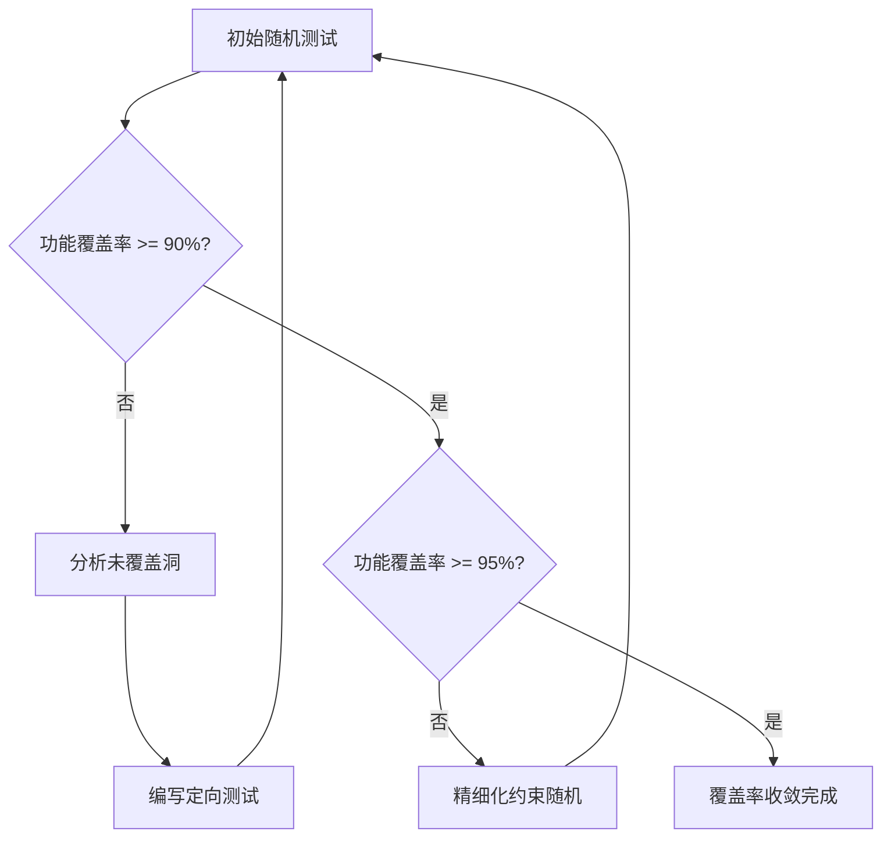

# AXI 验证计划

> [!abstract] 概述
> 本文档定义 AXI 主从设备验证的功能点、测试场景和覆盖率目标。验证计划是环境搭建和测试用例编写的指导依据。

前置笔记：[[00-项目概述]] | [[03-Protocol/AXI/00-AXI|AXI 协议]] | [[05-Verification/00-验证计划|验证计划方法论]]

---

## 功能点清单

### 1. 突发类型（Burst Type）

| 功能点 ID | 描述 | AXI 信号 | 优先级 |
|-----------|------|----------|--------|
| FT-BURST-01 | FIXED 突发 -- 地址固定不变 | AWBURST/ARBURST = 2'b00 | P1 |
| FT-BURST-02 | INCR 突发 -- 地址递增 | AWBURST/ARBURST = 2'b01 | P0 |
| FT-BURST-03 | WRAP 突发 -- 地址回绕 | AWBURST/ARBURST = 2'b10 | P1 |
| FT-BURST-04 | 突发长度 1-256 (AXI4) | AWLEN/ARLEN | P0 |
| FT-BURST-05 | 突发大小 1/2/4/8/.../128 字节 | AWSIZE/ARSIZE | P0 |
| FT-BURST-06 | 非对齐传输起始地址 | AWADDR/ARADDR 低比特 | P1 |

### 2. 响应码（Response Code）

| 功能点 ID | 描述 | AXI 信号 | 优先级 |
|-----------|------|----------|--------|
| FT-RESP-01 | OKAY 响应 -- 正常访问成功 | BRESP/RRESP = 2'b00 | P0 |
| FT-RESP-02 | EXOKAY 响应 -- 独占访问成功 | BRESP/RRESP = 2'b01 | P1 |
| FT-RESP-03 | SLVERR 响应 -- 从设备错误 | BRESP/RRESP = 2'b10 | P1 |
| FT-RESP-04 | DECERR 响应 -- 解码错误 | BRESP/RRESP = 2'b11 | P2 |
| FT-RESP-05 | 写响应每个突发仅一个 | BVALID/BREADY 握手 | P0 |
| FT-RESP-06 | 读响应每个 beat 一个 | RRESP 在每个 RDATA beat | P0 |

### 3. 乱序完成（Out-of-Order Completion）

| 功能点 ID | 描述 | AXI 信号 | 优先级 |
|-----------|------|----------|--------|
| FT-ORDER-01 | 不同 ID 事务可乱序完成 | AWID/ARID | P0 |
| FT-ORDER-02 | 相同 ID 事务必须保序 | AWID/ARID 相同 | P0 |
| FT-ORDER-03 | 读事务乱序完成 | RID 与 ARID 对应 | P1 |
| FT-ORDER-04 | 写事务乱序完成 | BID 与 AWID 对应 | P1 |
| FT-ORDER-05 | ID 宽度支持 (0-7 bit) | ID 信号位宽参数化 | P2 |

### 4. 数据交织（Data Interleaving）

| 功能点 ID | 描述 | AXI 信号 | 优先级 |
|-----------|------|----------|--------|
| FT-INTER-01 | 读数据通道交织 -- 不同 ID 数据 beat 交替返回 | RID/RDATA | P1 |
| FT-INTER-02 | 写数据通道无交织要求 (AXI4 已移除) | WDATA 按序发送 | P1 |
| FT-INTER-03 | 写数据选通 (WSTRB) 正确性 | WSTRB | P0 |
| FT-INTER-04 | 突发中最后一个 beat 的 WLAST | WLAST | P0 |

### 5. 握手机制（Handshake）

| 功能点 ID | 描述 | AXI 信号 | 优先级 |
|-----------|------|----------|--------|
| FT-HSK-01 | VALID/READY 同时有效完成握手 | 各通道 VALID/READY | P0 |
| FT-HSK-02 | VALID 先于 READY -- VALID 不能等待 READY | VALID 不依赖 READY | P0 |
| FT-HSK-03 | READY 先于 VALID -- 允许 | READY 可提前拉高 | P0 |
| FT-HSK-04 | 写地址通道独立于写数据通道 | AW 与 W 通道独立 | P1 |

### 6. 通道特性

| 功能点 ID | 描述 | AXI 信号 | 优先级 |
|-----------|------|----------|--------|
| FT-CH-01 | 读写通道完全独立 | 五通道并行 | P0 |
| FT-CH-02 | 写地址/写数据可同时发送 | AW 与 W 并行 | P1 |
| FT-CH-03 | 读地址/读数据流水线 | AR 与 R 流水 | P1 |
| FT-CH-04 | 低功耗接口 (可选) | CSYSREQ/CSYSACK/CACTIVE | P3 |

---

## 测试场景设计

### 基础场景

| 场景 ID | 场景描述 | 覆盖功能点 |
|---------|---------|-----------|
| TS-BASIC-01 | 单次读操作 | FT-BURST-02, FT-RESP-01, FT-HSK-01 |
| TS-BASIC-02 | 单次写操作 | FT-BURST-02, FT-RESP-01, FT-HSK-01 |
| TS-BASIC-03 | 连续读写交替 | FT-CH-01, FT-HSK-04 |
| TS-BASIC-04 | 不同 burst size | FT-BURST-05 |

### 突发传输场景

| 场景 ID | 场景描述 | 覆盖功能点 |
|---------|---------|-----------|
| TS-BURST-01 | INCR 突发长度 1/4/16/256 | FT-BURST-02, FT-BURST-04 |
| TS-BURST-02 | WRAP 突发 -- 地址回绕验证 | FT-BURST-03 |
| TS-BURST-03 | FIXED 突发 -- 同地址反复写 | FT-BURST-01 |
| TS-BURST-04 | 非对齐起始地址突发 | FT-BURST-06 |
| TS-BURST-05 | 最大突发长度边界 | FT-BURST-04 |

### 乱序与交织场景

| 场景 ID | 场景描述 | 覆盖功能点 |
|---------|---------|-----------|
| TS-ORDER-01 | 两个不同 ID 读事务乱序返回 | FT-ORDER-01, FT-ORDER-03 |
| TS-ORDER-02 | 相同 ID 读事务保序验证 | FT-ORDER-02 |
| TS-ORDER-03 | 多 ID 写事务乱序完成 | FT-ORDER-04 |
| TS-INTER-01 | 读数据交织 -- 多 ID 数据交替返回 | FT-INTER-01 |
| TS-INTER-02 | WSTRB 部分写验证 | FT-INTER-03 |
| TS-INTER-03 | WLAST 信号正确性 | FT-INTER-04 |

### 边界与异常场景

| 场景 ID | 场景描述 | 覆盖功能点 |
|---------|---------|-----------|
| TS-EDGE-01 | 地址 0x0000_0000 起始 | FT-BURST-06 |
| TS-EDGE-02 | 地址 0xFFFF_FFFC 边界 | FT-BURST-06 |
| TS-EDGE-03 | 从设备返回 SLVERR | FT-RESP-03 |
| TS-EDGE-04 | 从设备返回 DECERR | FT-RESP-04 |
| TS-EDGE-05 | 独占访问成功/失败 | FT-RESP-02 |
| TS-EDGE-06 | 同时大量读写压力 | FT-CH-01, FT-ORDER-01 |

---

## 覆盖率目标

### 功能覆盖率

```systemverilog
// 覆盖组示例
covergroup axi_burst_cg;
  burst_type: coverpoint tr.burst {
    bins fixed = {0};
    bins incr  = {1};
    bins wrap  = {2};
  }
  burst_len: coverpoint tr.len {
    bins len_1    = {0};
    bins len_2_7  = {[1:6]};
    bins len_8_15 = {[7:14]};
    bins len_16   = {[15]};
    bins len_17_31 = {[16:30]};
    bins len_32    = {[31]};
    bins len_64    = {[63]};
    bins len_128   = {[127]};
    bins len_256   = {[255]};
  }
  burst_size: coverpoint tr.size {
    bins b1   = {0};
    bins b2   = {1};
    bins b4   = {2};
    bins b8   = {3};
    bins b16  = {4};
    bins b32  = {5};
    bins b64  = {6};
    bins b128 = {7};
  }
  response: coverpoint tr.resp {
    bins okay   = {0};
    bins exokay = {1};
    bins slverr = {2};
    bins decerr = {3};
  }
  // 交叉覆盖
  burst_x_len: cross burst_type, burst_len;
  burst_x_size: cross burst_type, burst_size;
endgroup
```

### 覆盖率指标

| 覆盖率类型 | 目标值 | 说明 |
|-----------|--------|------|
| 功能覆盖率 | >= 95% | 所有功能点交叉覆盖 |
| 代码覆盖率 - 行覆盖 | >= 90% | RTL 代码行覆盖率 |
| 代码覆盖率 - 分支覆盖 | >= 85% | 条件分支覆盖 |
| 代码覆盖率 - FSM 覆盖 | >= 95% | 状态机状态/转换覆盖 |
| 断言覆盖率 | 100% | 所有 SVA 断言触发 |

### 覆盖率收敛策略



---

## 验证策略总结

| 策略 | 方法 | 工具/技术 |
|------|------|----------|
| 约束随机 | Transaction 随机化覆盖常规场景 | SV constraint, UVM sequence |
| 定向测试 | 覆盖边界和异常场景 | 手工编写 sequence |
| 覆盖率驱动 | 覆盖率洞引导新测试 | covergroup, cross coverage |
| 断言验证 | 协议时序检查 | SVA, UVM monitor |
| 自动比对 | Scoreboard 数据比对 | UVM scoreboard, TLM analysis |

---

## 相关链接

- [[00-项目概述]] -- 项目整体规划
- [[02-环境架构]] -- 验证环境架构设计
- [[03-测试用例]] -- 具体测试用例实现
- [[03-Protocol/AXI/00-AXI|AXI 协议]] -- AXI 协议规范
- [[05-Verification/00-验证计划|验证计划方法论]] -- 验证计划编写方法
- [[05-Verification/01-覆盖率|覆盖率]] -- 覆盖率方法论
