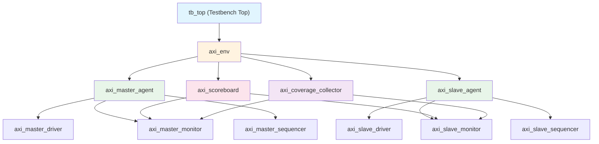
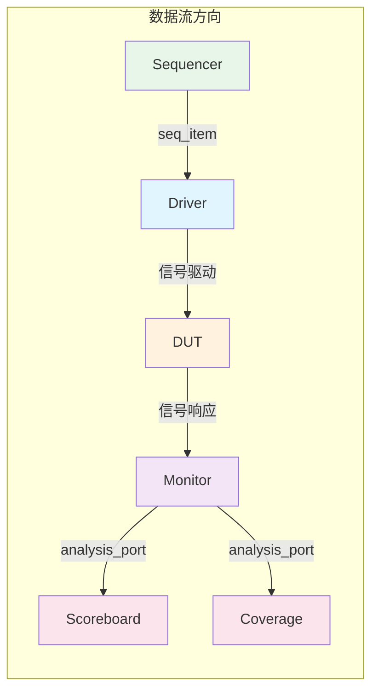

# AXI 验证环境架构

> [!abstract] 概述
> 本文档定义 AXI 验证环境的 UVM 组件层次、Agent 设计和 Scoreboard 设计。环境架构是代码实现的蓝图。

前置笔记：[[00-项目概述]] | [[01-验证计划]] | [[05-Verification/UVM-Template/00-总览|UVM 验证模板]]

---

## UVM 组件层次



---

## AXI Agent 设计

### Master Agent

> [!info] Master Agent 职责
> 产生 AXI 主设备事务：发送读写请求，接收写响应和读数据。

#### Master Driver

```systemverilog
class axi_master_driver extends uvm_driver #(axi_transaction);
  `uvm_component_utils(axi_master_driver)

  virtual axi_if vif;

  // 任务：驱动写地址通道
  task drive_write_address(axi_transaction tr);
    @(posedge vif.clk);
    vif.awaddr  <= tr.addr;
    vif.awlen   <= tr.len;
    vif.awsize  <= tr.size;
    vif.awburst <= tr.burst;
    vif.awid    <= tr.id;
    vif.awvalid <= 1'b1;
    // 等待 READY 握手
    do @(posedge vif.clk); while (!vif.awready);
    vif.awvalid <= 1'b0;
  endtask

  // 任务：驱动写数据通道
  task drive_write_data(axi_transaction tr);
    for (int i = 0; i <= tr.len; i++) begin
      @(posedge vif.clk);
      vif.wdata  <= tr.data[i];
      vif.wstrb  <= tr.strb[i];
      vif.wlast  <= (i == tr.len);
      vif.wvalid <= 1'b1;
      do @(posedge vif.clk); while (!vif.wready);
    end
    vif.wvalid <= 1'b0;
    vif.wlast  <= 1'b0;
  endtask

  // 任务：驱动读地址通道
  task drive_read_address(axi_transaction tr);
    @(posedge vif.clk);
    vif.araddr  <= tr.addr;
    vif.arlen   <= tr.len;
    vif.arsize  <= tr.size;
    vif.arburst <= tr.burst;
    vif.arid    <= tr.id;
    vif.arvalid <= 1'b1;
    do @(posedge vif.clk); while (!vif.arready);
    vif.arvalid <= 1'b0;
  endtask
endclass
```

关键设计点：
- 写地址和写数据可并行驱动（独立 `fork...join`）
- VALID 信号不能依赖 READY（协议要求）
- 支持多 ID 事务乱序发送

#### Master Monitor

```systemverilog
class axi_master_monitor extends uvm_monitor;
  `uvm_component_utils(axi_master_monitor)

  virtual axi_if vif;
  uvm_analysis_port #(axi_transaction) wr_addr_ap;
  uvm_analysis_port #(axi_transaction) wr_data_ap;
  uvm_analysis_port #(axi_transaction) wr_resp_ap;
  uvm_analysis_port #(axi_transaction) rd_addr_ap;
  uvm_analysis_port #(axi_transaction) rd_data_ap;

  // 监控写地址通道
  task monitor_write_address();
    forever begin
      @(posedge vif.clk);
      if (vif.awvalid && vif.awready) begin
        axi_transaction tr = axi_transaction::type_id::create("tr");
        tr.addr  = vif.awaddr;
        tr.len   = vif.awlen;
        tr.size  = vif.awsize;
        tr.burst = vif.awburst;
        tr.id    = vif.awid;
        wr_addr_ap.write(tr);
      end
    end
  endtask
endclass
```

关键设计点：
- 每个通道独立监控线程
- 通过 analysis_port 广播事务到 scoreboard 和 coverage
- 被动采样，不驱动任何信号

#### Master Sequencer

```systemverilog
class axi_master_sequencer extends uvm_sequencer #(axi_transaction);
  `uvm_component_utils(axi_master_sequencer)
endclass
```

---

### Slave Agent

> [!info] Slave Agent 职责
> 模拟 AXI 从设备行为：接收读写请求，返回响应和数据。

#### Slave Driver

```systemverilog
class axi_slave_driver extends uvm_driver #(axi_transaction);
  `uvm_component_utils(axi_slave_driver)

  virtual axi_if vif;

  // 任务：接收写地址并返回响应
  task receive_write();
    forever begin
      // 等待写地址握手
      @(posedge vif.clk iff (vif.awvalid && vif.awready));
      // 等待写数据完成 (WLAST)
      @(posedge vif.clk iff (vif.wvalid && vif.wready && vif.wlast));
      // 随机延迟后返回写响应
      repeat ($urandom_range(1, 10)) @(posedge vif.clk);
      vif.bresp <= 2'b00;  // OKAY
      vif.bvalid <= 1'b1;
      @(posedge vif.clk iff vif.bready);
      vif.bvalid <= 1'b0;
    end
  endtask

  // 任务：接收读地址并返回数据
  task receive_read();
    forever begin
      @(posedge vif.clk iff (vif.arvalid && vif.arready));
      // 随机延迟后返回读数据
      repeat ($urandom_range(1, 10)) @(posedge vif.clk);
      for (int i = 0; i <= ar_len; i++) begin
        vif.rdata <= mem[ar_addr + i * (1 << ar_size)];
        vif.rresp <= 2'b00;
        vif.rlast <= (i == ar_len);
        vif.rvalid <= 1'b1;
        @(posedge vif.clk iff vif.rready);
      end
      vif.rvalid <= 1'b0;
      vif.rlast  <= 1'b0;
    end
  endtask
endclass
```

关键设计点：
- 随机延迟模拟真实从设备行为
- 支持存储器模型 (memory model) 存储写入数据
- 可配置响应类型（OKAY/SLVERR/DECERR）用于异常测试

#### Slave Monitor

与 Master Monitor 结构相同，从从设备视角采样信号。通过 analysis_port 将观测到的事务发送到 Scoreboard。

---

## Scoreboard 设计

> [!important] 比对策略
> Scoreboard 接收 Master Monitor 和 Slave Monitor 的事务，进行数据一致性和协议合规性比对。

```systemverilog
class axi_scoreboard extends uvm_scoreboard;
  `uvm_component_utils(axi_scoreboard)

  // 接收端口
  uvm_analysis_imp_master #(axi_transaction, axi_scoreboard) master_export;
  uvm_analysis_imp_slave  #(axi_transaction, axi_scoreboard) slave_export;

  // 预期队列
  axi_transaction expected_q[$];
  axi_transaction actual_q[$];

  // Master 端写入预期数据
  function void write_master(axi_transaction tr);
    expected_q.push_back(tr);
    try_compare();
  endfunction

  // Slave 端写入实际数据
  function void write_slave(axi_transaction tr);
    actual_q.push_back(tr);
    try_compare();
  endfunction

  // 比对逻辑
  function void try_compare();
    while (expected_q.size() > 0 && actual_q.size() > 0) begin
      axi_transaction exp = expected_q.pop_front();
      axi_transaction act = actual_q.pop_front();

      if (exp.addr != act.addr) begin
        `uvm_error("SCB", $sformatf("地址不匹配: exp=0x%0h, act=0x%0h", exp.addr, act.addr))
      end
      if (exp.data[0] != act.data[0]) begin
        `uvm_error("SCB", $sformatf("数据不匹配: exp=0x%0h, act=0x%0h", exp.data[0], act.data[0]))
      end
      if (exp.resp != act.resp) begin
        `uvm_error("SCB", $sformatf("响应不匹配: exp=%0d, act=%0d", exp.resp, act.resp))
      end
    end
  endfunction
endclass
```

### Scoreboard 比对维度

| 比对项 | 说明 | 严重级 |
|--------|------|--------|
| 地址一致性 | 写入地址与读出地址匹配 | ERROR |
| 数据一致性 | 写入数据与读出数据匹配 | ERROR |
| 响应码正确性 | 响应码符合预期 | ERROR |
| 突发长度 | 写/读突发长度一致 | ERROR |
| ID 保序性 | 相同 ID 事务保序 | WARNING |
| WLAST/RLAST | 最后一个 beat 标记正确 | ERROR |

---

## Interface 设计

```systemverilog
interface axi_if(input logic clk, input logic rst_n);
  // 写地址通道
  logic [31:0] awaddr;
  logic [ 7:0] awlen;
  logic [ 2:0] awsize;
  logic [ 1:0] awburst;
  logic [ 3:0] awid;
  logic        awvalid;
  logic        awready;

  // 写数据通道
  logic [31:0] wdata;
  logic [ 3:0] wstrb;
  logic        wlast;
  logic        wvalid;
  logic        wready;

  // 写响应通道
  logic [ 1:0] bresp;
  logic [ 3:0] bid;
  logic        bvalid;
  logic        bready;

  // 读地址通道
  logic [31:0] araddr;
  logic [ 7:0] arlen;
  logic [ 2:0] arsize;
  logic [ 1:0] arburst;
  logic [ 3:0] arid;
  logic        arvalid;
  logic        arready;

  // 读数据通道
  logic [31:0] rdata;
  logic [ 1:0] rresp;
  logic [ 3:0] rid;
  logic        rlast;
  logic        rvalid;
  logic        rready;

  // SVA 断言
  // 参考: [[05-Verification/UVM-Template/Driver握手时序陷阱|握手时序陷阱]]
endinterface
```

参考：[[05-Verification/UVM-Template/01-interface|Interface 模板]]

---

## Env 顶层组装

```systemverilog
class axi_env extends uvm_env;
  `uvm_component_utils(axi_env)

  axi_master_agent    m_agent;
  axi_slave_agent     s_agent;
  axi_scoreboard      sb;
  axi_coverage_collector cov;

  function void build_phase(uvm_phase phase);
    super.build_phase(phase);
    m_agent = axi_master_agent::type_id::create("m_agent", this);
    s_agent = axi_slave_agent::type_id::create("s_agent", this);
    sb      = axi_scoreboard::type_id::create("sb", this);
    cov     = axi_coverage_collector::type_id::create("cov", this);
  endfunction

  function void connect_phase(uvm_phase phase);
    super.connect_phase(phase);
    // Monitor analysis_port 连接 Scoreboard
    m_agent.monitor.wr_addr_ap.connect(sb.master_export);
    m_agent.monitor.rd_data_ap.connect(sb.master_export);
    s_agent.monitor.wr_resp_ap.connect(sb.slave_export);
    s_agent.monitor.rd_addr_ap.connect(sb.slave_export);
    // Monitor analysis_port 连接 Coverage
    m_agent.monitor.wr_addr_ap.connect(cov.analysis_export);
  endfunction
endclass
```

参考：[[05-Verification/UVM-Template/09-env|Env 模板]] | [[02-UVM/06-TLM通信|TLM 通信]]

---

## 组件职责汇总



| 组件 | 类型 | 职责 |
|------|------|------|
| Sequencer | 主动 | 调度 sequence item 到 driver |
| Driver | 主动 | 将 transaction 转化为信号级激励 |
| Monitor | 被动 | 采集信号级活动，转化为 transaction |
| Scoreboard | 被动 | 比对预期与实际结果 |
| Coverage | 被动 | 收集功能覆盖率 |

---

## 相关链接

### UVM 组件模板
- [[05-Verification/UVM-Template/01-interface|Interface 模板]]
- [[05-Verification/UVM-Template/02-transaction|Transaction 模板]]
- [[05-Verification/UVM-Template/03-sequence|Sequence 模板]]
- [[05-Verification/UVM-Template/04-driver|Driver 模板]]
- [[05-Verification/UVM-Template/05-monitor|Monitor 模板]]
- [[05-Verification/UVM-Template/07-scoreboard|Scoreboard 模板]]
- [[05-Verification/UVM-Template/08-agent|Agent 模板]]
- [[05-Verification/UVM-Template/09-env|Env 模板]]

### UVM 机制
- [[02-UVM/01-Phase机制|Phase 机制]]
- [[02-UVM/02-config_db|config_db]]
- [[02-UVM/03-Sequence机制|Sequence 机制]]
- [[02-UVM/06-TLM通信|TLM 通信]]

### 常见陷阱
- [[05-Verification/UVM-Template/Driver握手时序陷阱|Driver 握手时序陷阱]]
- [[05-Verification/UVM-Template/UVM-Analysis-Port数据流|Analysis Port 数据流]]
- [[05-Verification/UVM-Template/uvm_analysis_imp多端口陷阱|uvm_analysis_imp 多端口陷阱]]

### 本项目
- [[00-项目概述]]
- [[01-验证计划]]
- [[03-测试用例]]
