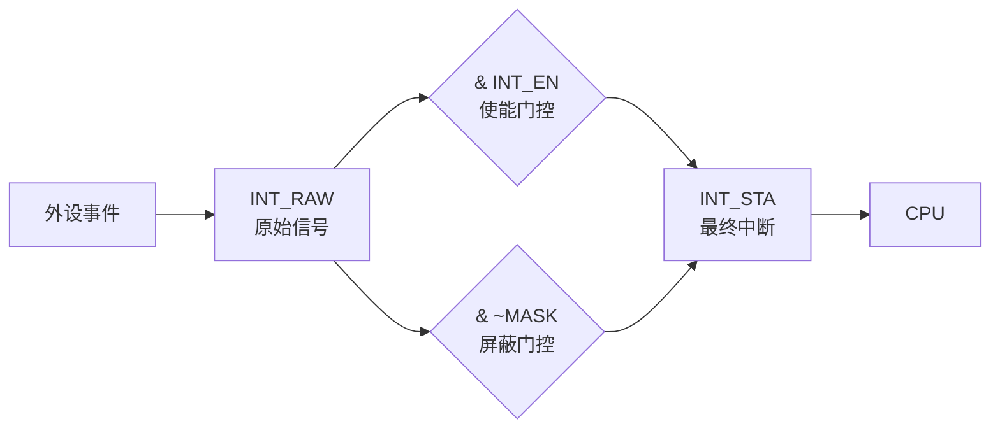

# 数字寄存器字段详解

在数字芯片（外设 IP、通信接口、功能安全模块）的寄存器映射中，==STA、TRIGGER、MASK、MNT、INT== 是最基础且通用的功能字段前缀，分别对应**状态、触发、屏蔽、维护/监控、中断**五大类核心功能。

---

### 8.1 五个核心字段详解

#### 1. STA（Status，状态寄存器） %% fold %%

> [!info-STA] 状态寄存器概述
> - **本质**：**只读寄存器**，实时反映模块当前运行状态和事件发生情况，是软件查询硬件状态的唯一窗口
> - **访问类型**：绝大多数为 **R**（只读），少数位支持 **W1C**（写 1 清零）用于清除粘滞状态标志
> - **与中断的关联**：STA 的置位位通常就是中断源——INT 寄存器判断哪些 STA 位可以产生中断

**典型位定义**（以 UART 为例）：

| 位域 | 含义 | 说明 |
|------|------|------|
| `STA[0]` RXNE | 接收 FIFO 非空 | 1 = 有数据可读 |
| `STA[1]` TXE | 发送 FIFO 空 | 1 = 可以写入新数据 |
| `STA[2]` OE | 溢出错误 | 接收数据未及时读取导致丢失 |
| `STA[3]` PE | 奇偶校验错误 | 校验位不匹配 |

> [!tip-STA] 验证要点
> 必须验证所有状态位在对应事件发生时的置位时机，以及 W1C 位的清零功能。

**STA 的两种子类型：**

| 类型 | 行为 | 适用场景 |
|------|------|---------|
| **Level STA**（电平型） | 条件满足就一直为 1，条件消失自动归 0 | FIFO 空/满标志、忙标志，适合轮询 |
| **Pulse STA**（脉冲型） | 事件发生时置位并保持，直到软件写 1 清除 | 错误标志、中断标志，适合中断驱动 |

---

#### 2. TRIGGER（Trigger，触发寄存器） %% fold %%

> [!info-TRIGGER] 触发寄存器概述
> - **本质**：用于配置硬件事件的**触发条件**，或**手动触发**一次性操作
> - **访问类型**：**R/W**（读写），部分位支持 **W1S**（写 1 置位），硬件完成操作后自动清零
> - **核心特性**：==触发即忘（Fire-and-Forget）==——软件只需写一次，硬件自动完成后续操作

**典型功能：**

| 功能 | 描述 |
|------|------|
| 中断触发方式配置 | 选择上升沿 / 下降沿 / 电平触发 |
| DMA 触发条件配置 | 选择 FIFO 半满 / 全满 / 非空时触发 DMA |
| 软件触发 | 写 1 启动 ADC 转换、写 1 产生软件中断、写 1 启动时隙帧 |

> [!example-TRIGGER] Verilog 示例
> ```verilog
> TRIGGER[0] SW_TRIG : 写 1 立即启动一次 ADC 采样，采样完成后硬件自动清零
> TRIGGER[2:1] EDGE_SEL : 00=上升沿, 01=下降沿, 10=双沿, 11=电平
> ```

---

#### 3. MASK（Mask，屏蔽寄存器） %% fold %%

> [!info-MASK] 屏蔽寄存器概述
> - **本质**：控制是否允许某个事件产生中断或触发其他硬件动作
> - **访问类型**：**R/W**（读写）
> - **核心逻辑**：最终中断信号 = 原始事件信号 `&` `(~MASK 位)`

| MASK 位值 | 效果 |
|-----------|------|
| `0` | 事件**不被屏蔽**，可以产生中断 |
| `1` | 事件**被屏蔽**，不会产生中断 |

**典型位定义**（与 STA 寄存器一一对应）：

| 位域 | 对应的事件 |
|------|-----------|
| `MASK[0]` RXNE_MASK | 屏蔽接收 FIFO 非空中断 |
| `MASK[1]` TXE_MASK | 屏蔽发送 FIFO 空中断 |
| `MASK[2]` OE_MASK | 屏蔽溢出错误中断 |

> [!tip-MASK] 验证要点
> 必须验证 `MASK=1` 时对应事件不产生中断，`MASK=0` 时中断正常产生。

> [!note-MASK] 与 INT_EN 的关系
> MASK 与 INT_EN 本质上是同一类功能的两种命名风格。部分 IP 用 MASK（屏蔽不想要的），部分用 INT_EN（使能想要的），逻辑上互为取反。

---

#### 4. MNT（Maintenance/Monitor，维护/监控寄存器） %% fold %%

> [!info-MNT] 维护/监控寄存器概述
> - **本质**：用于芯片的**生产测试、在线调试、性能监控和维护操作**，正常功能模式下一般不使用
> - **访问类型**：**R/W**，部分位仅在测试模式下可写，正常模式下为只读或返回 0

**两种常见含义：**

| 含义 | 适用场景 | 典型位定义 |
|------|---------|-----------|
| **Maintenance**（维护） | 生产测试、DFT | `MNT[0]` BIST_EN：使能内建自测试<br>`MNT[1]` SCAN_EN：使能扫描链<br>`MNT[3:2]` TEST_MODE：选择测试模式 |
| **Monitor**（监控） | 运行健康监测 | `MNT[7:4]` TEMP_MON：芯片内部温度传感器值<br>`MNT[15:8]` VOLT_MON：内部电压监测值<br>`MNT[16]` CLK_DET：时钟丢失检测标志 |

> [!danger-MNT] 设计警告
> MNT 寄存器在正常模式下应**写保护**，防止软件误写导致芯片进入测试模式。通常需要先写入特定的解锁序列（Unlock Sequence）才能修改 MNT 寄存器。

---

#### 5. INT（Interrupt，中断寄存器） %% fold %%

> [!info-INT] 中断寄存器概述
> - **本质**：中断相关寄存器的**统称**，通常包含中断状态、中断使能、中断清除等多个子寄存器
> - **核心作用**：管理模块产生的所有中断信号，是硬件与软件交互的核心机制

**常见子寄存器：**

| 子寄存器 | 访问类型 | 功能 |
|----------|---------|------|
| **INT_STA / INT_STAT** | R, W1C | 中断状态。硬件置位表示事件发生，软件写 1 清除 |
| **INT_EN** | R/W | 中断使能。写 1 使能对应中断，写 0 禁用 |
| **INT_CLR / ICR** | W1C | 中断清除。写 1 清除对应中断标志 |
| **INT_RAW** | R | 原始中断信号（不受 INT_EN 影响），用于调试 |

**完整中断路径：**



**常见的三种中断处理架构：**

| 架构 | 特点 | 典型应用 |
|------|------|---------|
| **单一 INT 寄存器** | 所有中断位在同一个寄存器，读即得状态，写 1 清除 | 简单外设（GPIO、定时器） |
| **INT_STA + INT_EN 分离** | 状态和使能分开，可灵活控制每个中断源 | 复杂外设（UART、SPI、I2C） |
| **INT_STA + INT_EN + INT_CLR 分离** | 状态、使能、清除三者独立，清除不影响状态读取 | 安全关键模块（汽车芯片、功能安全） |

> [!tip-INT] 验证要点
> 必须验证中断的产生、屏蔽、清除、嵌套等所有场景：
> - 单中断源产生、屏蔽、清除
> - 多中断源同时产生
> - 中断处理过程中新中断到达（嵌套）
> - 中断标志的粘滞特性（W1C 是否可靠）

---

### 8.2 寄存器常见字段缩写汇总 %% fold %%

> [!note] 说明
> 按功能分类整理行业最通用的寄存器字段缩写，覆盖 90% 以上的外设 IP 和通信接口。

> [!example]- 状态类（Status）
> | 缩写 | 全称 | 含义 | 访问类型 |
> |------|------|------|---------|
> | STA / STAT | Status | 通用状态寄存器 | R, W1C |
> | SR | Status Register | 状态寄存器 | R, W1C |
> | ISR | Interrupt Status Register | 中断状态寄存器 | R, W1C |
> | FLG | Flag | 标志寄存器 | R, W1C |
> | ERR | Error | 错误状态寄存器 | R, W1C |
> | LVL / LEVEL | FIFO Level | FIFO 当前数据量 | R |

> [!example]- 控制类（Control）
> | 缩写 | 全称 | 含义 | 访问类型 |
> |------|------|------|---------|
> | CTRL / CR | Control Register | 通用控制寄存器 | R/W |
> | CMD | Command | 命令寄存器（写即执行） | W1S |
> | EN | Enable | 使能寄存器 | R/W |
> | RST | Reset | 复位寄存器 | W1S |
> | MODE | Mode | 模式配置寄存器 | R/W |
> | CFG / CONF | Configuration | 配置寄存器 | R/W |
> | SEL | Select | 选择寄存器（如 MUX 通道选择） | R/W |

> [!example]- 中断类（Interrupt）
> | 缩写 | 全称 | 含义 | 访问类型 |
> |------|------|------|---------|
> | INT | Interrupt | 中断寄存器（统称） | R/W, W1C |
> | IER / IE | Interrupt Enable Register | 中断使能寄存器 | R/W |
> | ICR | Interrupt Clear Register | 中断清除寄存器 | W1C |
> | IMR | Interrupt Mask Register | 中断屏蔽寄存器 | R/W |
> | ISR | Interrupt Status Register | 中断状态寄存器 | R, W1C |
> | IVT | Interrupt Vector Table | 中断向量表 | -- |

> [!example]- 数据类（Data）
> | 缩写 | 全称 | 含义 | 访问类型 |
> |------|------|------|---------|
> | DATA | Data | 通用数据寄存器 | R/W |
> | DR | Data Register | 数据寄存器 | R/W |
> | TXD | Transmit Data | 发送数据寄存器 | W |
> | RXD | Receive Data | 接收数据寄存器 | R |
> | FIFO | FIFO | FIFO 数据寄存器 | R/W |
> | BUF | Buffer | 缓冲区寄存器 | R/W |

> [!example]- 定时/计数类（Timer/Counter）
> | 缩写 | 全称 | 含义 | 访问类型 |
> |------|------|------|---------|
> | CNT | Counter | 计数器寄存器 | R/W |
> | ARR | Auto Reload Register | 自动重装载寄存器 | R/W |
> | CCR | Capture/Compare Register | 捕获/比较寄存器 | R/W |
> | PSC | Prescaler | 预分频器寄存器 | R/W |
> | SR | Shadow Register | 影子寄存器（双缓冲） | R/W |

> [!example]- 地址类（Address）
> | 缩写 | 全称 | 含义 | 访问类型 |
> |------|------|------|---------|
> | ADDR / ADR | Address | 通用地址寄存器 | R/W |
> | MAR | Memory Address Register | 存储器地址寄存器 | R/W |
> | SAR | Source Address Register | 源地址寄存器 | R/W |
> | DAR / DST | Destination Address Register | 目的地址寄存器 | R/W |
> | BAR | Base Address Register | 基地址寄存器 | R/W |

---

### 8.3 寄存器字段命名通用规则 %% fold %%

#### 1. 前缀 + 功能

采用 `模块名_字段名` 的命名方式，一眼可知属于哪个模块：

```verilog
UART_STA, UART_TRIGGER, SPI_CTRL, SPI_MASK, TIM_CNT, TIM_ARR
```

#### 2. 位域大写缩写

状态位和控制位通常采用**大写下划线缩写**，简短且具有自描述性：

| 常见缩写 | 全称 |
|----------|------|
| RXNE | Receive FIFO Not Empty |
| TXE | Transmit FIFO Empty |
| BSY / BUSY | Busy Flag |
| OVF / OF | Overflow |
| UDF / UF | Underflow |
| ERR | Error |
| DONE | Operation Complete |
| RDY | Ready |

#### 3. 访问类型后缀

寄存器名后标注访问类型，便于软件驱动开发者理解：

| 后缀 | 含义 |
|------|------|
| `_R` | 只读（Read Only） |
| `_W` | 只写（Write Only） |
| `_RW` | 读写（Read/Write） |
| `_RC` | 读后清零（Read to Clear） |
| `_W1C` | 写 1 清零（Write 1 to Clear） |
| `_W1S` | 写 1 置位（Write 1 to Set） |

#### 4. W1C / W1S 的设计意图

| 访问类型 | 机制 | 应用场景 |
|----------|------|---------|
| **W1C**（Write 1 to Clear） | 写 1 清零对应位，写 0 无影响 | 状态标志清除、中断清除 |
| **W1S**（Write 1 to Set） | 写 1 置位对应位，写 0 无影响 | 命令触发、软件触发 |

> [!important] 核心设计意图
> 采用 W1C/W1S 而非直接 R/W，是为了避免软件在 Read-Modify-Write 过程中误修改其他位。每个位独立响应写操作，互不影响。

#### 5. 典型寄存器地址偏移布局

```verilog
// 32-bit 总线，4 字节对齐
0x00  STA       // 状态寄存器（只读）
0x04  CTRL      // 控制寄存器（读写）
0x08  TRIGGER   // 触发寄存器（写 1 置位）
0x0C  MASK      // 屏蔽寄存器（读写）
0x10  MNT       // 维护/监控寄存器（读写）
0x14  INT_STA   // 中断状态寄存器（读 + W1C）
0x18  INT_EN    // 中断使能寄存器（读写）
0x1C  DATA      // 数据寄存器（读写）
```

> [!note] 一般规则
> 每个寄存器占据 4 字节，按 4 字节对齐。状态类寄存器通常在偏移最小的地址，便于快速轮询。
