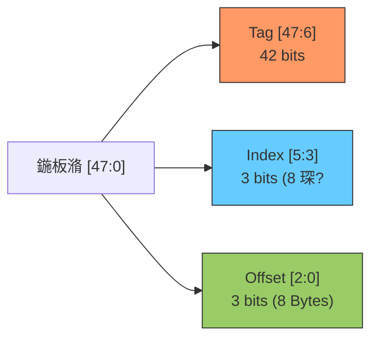
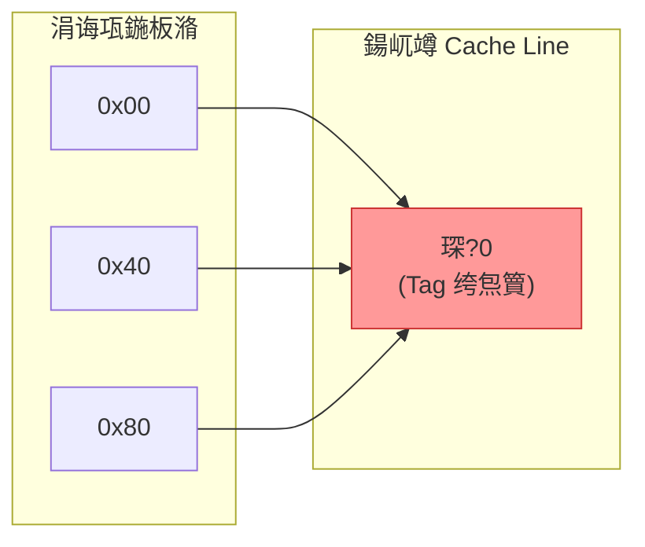
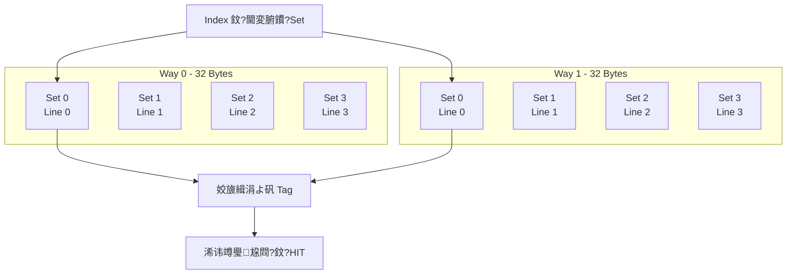
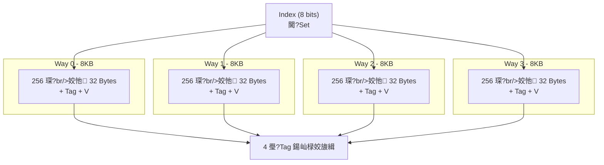
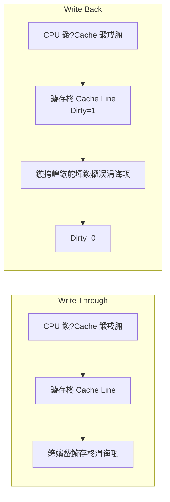
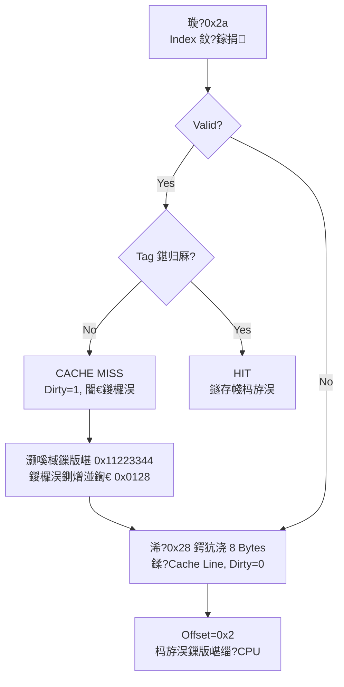

---
tags: [Architecture, Cache, CPU, Memory]
created: 2026-07-06
---

# Cache 鍩虹涓庢槧灏勬柟寮?

## 1. 鍩烘湰姒傚康

| 鏈 | 璇存槑 |
|------|------|
| Cache Size | cache 鍙紦瀛樼殑鏈€澶ф暟鎹噺 |
| Cache Line Size | 鍧囧垎 cache 鐨勫潡澶у皬锛屾暟鎹紶杈撴渶灏忓崟浣?|
| Offset | 瀵诲潃 cache line 鍐呭瓧鑺?(log2 line_size) |
| Index | 瀵诲潃 cache 琛?缁?(log2 num_lines) |
| Tag | 楂樹綅鍦板潃锛屽敮涓€鏍囪瘑 cache line 瀵瑰簲鐨勪富瀛樺湴鍧€ |

**绀轰緥**锛?4 Bytes cache, line size 8 Bytes 鈫?8 琛?



## 2. 鐩存帴鏄犲皠缂撳瓨

姣忎釜涓诲瓨鍦板潃鏄犲皠鍒?*鍞竴**涓€涓?cache line銆?

```mermaid
flowchart TD
    ADDR[CPU 鍦板潃] --> IDX[鎻愬彇 Index]
    IDX --> LINE[鎵惧埌瀵瑰簲 Cache Line]
    LINE --> VALID{Valid Bit?}
    VALID -->|0| MISS1[CACHE MISS<br/>浠庝富瀛樺姞杞絔
    VALID -->|1| TAG{Tag 鍖归厤?}
    TAG -->|No| MISS2[CACHE MISS<br/>鏇挎崲鏃ц]
    TAG -->|Yes| HIT[CACHE HIT<br/>杩斿洖鏁版嵁]
    MISS1 --> LOAD[鏇存柊 Cache Line<br/>Set Valid=1]
    MISS2 --> LOAD
```

**棰犵案闂**锛氬湴鍧€ 0x00銆?x40銆?x80 鏄犲皠鍒板悓涓€ cache line锛?



渚濇璁块棶鏃舵瘡娆?miss锛岄绻侀绨搞€?

## 3. 澶氳矾缁勭浉鑱旂紦瀛?

灏?cache 鍧囧垎 n 浠斤紙n 璺級锛屾瘡璺浉鍚?index 鐨勮缁勬垚涓€涓?set銆?

**绀轰緥**锛?4 Bytes, 8 Bytes line, **2 璺?*
- 姣忚矾 32 Bytes / 8 Bytes = 4 琛? 鍏?**4 涓?set**
- offset = 3 bits, index = 2 bits, tag = 43 bits



```mermaid
flowchart LR
    ADDR[Address] --> EX[Extract Index<br/>2 bits] --> SETS["閫?Set (鍏?4 缁?"]
    SETS --> CMP["瀵规瘮缁勫唴鎵€鏈?Tag<br/>(Way 0 & Way 1)"]
    CMP -->|Way 0 鍖归厤| H0[HIT - Way 0]
    CMP -->|Way 1 鍖归厤| H1[HIT - Way 1]
    CMP -->|鏃犲尮閰峾 M[CACHE MISS]
```

**浼樺娍**锛?x00 鍜?0x40 鍙悓鏃剁紦瀛樺湪涓嶅悓璺紝閬垮厤棰犵案銆?

鐩存帴鏄犲皠缂撳瓨 = 鍗曡矾缁勭浉鑱旓紙鐗逛緥锛夈€?

## 4. 鍏ㄧ浉杩炵紦瀛?

```mermaid
flowchart LR
    ADDR[Address] --> TAG["Tag (鏃?Index)"]
    TAG --> CMP["涓庢墍鏈?Cache Line Tag 骞惰姣旇緝"]
    CMP -->|浠讳竴鍖归厤| HIT[HIT]
    CMP -->|鏃犲尮閰峾 MISS[CACHE MISS]
```

鎵€鏈?cache line 鍦ㄤ竴涓粍鍐咃紝鏃?index銆備换鎰忓湴鍧€鍙瓨浜庝换鎰?cache line銆?

**浼樼偣**锛氭渶澶х▼搴﹂檷浣庨绨搞€?
**缂虹偣**锛氱‖浠舵垚鏈珮锛坱ag 姣旇緝鍣ㄥ锛夈€?

## 5. 瀹炰緥锛?2KB 4璺粍鐩歌仈

| 鍙傛暟 | 璁＄畻 | 鍊?|
|------|------|----|
| Cache Size | 鈥?| 32 KB |
| 璺暟 | 鈥?| 4 |
| 姣忚矾澶у皬 | 32KB / 4 | 8 KB |
| Line Size | 鈥?| 32 Bytes |
| 姣忕粍琛屾暟 | 鈥?| 4 (姣忚矾 1 琛? |
| 缁勬暟 | 8KB / 32B | 256 |
| Offset | log2(32) | 5 bits |
| Index | log2(256) | 8 bits |
| Tag (48-bit) | 48 - 5 - 8 | 35 bits |



## 6. 鍒嗛厤绛栫暐

| 绛栫暐 | 璇荤己澶?| 鍐欑己澶?|
|------|--------|--------|
| 璇诲垎閰?| 鍒嗛厤 cache line | 鈥?|
| 鍐欏垎閰?| 鈥?| load 鏁版嵁鍒?cache line 鍚庡啀鍐?|
| 闈炲啓鍒嗛厤 | 鈥?| 鍙洿鏂颁富瀛橈紝涓嶅垎閰?cache line |

```mermaid
flowchart LR
    subgraph ReadMiss[璇荤己澶盷
        RM[CPU 璇?br/>Cache Miss] --> RA[鍒嗛厤 Cache Line<br/>浠庝富瀛樺姞杞絔
    end
    subgraph WriteMiss[鍐欑己澶盷
        WM[CPU 鍐?br/>Cache Miss] --> WA{鍐欏垎閰?}
        WA -->|Yes| WL["Load 鏁版嵁鍒?Line<br/>鍐嶆洿鏂?]
        WA -->|No| WN[鍙洿鏂颁富瀛榏
    end
```

## 7. 鏇存柊绛栫暐

| 绛栫暐 | 鍐欏懡涓椂 | 涓诲瓨涓€鑷存€?| 鑴忔爣蹇椾綅 |
|------|---------|-----------|---------|
| 鍐欑洿閫?(WT) | 鏇存柊 cache + 涓诲瓨 | 涓€鑷?| 鏃?|
| 鍐欏洖 (WB) | 鍙洿鏂?cache | 鍙兘涓嶄竴鑷?| Dirty bit |



鍐欏洖绛栫暐涓嬶紝cache line 鏇挎崲鍓嶉渶灏嗚剰鏁版嵁鍐欏洖涓诲瓨锛岃繖涔熸槸 cache line 涓轰紶杈撴渶灏忓崟浣嶇殑鍘熷洜锛堟瘡涓?line 鍏辩敤涓€涓?dirty bit锛夈€?

## 8. 瀹炰緥锛氱洿鎺ユ槧灏?+ 鍐欏洖

64 Bytes cache, 8 Bytes line, 璇诲湴鍧€ 0x2a锛?



---

**鍙傝**
- [[09-Notes/07-Cache缁勭粐涓庣瓥鐣] 鈥?VIVT/PIPT/VIPT

