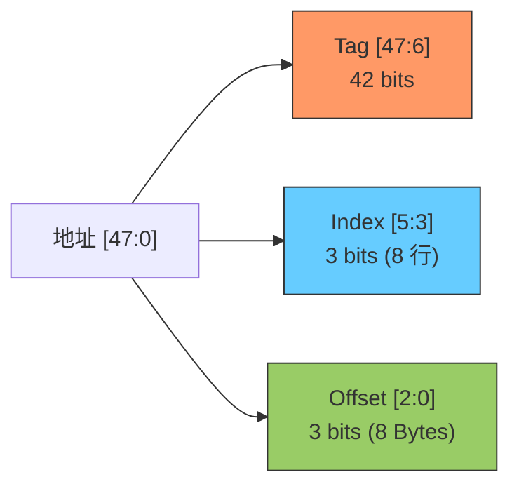
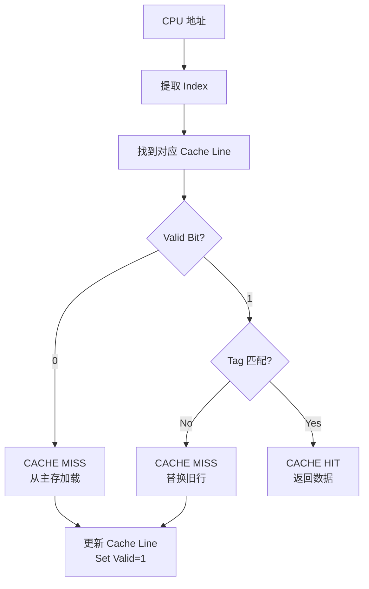
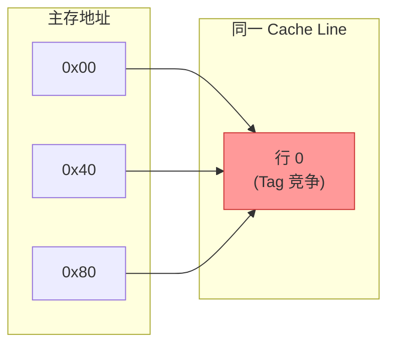
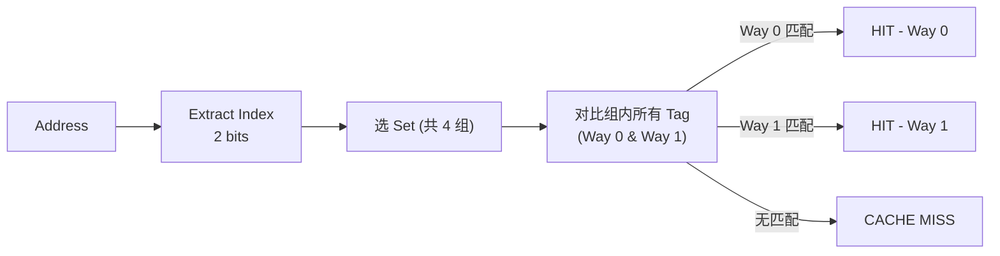
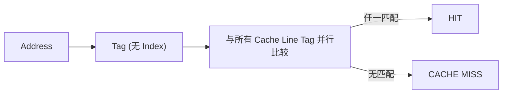
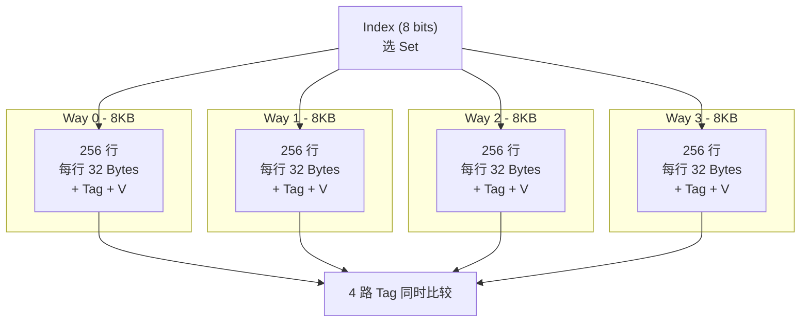
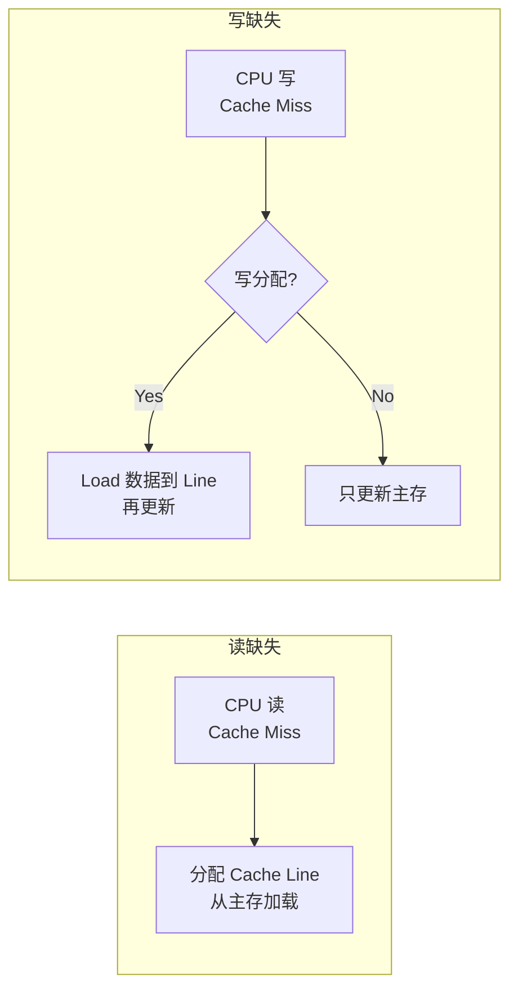
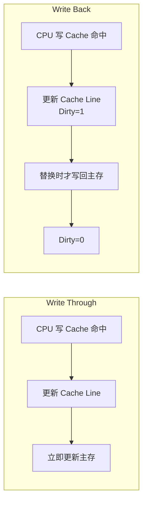
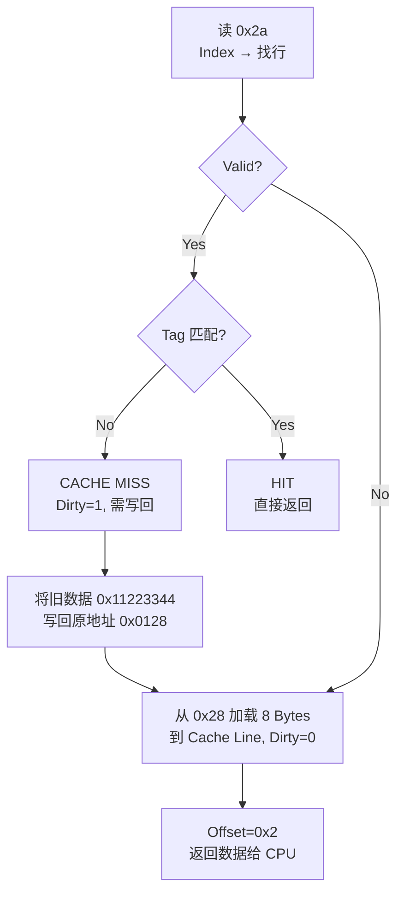

# Cache 基础与映射方式

## 1. 基本概念

| 术语 | 说明 |
|------|------|
| Cache Size | cache 可缓存的最大数据量 |
| Cache Line Size | 均分 cache 的块大小，数据传输最小单位 |
| Offset | 寻址 cache line 内字节 (log2 line_size) |
| Index | 寻址 cache 行/组 (log2 num_lines) |
| Tag | 高位地址，唯一标识 cache line 对应的主存地址 |

**示例**：64 Bytes cache, line size 8 Bytes → 8 行

## 2. 直接映射缓存

每个主存地址映射到**唯一**一个 cache line。

**颠簸问题**：地址 0x00、0x40、0x80 映射到同一 cache line：

依次访问时每次 miss，频繁颠簸。

## 3. 多路组相联缓存

将 cache 均分 n 份（n 路），每路相同 index 的行组成一个 set。

**示例**：64 Bytes, 8 Bytes line, **2 路**
- 每路 32 Bytes / 8 Bytes = 4 行, 共 **4 个 set**
- offset = 3 bits, index = 2 bits, tag = 43 bits

**优势**：0x00 和 0x40 可同时缓存在不同路，避免颠簸。

直接映射缓存 = 单路组相联（特例）。

## 4. 全相连缓存

所有 cache line 在一个组内，无 index。任意地址可存于任意 cache line。

**优点**：最大程度降低颠簸。
**缺点**：硬件成本高（tag 比较器多）。

## 5. 实例：32KB 4路组相联

| 参数 | 计算 | 值 |
|------|------|----|
| Cache Size | — | 32 KB |
| 路数 | — | 4 |
| 每路大小 | 32KB / 4 | 8 KB |
| Line Size | — | 32 Bytes |
| 每组行数 | — | 4 (每路 1 行) |
| 组数 | 8KB / 32B | 256 |
| Offset | log2(32) | 5 bits |
| Index | log2(256) | 8 bits |
| Tag (48-bit) | 48 - 5 - 8 | 35 bits |

## 6. 分配策略

| 策略 | 读缺失 | 写缺失 |
|------|--------|--------|
| 读分配 | 分配 cache line | — |
| 写分配 | — | load 数据到 cache line 后再写 |
| 非写分配 | — | 只更新主存，不分配 cache line |

## 7. 更新策略

| 策略 | 写命中时 | 主存一致性 | 脏标志位 |
|------|---------|-----------|---------|
| 写直通 (WT) | 更新 cache + 主存 | 一致 | 无 |
| 写回 (WB) | 只更新 cache | 可能不一致 | Dirty bit |

写回策略下，cache line 替换前需将脏数据写回主存，这也是 cache line 为传输最小单位的原因（每个 line 共用一个 dirty bit）。

## 8. 实例：直接映射 + 写回

64 Bytes cache, 8 Bytes line, 读地址 0x2a：

---

**参见**
- [[09-Notes/07-Cache组织与策略]] — VIVT/PIPT/VIPT
