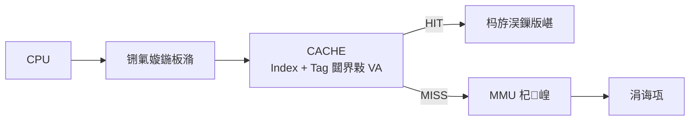
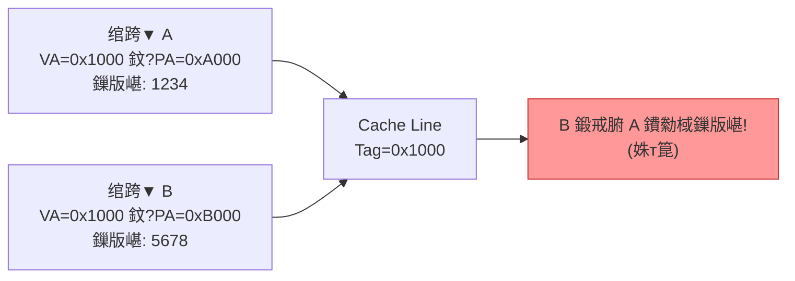
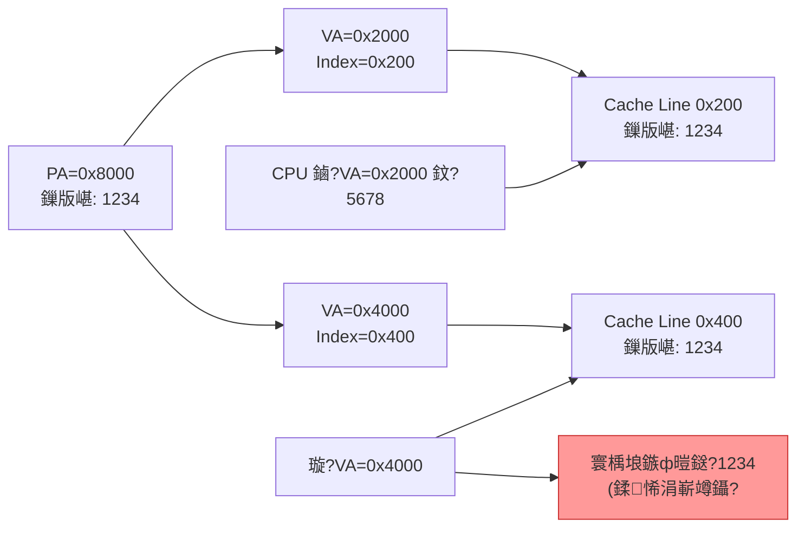
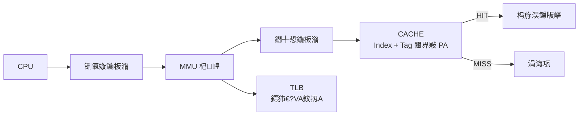
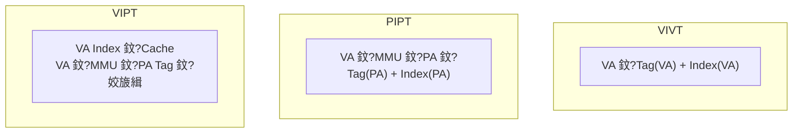

---
tags: [Architecture, Cache, MMU, VIPT, PIPT]
created: 2026-07-06
---

# Cache 缁勭粐鏂瑰紡涓庣瓥鐣?

> cache 鎺у埗鍣ㄦ牴鎹湴鍧€鍒ゆ柇鍛戒腑鐨勪緷鎹細铏氭嫙鍦板潃 (VA) 杩樻槸鐗╃悊鍦板潃 (PA)銆?

CPU 鍙戝嚭铏氭嫙鍦板潃 鈫?MMU 杞崲鎴愮墿鐞嗗湴鍧€ 鈫?璇诲彇鏁版嵁銆俢ache 鍙敤 VA銆丳A 鎴栦袱鑰呯粍鍚堛€?

## 1. VIVT锛堣櫄鎷熼珮閫熺紦瀛橈級

Index 鍜?Tag 鍧囧彇鑷櫄鎷熷湴鍧€銆?



**浼樼偣**锛氭棤闇€鍦板潃杞崲鍗冲彲鏌?cache锛岄€熷害蹇€?

**闂 1锛氭涔?* 鈥?鐩稿悓 VA 鏄犲皠涓嶅悓 PA



- 瑙ｅ喅锛氬垏鎹㈡椂 flush cache锛堝啓鍥炶剰鏁版嵁 + 鏃犳晥鍖栵級

**闂 2锛氬埆鍚?* 鈥?涓嶅悓 VA 鏄犲皠鐩稿悓 PA锛屼笖 index 涓嶅悓



- 瑙ｅ喅锛歯ocache 鏄犲皠銆乫lush cache銆佷繚璇?VA 绱㈠紩鍒扮浉鍚?cache line

**缁撹**锛歏IVT 闂澶锛屽凡鍩烘湰娣樻卑銆?

## 2. PIPT锛堢墿鐞嗛珮閫熺紦瀛橈級

Index 鍜?Tag 鍧囧彇鑷墿鐞嗗湴鍧€銆?



**浼樼偣**锛?
- Tag 鍞竴 鈫?鏃犳涔?
- Index 鍞竴 鈫?鏃犲紓鍚?
- 杞欢鏃犻渶缁存姢

**缂虹偣**锛?
- 闇€绛夊緟 VA鈫扨A 杞崲鍚庢墠鑳芥煡 cache
- 纭欢澶嶆潅

**鐜扮姸**锛歀inux 涓?PIPT 绠＄悊鍑芥暟鍏ㄤ负绌猴紝鏃犻渶缁存姢銆傜幇浠?CPU 鏅亶閲囩敤銆?

## 3. VIPT锛堢墿鐞嗘爣璁扮殑铏氭嫙楂橀€熺紦瀛橈級

Index 鍙栬嚜铏氭嫙鍦板潃锛孴ag 鍙栬嚜鐗╃悊鍦板潃銆傛煡 cache 涓?MMU 杞崲**鍚屾椂杩涜**銆?

```mermaid
flowchart LR
    CPU[CPU] --> VA[铏氭嫙鍦板潃]
    VA --> PATH1["鎻愬彇 Index<br/>(鏉ヨ嚜 VA)"]
    VA --> PATH2["MMU 杞崲<br/>(鍚屾椂杩涜)"]
    PATH1 --> CACHE[CACHE<br/>鐢?VA Index 鏌ヨ]
    PATH2 --> PA[鐗╃悊鍦板潃]
    PA --> TAG["鎻愬彇 Tag<br/>(鏉ヨ嚜 PA)"]
    CACHE --> CMP["姣旇緝 Tag"]
    TAG --> CMP
    CMP -->|鍖归厤| HIT[HIT]
    CMP -->|涓嶅尮閰峾 MISS[MISS 鈫?涓诲瓨]
```

**浼樼偣**锛氭€ц兘濂斤紙骞惰锛夛紝鏃犳涔夛紙tag 鏄墿鐞嗙殑锛夈€?

```mermaid
flowchart TD
    subgraph NoAlias[涓€璺?鈮?4KB: 鏃犲紓鍚峕
        N1["VA 鍜?PA 鐨?[11:0] 鐩稿悓<br/>(椤靛唴鍋忕Щ)"] --> N2["Index 鍙栬嚜 [11:x]<br/>涓嶈秴鍑洪〉杈圭晫"]
        N2 --> N3["绛変环浜?PIPT<br/>鏃犻渶棰濆缁存姢"]
    end
    subgraph Alias[涓€璺?> 4KB: 鍙兘鍒悕]
        A1["渚? 8KB 鐩存帴鏄犲皠<br/>256B line"] --> A2["Index 闇€瑕?bit12<br/>VA bit12 鈮?PA bit12"]
        A2 --> A3["鐩稿悓 PA 鏁版嵁<br/>鍔犺浇鍒颁笉鍚?cache line"]
    end
```

**瑙ｅ喅鍒悕**锛?
- 寤虹珛鍏变韩鏄犲皠鏃讹紝杩斿洖鐨勮櫄鎷熷湴鍧€鎸?cache size 瀵归綈11
- 澶氳矾缁勭浉鑱旀椂鎸変竴璺ぇ灏忓榻?

## 4. 涓夌鏂瑰紡瀵规瘮



| 鐗规€?        | VIVT | PIPT | VIPT         |
| ---------- | ---- | ---- | ------------ |
| Index 鏉ユ簮   | VA   | PA   | VA           |
| Tag 鏉ユ簮     | VA   | PA   | PA           |
| 姝т箟闂       | 鉂?鏈? | 鉁?鏃? | 鉁?鏃?         |
| 鍒悕闂       | 鉂?鏈? | 鉁?鏃? | 鈿狅笍 涓€璺?4KB 鏃舵湁 |
| 鏌?cache 鏃舵満 | 杞崲鍓? | 杞崲鍚? | 鍚屾椂           |
| 杞欢缁存姢鎴愭湰     | 楂?   | 鏃?   | 浣?           |
| 褰撳墠浣跨敤       | 娣樻卑   | 甯歌   | 甯歌锛堜竴璺墹4KB鏃讹級  |

## 5. 琛ュ厖锛歍LB

```mermaid
flowchart LR
    CPU[CPU] --> VA[铏氭嫙鍦板潃]
    VA --> TLB{"TLB<br/>(VA鈫扨A 缂撳瓨)"}
    TLB -->|HIT| PA1[鐗╃悊鍦板潃 鈫?Cache]
    TLB -->|MISS| PT[鏌ラ〉琛?br/>鎱㈤€熻矾寰刔
    PT --> PA2[鐗╃悊鍦板潃]
    PT --> TLB[鏇存柊 TLB]
    style TLB fill:#6cf,stroke:#333
```

MMU 涓紦瀛?VA鈫扨A 鏄犲皠鍏崇郴鐨勫皬瀹归噺 cache銆傚姞閫熷湴鍧€杞崲銆?

---

**鍙傝**
- [[09-Notes/06-Cache鍩虹涓庢槧灏勬柟寮廬] 鈥?鏄犲皠鏂瑰紡涓庣瓥鐣?

