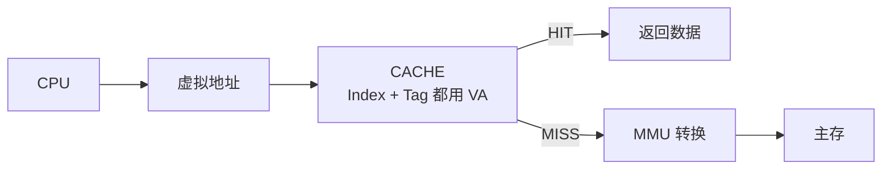
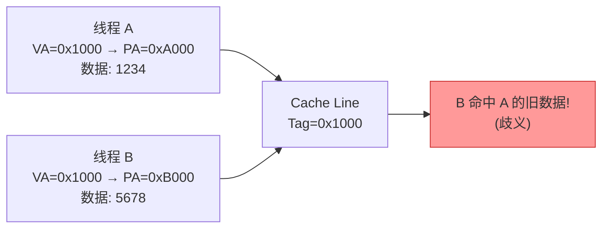
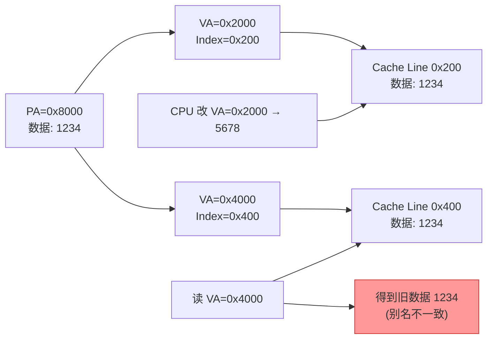
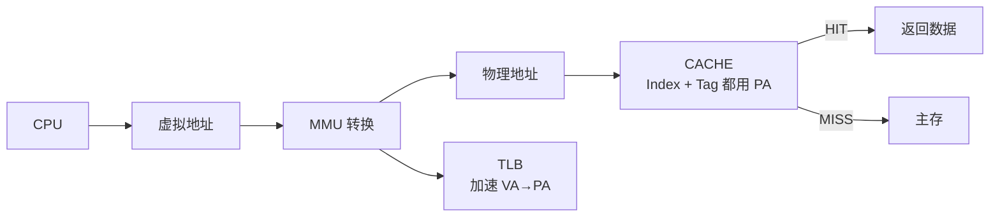
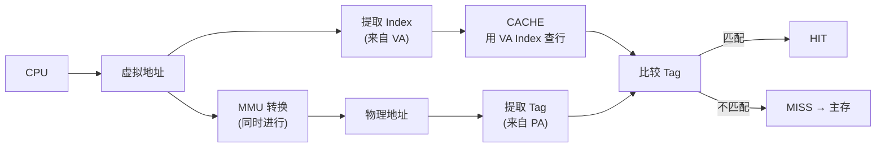
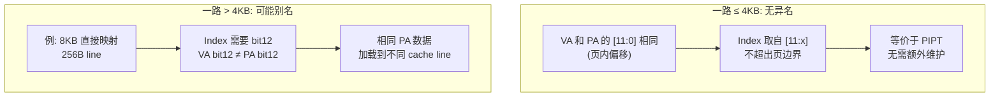
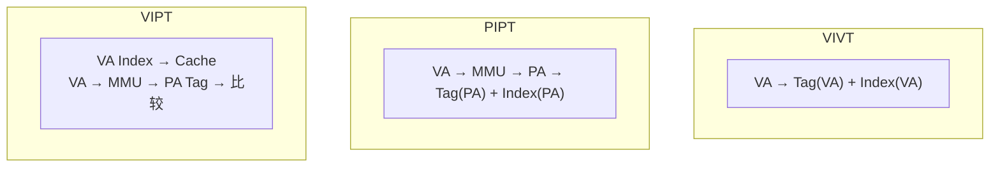
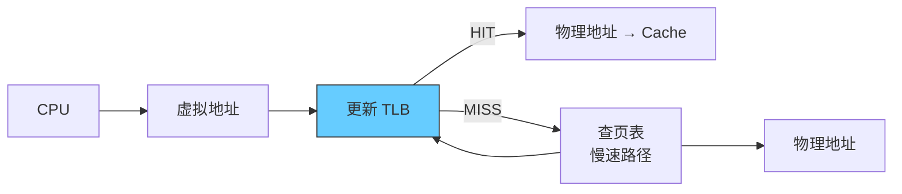

# Cache 组织方式与策略

> cache 控制器根据地址判断命中的依据：虚拟地址 (VA) 还是物理地址 (PA)。

CPU 发出虚拟地址 → MMU 转换成物理地址 → 读取数据。cache 可用 VA、PA 或两者组合。

## 1. VIVT（虚拟高速缓存）

Index 和 Tag 均取自虚拟地址。

**优点**：无需地址转换即可查 cache，速度快。

**问题 1：歧义** — 相同 VA 映射不同 PA

- 解决：切换时 flush cache（写回脏数据 + 无效化）

**问题 2：别名** — 不同 VA 映射相同 PA，且 index 不同

- 解决：nocache 映射、flush cache、保证 VA 索引到相同 cache line

**结论**：VIVT 问题太多，已基本淘汰。

## 2. PIPT（物理高速缓存）

Index 和 Tag 均取自物理地址。

**优点**：
- Tag 唯一 → 无歧义
- Index 唯一 → 无异名
- 软件无需维护

**缺点**：
- 需等待 VA→PA 转换后才能查 cache
- 硬件复杂

**现状**：Linux 中 PIPT 管理函数全为空，无需维护。现代 CPU 普遍采用。

## 3. VIPT（物理标记的虚拟高速缓存）

Index 取自虚拟地址，Tag 取自物理地址。查 cache 与 MMU 转换**同时进行**。

**优点**：性能好（并行），无歧义（tag 是物理的）。

**解决别名**：
- 建立共享映射时，返回的虚拟地址按 cache size 对齐11
- 多路组相联时按一路大小对齐

## 4. 三种方式对比

| 特性         | VIVT | PIPT | VIPT         |
| ---------- | ---- | ---- | ------------ |
| Index 来源   | VA   | PA   | VA           |
| Tag 来源     | VA   | PA   | PA           |
| 歧义问题       | ❌ 有  | ✅ 无  | ✅ 无          |
| 别名问题       | ❌ 有  | ✅ 无  | ⚠️ 一路>4KB 时有 |
| 查 cache 时机 | 转换前  | 转换后  | 同时           |
| 软件维护成本     | 高    | 无    | 低            |
| 当前使用       | 淘汰   | 常见   | 常见（一路≤4KB时）  |

## 5. 补充：TLB

MMU 中缓存 VA→PA 映射关系的小容量 cache。加速地址转换。

---

**参见**
- [[10-Notes/06-Cache基础与映射方式]] — 映射方式与策略
